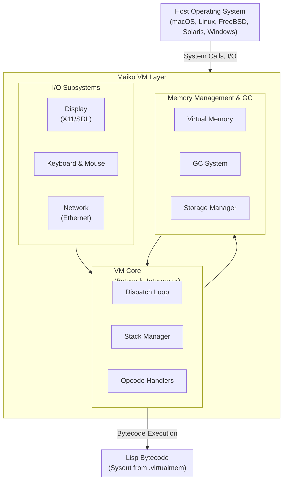
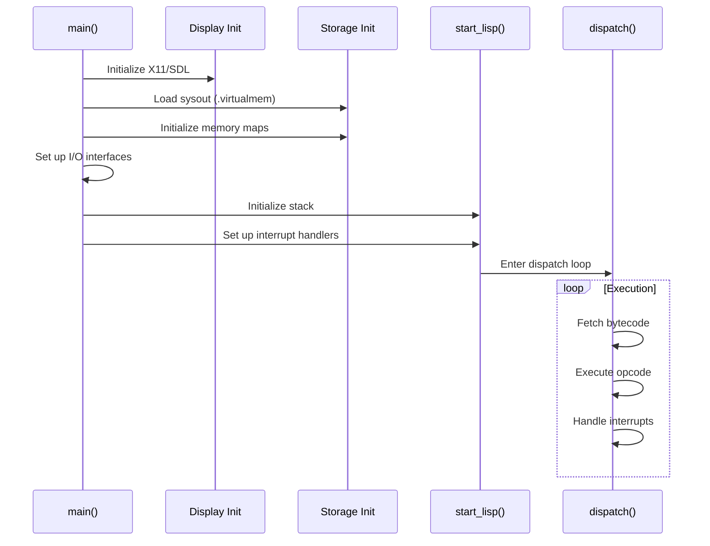
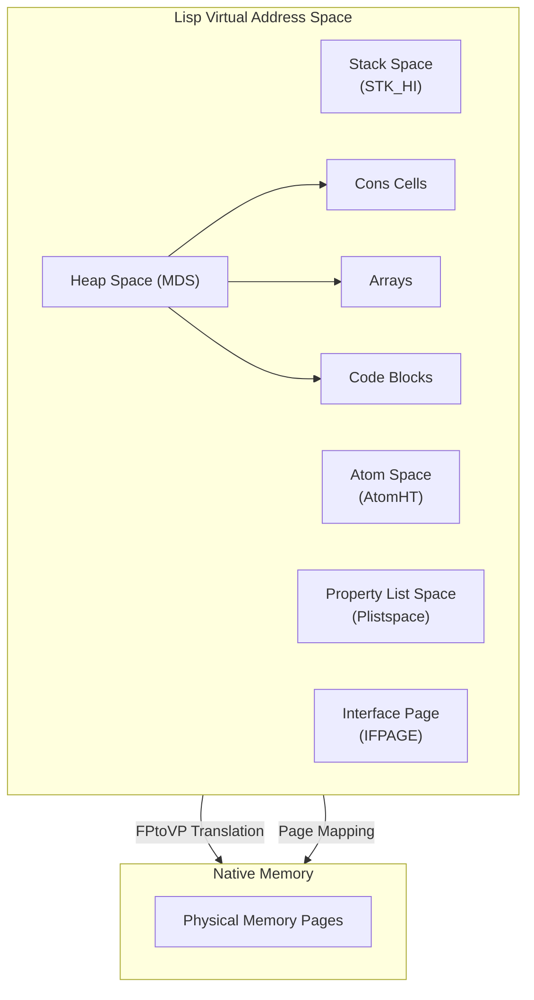
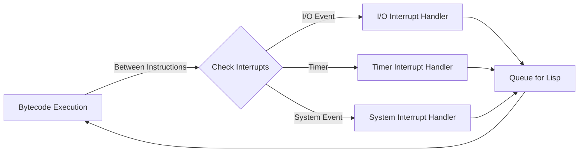

# Maiko Architecture Overview

**Navigation**: [README](README.md) | [Index](INDEX.md) | [Components](components/) | [API](api/) | [Glossary](glossary.md) | [Build System](build-system.md)

## System Purpose

Maiko is a virtual machine emulator for the Medley Interlisp byte-coded Lisp instruction set. It provides the runtime environment that executes Lisp bytecode, manages memory, handles I/O, and interfaces with the host operating system.

For detailed component documentation, see:

- [VM Core Component](components/vm-core.md) - Bytecode execution and stack management
- [Memory Management Component](components/memory-management.md) - Garbage collection and virtual memory
- [Display Component](components/display.md) - Graphics output subsystems
- [I/O Systems Component](components/io.md) - Input/output handling

## High-Level Architecture

See [VM Core Component](components/vm-core.md) for details on the dispatch loop and execution model.

## Core Components

### 1. VM Core

**See**: [VM Core Component Documentation](components/vm-core.md)

The heart of the system, responsible for:

- **Bytecode Dispatch**: Main execution loop that interprets Lisp bytecode instructions (see [Dispatch Loop](components/vm-core.md#dispatch-loop-structure))
- **Stack Management**: Maintains Lisp execution stack frames (see [Stack Management](components/vm-core.md#stack-management))
- **Instruction Execution**: Handles opcodes for arithmetic, control flow, memory access (see [Instruction Handlers](components/vm-core.md#instruction-handlers))
- **Interrupt Handling**: Processes interrupts from I/O and timers (see [Interrupt Handling](components/vm-core.md#interrupt-handling))

**Key Files**:

- `maiko/src/main.c` - Entry point, initialization, main loop (see [Main Entry Point](components/vm-core.md#main-entry-point))
- `maiko/src/hardrtn.c` - Hard return handling (see [Hard Return](components/vm-core.md#stack-management))
- `maiko/src/llstk.c` - Low-level stack operations
- `maiko/src/return.c` - Return instruction handling (see [Function Call Mechanism](components/vm-core.md#function-call-mechanism))

### 2. Memory Management

**See**: [Memory Management Component Documentation](components/memory-management.md)

Manages the Lisp heap and garbage collection:

- **Virtual Memory**: Maps Lisp addresses to host memory (see [Virtual Memory](components/memory-management.md#virtual-memory))
- **Garbage Collection**: Reference-counting based GC (see [Garbage Collection Algorithm](components/memory-management.md#garbage-collection-algorithm))
- **Storage Allocation**: Cell allocation, page management (see [Storage Allocation](components/memory-management.md#storage-allocation))
- **Memory Safety**: Reference counting, pointer validation

**Key Files**:

- `maiko/src/gc.c`, `maiko/src/gc2.c` - Garbage collection core (see [GC Core](components/memory-management.md#garbage-collection-core))
- `maiko/src/gcmain3.c` - GC main loop (see [GC Phases](components/memory-management.md#gc-phases))
- `maiko/src/gcscan.c` - GC scanning phase
- `maiko/src/storage.c` - Storage allocation (see [Storage Management](components/memory-management.md#storage-management))
- `maiko/src/conspage.c` - Cons cell page management

### 3. Display Subsystems

**See**: [Display Component Documentation](components/display.md)

Abstracts display output across different graphics systems:

- **X11 Support**: X Window System integration (see [X11 Implementation](components/display.md#x11-implementation))
- **SDL Support**: Simple DirectMedia Layer integration (see [SDL Implementation](components/display.md#sdl-implementation))
- **BitBLT Operations**: Bit-block transfer for graphics rendering (see [BitBLT Operations](components/display.md#bitblt-operations))
- **Window Management**: Lisp window abstraction (see [Window Management](components/display.md#window-management))

**Key Files**:

- `maiko/src/xinit.c` - X11 initialization (see [X11 Initialization](components/display.md#initialization-sequence))
- `maiko/src/sdl.c` - SDL initialization
- `maiko/src/xbbt.c`, `maiko/src/bitblt.c` - BitBLT operations
- `maiko/src/dspif.c` - Display interface abstraction (see [Display Interface Abstraction](components/display.md#display-interface-structure))

### 4. I/O Systems

**See**: [I/O Systems Component Documentation](components/io.md)

Handles all input/output operations:

#### Keyboard & Mouse

- Keyboard event processing (see [Keyboard System](components/io.md#keyboard-system))
- Mouse event handling (see [Mouse System](components/io.md#mouse-system))
- Input device abstraction

#### File System

- Directory operations (see [File System](components/io.md#file-system))
- File I/O
- Pathname handling

#### Networking

- Ethernet support (DLPI, NIT, NETHUB) (see [Network Communication](components/io.md#network-communication))
- Internet protocol handling
- Network device abstraction

### 5. Build System

**See**: [Build System Documentation](build-system.md)

Supports multiple build configurations:

- **CMake**: Modern build system (see [CMake Build System](build-system.md#cmake-build-system))
- **Make**: Traditional build system (see [Make Build System](build-system.md#make-build-system))
- **Platform Detection**: Automatic OS/architecture detection (see [Platform-Specific Considerations](build-system.md#platform-specific-considerations))
- **Feature Flags**: Conditional compilation for features (see [Feature Flags](build-system.md#feature-flags))

## Data Flow

### Startup Sequence

1. **Initialization** (`main()` in `maiko/src/main.c` - see [VM Core](components/vm-core.md#main-entry-point)):
   - Parse command-line arguments
   - Initialize display subsystem (X11 or SDL) (see [Display Initialization](components/display.md#initialization-sequence))
   - Load sysout file (`.virtualmem`) (see [Storage Initialization](components/memory-management.md#initialization))
   - Initialize memory maps (see [Memory Layout](components/memory-management.md#memory-layout))
   - Set up I/O interfaces (see [I/O Systems](components/io.md))

2. **VM Startup** (`start_lisp()` in `maiko/src/main.c` - see [VM Core](components/vm-core.md#main-entry-point)):
   - Initialize stack (see [Stack Management](components/vm-core.md#stack-management))
   - Set up interrupt handlers (see [Interrupt Handling](components/vm-core.md#interrupt-handling))
   - Enter dispatch loop (see [Dispatch Loop](components/vm-core.md#dispatch-loop-structure))

3. **Execution Loop** (`dispatch()` - see [Dispatch Loop](components/vm-core.md#dispatch-loop-structure)):
   - Fetch bytecode instruction
   - Decode opcode (see [Opcode Categories](components/vm-core.md#opcode-categories))
   - Execute handler function
   - Update program counter
   - Handle interrupts

### Memory Layout

The VM uses a virtual memory model (see [Memory Management](components/memory-management.md#memory-layout)):

- **Lisp Address Space**: 32-bit addresses (or larger with BIGVM - see [BIGVM Support](components/memory-management.md#bigvm-support))
- **Page Mapping**: Virtual pages mapped to physical memory (see [Address Translation](components/memory-management.md#address-translation))
- **Address Translation**: `FPtoVP` (Frame Pointer to Virtual Pointer) mapping (see [Address Translation](components/vm-core.md#address-translation))
- **Memory Regions**: Stack, heap, atom space, property lists, etc. (see [Memory Regions](components/memory-management.md#memory-regions))

### Interrupt Handling

Interrupts are processed between bytecode instructions (see [Interrupt Handling](components/vm-core.md#interrupt-handling)):

- **I/O Interrupts**: Keyboard, mouse, network events (see [I/O Systems](components/io.md))
- **Timer Interrupts**: Periodic tasks, GC scheduling (see [GC Timing](components/memory-management.md#performance-considerations))
- **System Interrupts**: File system events, signals

## Platform Abstraction

Maiko abstracts platform differences through:

- **Platform Detection**: `maiko/inc/maiko/platform.h`
- **Conditional Compilation**: `#ifdef` blocks for platform-specific code
- **Architecture-Specific Code**: Separate implementations for different CPUs
- **OS Abstraction**: Wrappers for OS-specific system calls

## Key Design Principles

1. **Portability**: Support multiple OSes and architectures
2. **Modularity**: Clear separation between VM core and I/O subsystems
3. **Abstraction**: Display and network subsystems are pluggable
4. **Compatibility**: Maintain compatibility with Medley Interlisp bytecode format
5. **Performance**: Optimized dispatch loop and memory management

## Version Compatibility

The VM maintains version compatibility through:

- **LVERSION**: Minimum Lisp version required
- **MINBVERSION**: Current emulator version
- **Release Flags**: Feature flags tied to release numbers (115, 200, 201, 210, 300, 350, 351)

See `maiko/inc/version.h` for version definitions.

## Related Documentation

- [Component Details](components/) - Detailed component documentation
  - [VM Core](components/vm-core.md) - Execution engine details
  - [Memory Management](components/memory-management.md) - GC and memory details
  - [Display](components/display.md) - Graphics subsystem details
  - [I/O Systems](components/io.md) - Input/output details
- [API Reference](api/overview.md) - Function and data structure reference
- [Glossary](glossary.md) - Terminology and concepts
- [Build System](build-system.md) - Build configuration and platform support
- [Index](INDEX.md) - Quick reference guide
