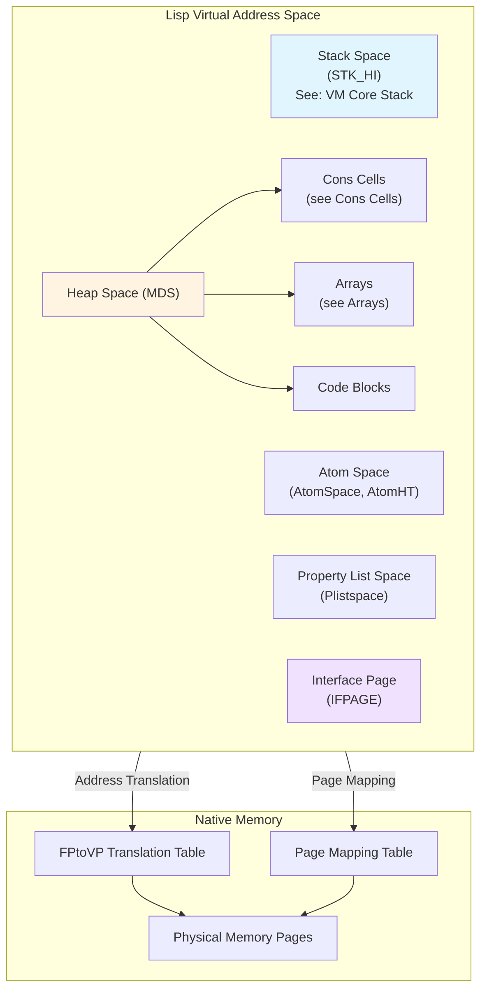
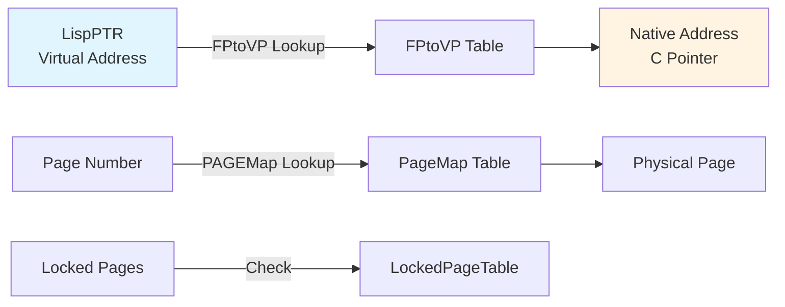
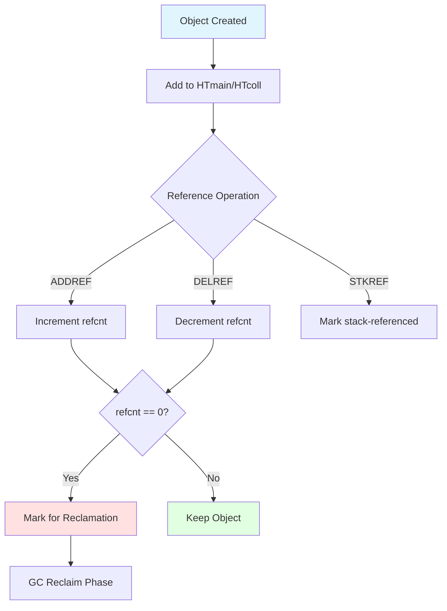
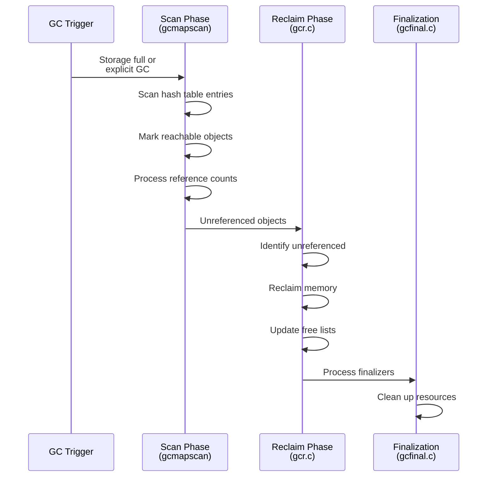

# Memory Management Component

**Navigation**: [README](../README.md) | [Index](../INDEX.md) | [Architecture](../architecture.md) | [VM Core](vm-core.md) | [Display](display.md) | [I/O](io.md) | [Glossary](../glossary.md)

The Memory Management system handles heap allocation, garbage collection, and virtual memory mapping for the Lisp heap.

**Related Components**:

- [VM Core](vm-core.md) - Uses memory for stack and execution
- [I/O Systems](io.md) - May allocate buffers

## Overview

Maiko uses a virtual memory model with:

- **Virtual Address Space**: Lisp addresses ([LispPTR](../glossary.md#lispptr)) mapped to physical memory
- **Garbage Collection**: Reference-counting based GC with mark-sweep phases (see [Garbage Collection Algorithm](#garbage-collection-algorithm))
- **Page Management**: Virtual pages mapped to physical memory pages (see [Address Translation](#address-translation))
- **Storage Allocation**: Cons cells, arrays, and other Lisp objects (see [Storage Allocation](#storage-allocation))

## Key Files

### Garbage Collection Core

- **`src/gc.c`**: Basic GC operations
  - `OP_gcref()`: GC reference opcode handler
  - Reference counting operations

- **`src/gc2.c`**: Extended GC operations
  - Additional GC primitives
  - GC state management

- **`src/gcmain3.c`**: Main GC scanning routines
  - `gcmapscan()`: Scan hash table for GC
  - `gcmapunscan()`: Unscan hash table
  - `gcscanstack()`: Scan stack for references

- **`src/gcscan.c`**: GC scanning phase
  - Mark phase implementation
  - Object traversal

- **`src/gcr.c`**: GC reclamation
  - Reclaim unreferenced objects
  - Free memory back to heap

- **`src/gcrcell.c`**: Cell reclamation
  - Cons cell reclamation
  - Cell chain processing

- **`src/gcarray.c`**: Array GC
  - Array object collection
  - Array block management

- **`src/gccode.c`**: Code GC
  - Function code collection
  - Code block reclamation

- **`src/gcfinal.c`**: Final GC phase
  - Finalization processing
  - Cleanup operations

- **`src/gchtfind.c`**: Hash table GC
  - Hash table entry management
  - Reference lookup

### Storage Management

- **`src/storage.c`**: Storage allocation and management
  - `init_storage()`: Initialize storage system
  - `checkfor_storagefull()`: Check if storage is full
  - `newpage()`: Allocate new page
  - Storage state management

- **`src/conspage.c`**: Cons cell page management
  - Cons page allocation
  - Cons cell management

- **`src/allocmds.c`**: MDS (Memory Data Structure) allocation
  - MDS page management
  - Array allocation

### Virtual Memory

- **`src/vmemsave.c`**: Virtual memory save/restore
  - Save VM state to disk
  - Restore VM state from disk

## Memory Layout

### Address Spaces



The VM uses virtual addresses that are translated to native addresses (see [Address Translation in VM Core](vm-core.md#address-translation)):

- **Stack Space**: Execution stack (see [VM Core Stack Management](vm-core.md#stack-management))
- **Atom Space**: Symbol storage (see [Memory Regions](#memory-regions))
- **Property List Space**: Symbol properties
- **Heap Space (MDS)**: Cons cells, arrays, code blocks
- **Interface Page**: VM-Lisp communication (see [Interface Page](#memory-regions))

### Address Translation



- **`FPtoVP`**: Frame Pointer to Virtual Pointer mapping table (see [Address Translation in VM Core](vm-core.md#address-translation))
- **`PAGEMap`**: Page mapping table
- **`PageMapTBL`**: Page map table
- **`LockedPageTable`**: Locked pages (not swappable)

### BIGVM Support

With `BIGVM` defined (see [Build System Feature Flags](../build-system.md#feature-flags)):

- Larger address space (32+ bits)
- Extended pointer types (see [BIGVM in Glossary](../glossary.md#bigvm))
- Different address encoding

## Garbage Collection Algorithm

### Reference Counting



Maiko uses a reference-counting GC system (see [GC Terms in Glossary](../glossary.md#garbage-collection-terms)):

1. **Reference Tracking**: Each object has a reference count (see [GC Data Structures](#gc-data-structures))
2. **Hash Table**: `HTmain` and `HTcoll` track references
3. **Stack References**: Special handling for stack-referenced objects (see [STKREF in Glossary](../glossary.md#stkref))
4. **Reference Operations**:
   - `ADDREF`: Increment reference count (see [ADDREF in Glossary](../glossary.md#addref))
   - `DELREF`: Decrement reference count (see [DELREF in Glossary](../glossary.md#delref))
   - `STKREF`: Mark as stack-referenced

### GC Phases



1. **Scan Phase** (`gcmapscan()` - see [GC Main Loop](#garbage-collection-core)):
   - Scan hash table entries
   - Mark reachable objects
   - Process reference counts

2. **Reclaim Phase** (`gcr.c` - see [GC Reclamation](#garbage-collection-core)):
   - Identify unreferenced objects
   - Reclaim memory
   - Update free lists

3. **Finalization Phase** (`gcfinal.c` - see [GC Finalization](#garbage-collection-core)):
   - Process finalizers
   - Clean up resources

### GC Data Structures

#### Hash Table Entry (`GCENTRY`)

```c
struct hashentry {
    LispPTR ptr;        // Object pointer
    unsigned stkcnt;   // Stack reference count
    unsigned refcnt;   // Reference count
    // ... flags ...
};
```

#### Reference Types

- **ADDREF**: Normal reference increment
- **DELREF**: Normal reference decrement
- **STKREF**: Stack reference (special handling)

## Storage Allocation

### Cons Cells

Cons cells are allocated in pages:

- **Cons Page**: Contains multiple cons cells
- **CDR Coding**: Compact representation using CDR codes
- **Allocation**: `cons()` function allocates new cons cell

### Arrays

Arrays are allocated in the MDS (Memory Data Structure):

- **Array Blocks**: Contiguous memory blocks
- **Block Size**: Variable size based on array type
- **Alignment**: Proper alignment for array elements

### Storage States

Storage can be in different states:

- **SFS_NOTSWITCHABLE**: Cannot switch array space
- **SFS_SWITCHABLE**: Can switch array space
- **SFS_FULLYSWITCHED**: Array space fully switched

### Storage Full Handling

When storage is full:

1. Check available pages
2. Trigger GC if possible
3. Switch array space if switchable
4. Signal error if completely full

## Memory Regions

### Stack Space (`Stackspace`)

- Execution stack
- Frame storage
- Local variables

### Atom Space (`AtomSpace`)

- Atom table
- Symbol storage
- Atom hash table (`AtomHT`)

### Property List Space (`Plistspace`)

- Property lists
- Symbol properties

### Heap Space (MDS)

- Cons cells
- Arrays
- Code blocks
- User data

### Interface Page (`InterfacePage`)

- VM-Lisp communication
- System variables
- Interrupt state

## Key Functions

### Initialization

- `init_storage()`: Initialize storage system
- `init_ifpage()`: Initialize interface page
- `build_lisp_map()`: Build memory maps

### Allocation

- `cons()`: Allocate cons cell
- `newpage()`: Allocate new page
- `makefreearrayblock()`: Allocate array block

### GC Operations

- `OP_gcref()`: GC reference opcode
- `GCLOOKUP()`: Look up object in GC hash table
- `gcmapscan()`: Scan hash table for GC
- `gcreccell()`: Reclaim cons cell

### Memory Access

- `NativeAligned2FromLAddr()`: Convert Lisp address to native 16-bit pointer
- `NativeAligned4FromLAddr()`: Convert Lisp address to native 32-bit pointer
- `LAddrFromNative()`: Convert native address to Lisp address

## Performance Considerations

1. **Reference Counting**: Fast increment/decrement, but requires hash table lookup
2. **Stack References**: Special handling avoids unnecessary reference counting
3. **Page Management**: Efficient page allocation reduces fragmentation
4. **GC Timing**: GC triggered when storage is full or on demand

## Related Components

- [VM Core](vm-core.md) - Uses memory for stack and execution
  - [Stack Management](vm-core.md#stack-management) - Stack frame allocation
  - [Address Translation](vm-core.md#address-translation) - Virtual to native address conversion
- [I/O Systems](io.md) - May allocate buffers
- [Architecture Overview](../architecture.md) - System-wide memory architecture

## See Also

- [Glossary](../glossary.md) - Memory-related terms:
  - [LispPTR](../glossary.md#lispptr), [DLword](../glossary.md#dlword)
  - [Cons Cell](../glossary.md#cons-cell), [CDR Coding](../glossary.md#cdr-coding)
  - [GC](../glossary.md#gc), [Reference Counting](../glossary.md#reference-counting)
- Header Files:
  - `maiko/inc/gcdata.h` - GC data structure definitions
  - `maiko/inc/gcdefs.h` - GC function definitions
  - `maiko/inc/storagedefs.h` - Storage function definitions
  - `maiko/inc/lispmap.h` - Memory map definitions
- [API Overview](../api/overview.md) - Memory management functions
