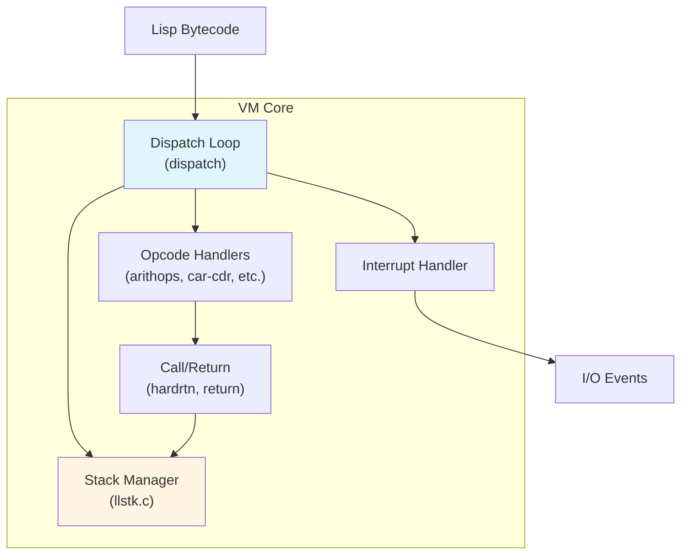
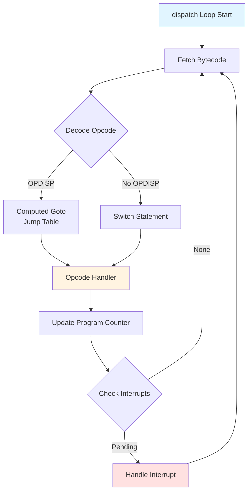
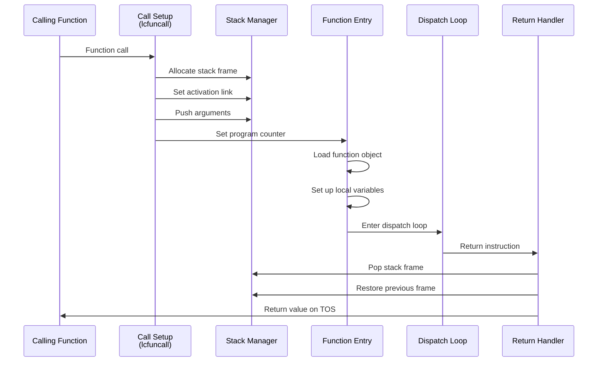

# VM Core Component

**Navigation**: [README](../README.md) | [Index](../INDEX.md) | [Architecture](../architecture.md) | [Memory Management](memory-management.md) | [Display](display.md) | [I/O](io.md) | [Glossary](../glossary.md)

The VM Core is the heart of Maiko, responsible for executing Lisp bytecode instructions and managing the execution environment.

**Related Components**:

- [Memory Management](memory-management.md) - Heap and GC used by VM
- [I/O Systems](io.md) - Input/output handling triggers interrupts
- [Display](display.md) - Graphics output from VM

## Overview



The VM Core consists of:

- **Bytecode dispatch loop** (see [Dispatch Loop Structure](#dispatch-loop-structure))
- **Stack frame management** (see [Stack Management](#stack-management))
- **Instruction execution handlers** (see [Instruction Handlers](#instruction-handlers))
- **Interrupt processing** (see [Interrupt Handling](#interrupt-handling))
- **Function call/return mechanisms** (see [Function Call Mechanism](#function-call-mechanism))

## Key Files

### Main Entry Point

- **`src/main.c`**: Entry point, initialization, command-line processing
  - `main()`: Processes arguments, initializes subsystems, loads sysout
  - `start_lisp()`: Initializes VM state and enters dispatch loop

### Dispatch Loop

- **`src/xc.c`**: Main bytecode dispatch loop
  - `dispatch()`: Core instruction dispatch using computed goto (OPDISP) or switch
  - Opcode table: Maps bytecode values to handler functions
  - UFN (Undefined Function Name) handling

### Stack Management

- **`src/llstk.c`**: Low-level stack operations
  - Stack block allocation/deallocation
  - Stack frame manipulation
  - Stack overflow detection

- **`src/hardrtn.c`**: Hard return handling
  - `make_FXcopy()`: Creates copy of frame for hard return
  - Frame copying with name table preservation
  - Stack space management

- **`src/return.c`**: Return instruction handling
  - Normal return processing
  - Stack cleanup
  - Frame unwinding

### Instruction Handlers

#### Arithmetic Operations

- **`src/arithops.c`**: Arithmetic opcodes (add, subtract, multiply, divide)
- **`src/fp.c`**: Floating-point operations

#### Memory Operations

- **`src/car-cdr.c`**: CAR/CDR operations on cons cells
- **`src/arrayops.c`**: Array access operations
- **`src/binds.c`**: Variable binding operations

#### Control Flow

- **`src/loopsops.c`**: Loop operations
  - `lcfuncall()`: Loops function call mechanism
- **`src/shift.c`**: Bit shift operations

#### Data Operations

- **`src/eqf.c`**: Equality and comparison operations
- **`src/typeof.c`**: Type checking operations
- **`src/mkcell.c`**: Cell creation
- **`src/mkatom.c`**: Atom creation

## Execution Model

### Dispatch Loop Structure



The dispatch loop (`dispatch()` in `src/xc.c`) uses one of two mechanisms (see [Build System Feature Flags](../build-system.md#feature-flags)):

1. **Computed Goto (OPDISP)**: Uses GCC's computed goto extension for fast dispatch (see [OPDISP in Glossary](../glossary.md#opdisp))
   - Jump table with labels for each opcode
   - Minimal overhead per instruction

2. **Switch Statement**: Fallback for compilers without computed goto support
   - Standard C switch/case
   - Slightly slower but portable

### Instruction Format

Lisp bytecode instructions are variable-length:

- **Opcode**: 1 byte (0-255)
- **Operands**: Variable number of bytes depending on opcode
- **Multi-byte opcodes**: Some opcodes span multiple bytes

### Stack Frame Structure

Each function call creates a stack frame (FX - Frame eXtended):

```c
struct frameex1 {
    DLword alink;        // Activation link (previous frame)
    DLword fnheader;     // Function header pointer
    DLword pc;           // Program counter offset
    DLword nextblock;    // Next stack block offset
    // ... local variables ...
};
```

### Function Call Mechanism



1. **Call Setup** (`loopsops.c:lcfuncall()` - see [Loops Operations](#instruction-handlers)):
   - Allocate new stack frame (see [Stack Frame Structure](#stack-frame-structure))
   - Set up activation link (see [Activation Link in Glossary](../glossary.md#activation-link))
   - Push arguments
   - Set program counter (see [Program Counter in Glossary](../glossary.md#program-counter-pc))

2. **Function Entry**:
   - Load function object (see [Function Object in Glossary](../glossary.md#function-object-funcobj))
   - Set up local variables (see [IVar in Glossary](../glossary.md#ivar))
   - Enter dispatch loop (see [Dispatch Loop Structure](#dispatch-loop-structure))

3. **Return** (`return.c` - see [Return Handling](#stack-management)):
   - Pop stack frame
   - Restore previous frame
   - Return value on top of stack (see [Top of Stack in Glossary](../glossary.md#top-of-stack-tos))

### Interrupt Handling

Interrupts are checked between instructions:

- **I/O Interrupts**: Keyboard, mouse, network events
- **Timer Interrupts**: Periodic tasks, GC scheduling
- **System Interrupts**: File system, signals

Interrupt state is stored in `INTSTAT` structure:

```c
struct interrupt_state {
    unsigned LogFileIO : 1;
    unsigned ETHERInterrupt : 1;
    unsigned IOInterrupt : 1;
    unsigned gcdisabled : 1;
    unsigned vmemfull : 1;
    unsigned stackoverflow : 1;
    unsigned storagefull : 1;
    unsigned waitinginterrupt : 1;
    DLword intcharcode;
};
```

## Key Data Structures

### Execution State (`struct state` in `inc/lispemul.h`)

```c
struct state {
    DLword *ivar;           // IVar pointer
    DLword *pvar;           // PVar pointer
    DLword *csp;            // C stack pointer
    ByteCode *currentpc;    // Current program counter
    struct fnhead *currentfunc;  // Current function
    DLword *endofstack;     // End of stack
    UNSIGNED irqcheck;      // IRQ check flag
    UNSIGNED irqend;        // IRQ end flag
    LispPTR tosvalue;       // Top of stack value
    LispPTR scratch_cstk;   // Scratch C stack
    int errorexit;          // Error exit flag
};
```

### Function Header (`struct fnhead`)

Contains function metadata:

- Bytecode stream
- Stack requirements
- Argument count
- Local variable count

### Frame Structure (`FX`)

Stack frame containing:

- Activation link to previous frame
- Function header reference
- Program counter offset
- Local variables
- Name table (if present)

## Address Translation

The VM uses virtual addresses that must be translated to native addresses:

- **`LispPTR`**: Virtual address in Lisp space
- **`NativeAligned2FromLAddr()`**: Convert Lisp address to native 16-bit aligned pointer
- **`NativeAligned4FromLAddr()`**: Convert Lisp address to native 32-bit aligned pointer
- **`LAddrFromNative()`**: Convert native address to Lisp address

## Opcode Categories

### Control Flow (0x00-0x3F)

- Function calls
- Returns
- Jumps
- Conditionals

### Arithmetic (0x40-0x7F)

- Add, subtract, multiply, divide
- Bitwise operations
- Comparisons

### Memory Access (0x80-0xBF)

- Variable access
- Array access
- CAR/CDR operations

### Special Operations (0xC0-0xFF)

- Type checking
- Cell creation
- Atom operations
- System calls

## Performance Considerations

1. **Dispatch Speed**: Computed goto provides fastest dispatch
2. **Stack Management**: Efficient frame allocation/deallocation
3. **Address Translation**: Cached translations where possible
4. **Interrupt Checking**: Minimal overhead between instructions

## Related Components

- [Memory Management](memory-management.md) - Heap and GC
  - [Stack Space](memory-management.md#memory-regions) - Execution stack storage
  - [Address Translation](memory-management.md#address-translation) - Virtual address conversion
- [I/O Systems](io.md) - Input/output handling
  - [Interrupt Sources](io.md) - I/O events trigger interrupts
- [Display](display.md) - Graphics output
- [Architecture Overview](../architecture.md) - System architecture context

## See Also

- [Glossary](../glossary.md) - VM-related terms:
  - [Dispatch Loop](../glossary.md#dispatch-loop), [Stack Frame](../glossary.md#stack-frame-fx)
  - [LispPTR](../glossary.md#lispptr), [DLword](../glossary.md#dlword), [ByteCode](../glossary.md#bytecode)
  - [Opcode](../glossary.md#opcode), [UFN](../glossary.md#ufn), [Hard Return](../glossary.md#hard-return)
- Header Files:
  - `maiko/inc/opcodes.h` - Opcode definitions
  - `maiko/inc/lispemul.h` - Core data types (see [Execution State](#key-data-structures))
  - `maiko/inc/stack.h` - Stack frame definitions (see [Stack Frame Structure](#stack-frame-structure))
- [API Overview](../api/overview.md) - VM core functions
