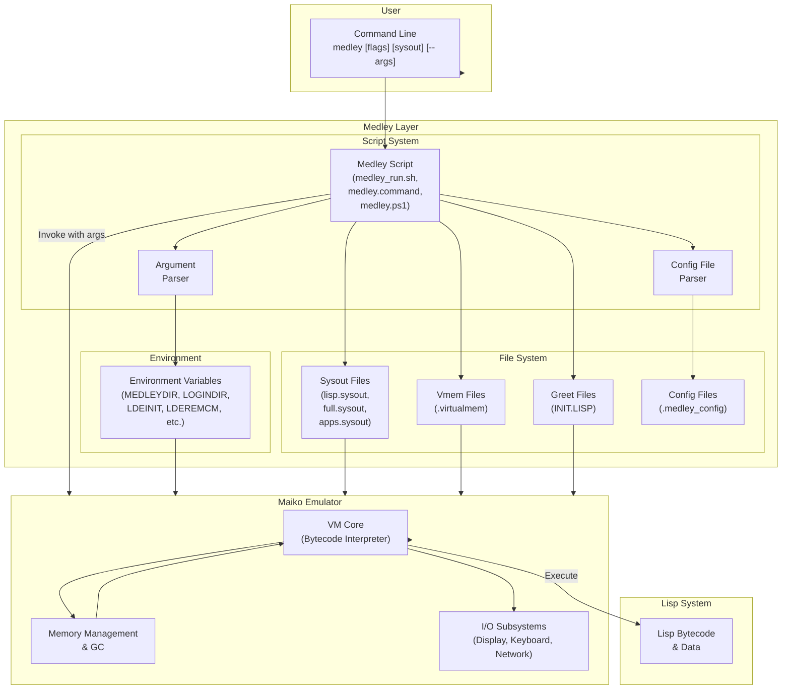
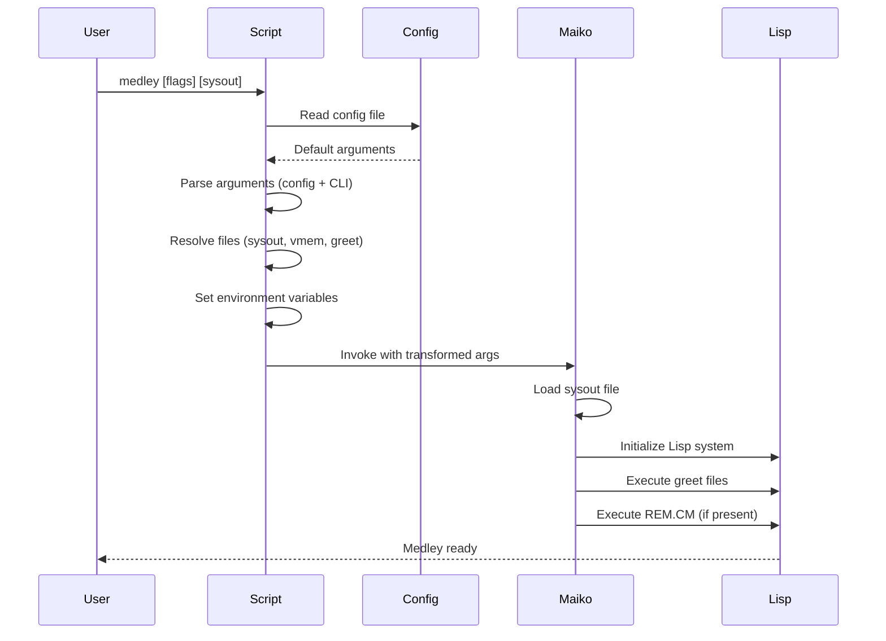
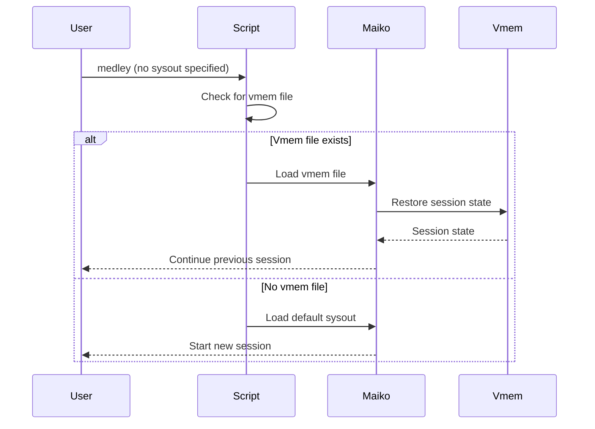
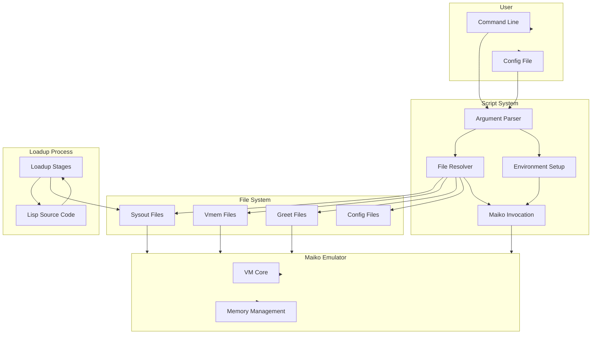

# Medley Architecture Overview

**Navigation**: [README](README.md) | [Index](INDEX.md) | [Components](components/) | [Interface](interface/) | [Platform](platform/) | [Glossary](glossary.md)

## System Purpose

Medley is the Lisp machine content that runs on the Maiko emulator. It provides a complete Lisp development environment including Interlisp and Common Lisp implementations, development tools, and applications. Medley scripts orchestrate the startup process, configure the environment, and invoke Maiko to execute the Lisp system.

For detailed component documentation, see:

- [Scripts Component](components/scripts.md) - Medley script system and argument parsing
- [Sysout Files Component](components/sysout.md) - Sysout file format and loading
- [Virtual Memory Files Component](components/vmem.md) - Vmem files and session persistence
- [Configuration Files Component](components/configuration.md) - Config files and precedence
- [Greet Files Component](components/greetfiles.md) - Greet file system
- [Loadup Workflow Component](components/loadup.md) - Loadup workflow and sysout creation
- [Directory Structure Component](components/directory-structure.md) - Medley directory organization

## High-Level Architecture

See [Interface Documentation](interface/README.md) for details on how Medley and Maiko communicate.

## Core Components

### 1. Script System

**See**: [Scripts Component Documentation](components/scripts.md)

The Medley script system is the entry point for starting Medley. It handles:

- **Argument Parsing**: Parses command-line arguments and config file options
- **Environment Setup**: Sets environment variables for Maiko communication
- **File Resolution**: Resolves sysout files, vmem files, and greet files
- **Maiko Invocation**: Invokes the Maiko emulator with transformed arguments

**Key Scripts**:

- `medley/scripts/medley/medley_run.sh` - Linux/macOS shell script
- `medley/scripts/medley/medley.command` - macOS application bundle script
- `medley/scripts/medley/medley.ps1` - Windows PowerShell script

**Platform Variations**: Scripts adapt to platform differences (Windows/Cygwin, WSL, macOS, Linux)

### 2. Sysout Files

**See**: [Sysout Files Component Documentation](components/sysout.md)

Sysout files are binary files containing complete Lisp system state:

- **lisp.sysout**: Minimal Interlisp and Common Lisp environment
- **full.sysout**: Complete environment with development tools
- **apps.sysout**: Full environment plus applications (Notecards, Rooms, CLOS)

**Purpose**: Provide starting point for Medley sessions. Maiko loads sysout files to initialize the Lisp system.

**Creation**: Sysout files are created by the loadup process (see [Loadup Workflow](components/loadup.md))

### 3. Virtual Memory Files (Vmem)

**See**: [Virtual Memory Files Component Documentation](components/vmem.md)

Vmem files store persistent session state:

- **Purpose**: Enable session continuation across Medley restarts
- **Format**: Binary format, platform-specific
- **Location**: `LOGINDIR/{run-id}.virtualmem` or `LOGINDIR/lisp.virtualmem`
- **Coordination**: Medley scripts coordinate with Maiko for vmem save/load

**Lifecycle**: Created on Medley exit, loaded on next startup if present

### 4. Configuration Files

**See**: [Configuration Files Component Documentation](components/configuration.md)

Configuration files provide default command-line arguments:

- **Format**: Text file with flag-value pairs
- **Precedence**: Config file → Command-line arguments (command-line overrides config)
- **Locations**: `MEDLEYDIR/.medley_config`, `~/.medley_config`
- **Parsing**: Processed by Medley scripts before command-line arguments

### 5. Greet Files

**See**: [Greet Files Component Documentation](components/greetfiles.md)

Greet files are Lisp files executed during startup:

- **Purpose**: Initialize Lisp environment before main system starts
- **Format**: Lisp source code
- **Execution Order**: Greet files → REM.CM file → Main Lisp system
- **Default**: `MEDLEYDIR/greetfiles/INIT.LISP`

### 6. Loadup Workflow

**See**: [Loadup Workflow Component Documentation](components/loadup.md)

The loadup process creates sysout files from Lisp source:

- **Stages**: Sequential stages (Init → Mid → Lisp → Full → Apps)
- **Scripts**: `loadup-all.sh` orchestrates the complete process
- **Output**: Sysout files copied to `MEDLEYDIR/loadups/`
- **Dependencies**: Requires Maiko executables (`lde`, `ldeinit`, `ldex` or `ldesdl`)

## Medley-Maiko Integration

Medley and Maiko communicate through multiple mechanisms:

### Command-Line Arguments

Medley scripts transform user arguments and pass specific flags to Maiko:

- **Argument Transformation**: Medley flags (e.g., `-f`, `-l`, `-a`) → Maiko flags (e.g., `-id`, `-g`, `-sc`)
- **Pass-Through Arguments**: Arguments after `--` are passed directly to Maiko
- **See**: [Command-Line Interface](interface/command-line.md) for complete mapping

### Environment Variables

Medley scripts set environment variables that Maiko reads:

- **MEDLEYDIR**: Top-level Medley installation directory
- **LOGINDIR**: User-specific Medley directory
- **LDESOURCESYSOUT**: Source sysout file path
- **LDEINIT**: Greet file path
- **LDEREMCM**: REM.CM file path
- **LDEDESTSYSOUT**: Destination vmem file path

**See**: [Environment Variables](interface/environment.md) for complete specification

### File Formats

Medley and Maiko coordinate through file formats:

- **Sysout Files**: Binary format containing Lisp system state
- **Vmem Files**: Binary format for session persistence
- **Config Files**: Text format for default arguments
- **Greet Files**: Lisp source code format

**See**: [File Formats](interface/file-formats.md) for complete specifications

### Runtime Protocols

Medley scripts invoke Maiko and handle:

- **Invocation Pattern**: Scripts call Maiko executable with arguments
- **Error Handling**: Scripts check exit codes and handle errors
- **Startup Sequence**: Scripts coordinate file loading and initialization
- **Session Management**: Scripts manage run IDs and vmem file coordination

**See**: [Protocols](interface/protocols.md) for complete protocol documentation

## Data Flow

### Startup Flow

### Session Continuation Flow

## Component Relationships

### Scripts → Files

- Scripts resolve sysout file paths based on flags (`-f`, `-l`, `-a`) or explicit sysout argument
- Scripts locate vmem files based on run ID and LOGINDIR
- Scripts find greet files based on `-r` flag or defaults
- Scripts read config files from standard locations

**See**: [Scripts Component](components/scripts.md) for script system details

### Scripts → Maiko

- Scripts transform arguments for Maiko
- Scripts set environment variables for Maiko
- Scripts invoke Maiko executable with arguments
- Scripts handle Maiko exit codes and errors

**See**: [Scripts Component](components/scripts.md) and [Interface Documentation](interface/README.md) for interface details

### Files → Maiko

- Maiko loads sysout files to initialize Lisp system
- Maiko loads vmem files to restore session state
- Maiko executes greet files during startup
- Maiko saves vmem files on exit

**See**: [Sysout Files Component](components/sysout.md), [Virtual Memory Files Component](components/vmem.md), and [Greet Files Component](components/greetfiles.md) for file details

### Loadup → Sysout Files

- Loadup process creates sysout files from Lisp source
- Loadup runs in sequential stages
- Each stage produces a sysout file used by the next stage
- Final sysout files are copied to `loadups/` directory

**See**: [Loadup Workflow Component](components/loadup.md) for loadup process details

## Component Interaction Diagram

## Platform Abstraction

Medley scripts abstract platform differences:

- **Script Variants**: Different scripts for Linux, macOS, Windows
- **Path Handling**: Platform-specific path conventions
- **Display Backend**: X11, SDL, or VNC selection based on platform
- **File System**: Platform-specific file system behaviors

**See**: [Platform Documentation](platform/) for platform-specific details

## Directory Structure

Medley organizes files in a standard directory structure:

- **MEDLEYDIR**: Top-level installation directory
  - `scripts/`: Medley scripts
  - `sources/`: Lisp source code
  - `loadups/`: Sysout files
  - `greetfiles/`: Greet files
  - `library/`: Supported packages
  - `lispusers/`: User-contributed packages

- **LOGINDIR**: User-specific directory
  - `{run-id}.virtualmem`: Vmem files
  - `INIT.LISP`: User greet file
  - `.medley_config`: User config file

**See**: [Directory Structure Component](components/directory-structure.md) for complete details

## Related Documentation

### Maiko Documentation

For understanding the Maiko emulator side:

- **Maiko Architecture**: `../architecture.md` - Maiko system architecture
- **Maiko Components**: `../components/` - Maiko component documentation
- **Maiko API**: `../api/` - Maiko API reference

### Interface Documentation

For complete Medley-Maiko interface specification:

- **Interface Overview**: [interface/README.md](interface/README.md)
- **Command-Line Interface**: [interface/command-line.md](interface/command-line.md)
- **Environment Variables**: [interface/environment.md](interface/environment.md)
- **File Formats**: [interface/file-formats.md](interface/file-formats.md)
- **Protocols**: [interface/protocols.md](interface/protocols.md)

## Summary

Medley provides the Lisp machine content that runs on Maiko. The Medley script system orchestrates startup by parsing arguments, setting up the environment, resolving files, and invoking Maiko. Medley and Maiko communicate through command-line arguments, environment variables, file formats, and runtime protocols. The system supports session persistence through vmem files and configuration through config files and greet files.
