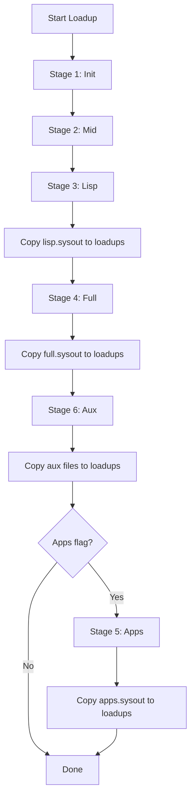

# Loadup Workflow

**Navigation**: [Medley README](../README.md) | [Medley Index](../INDEX.md) | [Architecture](../architecture.md)

## Overview

The loadup process creates sysout files from Lisp source code. It runs in sequential stages, with each stage building on the previous one to create progressively more complete sysout files. The loadup process is essential for building Medley from source and creating custom sysout files.

## Loadup Stages

### Sequential Stages

The loadup process runs in 5 sequential stages:

#### Stage 1: Init

**Script**: `loadup-init.sh`

**Product**: `init.dlinit` sysout file

**Purpose**: Create initial sysout file used internally for Stage 2.

**Status**: Internal file, not copied to loadups directory.

#### Stage 2: Mid

**Script**: `loadup-mid-from-init.sh`

**Product**: `init-mid.sysout`

**Purpose**: Create intermediate sysout file used internally for Stage 3.

**Status**: Internal file, not copied to loadups directory.

#### Stage 3: Lisp

**Script**: `loadup-lisp-from-mid.sh`

**Product**: `lisp.sysout`

**Purpose**: Create minimal sysout with basic Interlisp and Common Lisp.

**Contents**:
- Basic Interlisp implementation
- Basic Common Lisp implementation
- Minimal functionality

**Status**: Copied to `MEDLEYDIR/loadups/` directory.

**See**: [Sysout Files Component](sysout.md#lisp-sysout) for lisp.sysout details

#### Stage 4: Full

**Script**: `loadup-full-from-lisp.sh`

**Product**: `full.sysout`

**Purpose**: Create full sysout with complete environment and development tools.

**Contents**:
- Everything in lisp.sysout
- Complete Interlisp and Common Lisp
- Development tools (TEdit, etc.)
- Modernizations and updates

**Status**: Copied to `MEDLEYDIR/loadups/` directory.

**See**: [Sysout Files Component](sysout.md#full-sysout) for full.sysout details

#### Stage 5: Apps

**Script**: `loadup-apps-from-full.sh`

**Product**: `apps.sysout`

**Purpose**: Create apps sysout with applications.

**Contents**:
- Everything in full.sysout
- Medley applications (Notecards, Rooms, CLOS, Buttons)
- Pre-installed documentation links

**Status**: Copied to `MEDLEYDIR/loadups/` directory.

**See**: [Sysout Files Component](sysout.md#apps-sysout) for apps.sysout details

### Independent Stages

Two independent stages can be run after Stage 4 completes:

#### Stage 6: Aux

**Script**: `loadup-aux.sh`

**Products**: 
- `whereis.hash`: Hash file directory index
- `exports.all`: Exports database

**Purpose**: Create databases commonly used when working on Medley source code.

**Dependencies**: Requires Stage 4 (full.sysout) completion.

**Status**: Copied to `MEDLEYDIR/loadups/` directory.

#### Stage 7: DB

**Script**: `loadup-db-from-full.sh`

**Product**: `fuller.database`

**Purpose**: Create Mastercope database by analyzing all source code in full.sysout.

**Dependencies**: Requires Stage 4 (full.sysout) completion.

**Status**: Copied to `MEDLEYDIR/loadups/` directory.

## Loadup Scripts

### Orchestration Scripts

#### loadup-all.sh

Orchestrates complete loadup process.

**Usage**:
```bash
./scripts/loadup-all.sh [-apps]
```

**Stages**:
- Stages 1-4: Always run
- Stage 6: Always run
- Stage 5: Run only if `-apps` flag is specified

**Output**: Sysout files copied to `MEDLEYDIR/loadups/` directory.

**Source Code Reference**: [medley/scripts/loadup-all.sh](medley/scripts/loadup-all.sh)

#### loadup-full.sh

Runs stages 1-4 only, no copy to loadups.

**Usage**:
```bash
./scripts/loadup-full.sh
```

**Purpose**: Create full.sysout without copying to loadups directory.

**Source Code Reference**: [medley/scripts/loadup-full.sh](medley/scripts/loadup-full.sh)

#### loadup-db.sh

Runs stage 7 only, based on full.sysout in loadups directory.

**Usage**:
```bash
./scripts/loadup-db.sh
```

**Purpose**: Create fuller.database from existing full.sysout.

**Source Code Reference**: [medley/scripts/loadup-db.sh](medley/scripts/loadup-db.sh)

### Individual Stage Scripts

- `loadup-init.sh`: Stage 1
- `loadup-mid-from-init.sh`: Stage 2
- `loadup-lisp-from-mid.sh`: Stage 3
- `loadup-full-from-lisp.sh`: Stage 4
- `loadup-apps-from-full.sh`: Stage 5
- `loadup-aux.sh`: Stage 6
- `loadup-db-from-full.sh`: Stage 7

**Source Code Reference**: [medley/scripts/loadups/](medley/scripts/loadups/) - individual stage scripts

## Work Directory

### LOADUP_WORKDIR

Loadup scripts use a work directory for intermediate files:

**Default**: `/tmp/loadups-$$` (where `$$` is the script PID)

**Override**: Set `LOADUP_WORKDIR` environment variable:

```bash
export LOADUP_WORKDIR=./tmp
./scripts/loadup-all.sh
```

**Note**: `/tmp` files are cleared after 10 days or on system reboot. Use `./tmp` for persistent work directory.

**Source Code Reference**: [medley/scripts/README.md](medley/scripts/README.md) - work directory documentation

### File Management

- **Intermediate files**: Created in work directory
- **Final files**: Copied (or hardlinked) to `MEDLEYDIR/loadups/` directory
- **Hardlinking**: Used if work directory and loadups are on same filesystem
- **Copying**: Used if on different filesystems

## Loadup Process Flow



## Prerequisites

### Maiko Executables

Loadup requires Maiko executables:

- `lde`: Main Maiko executable
- `ldeinit`: Initialization executable
- `ldex` or `ldesdl`: Display backend executable

**Location Resolution**: Loadup scripts locate Maiko in this order:

1. `MAIKODIR` environment variable: `<MAIKODIR>/<osversion>.<machinetype>/`
2. `MEDLEYDIR/../maiko/`: `<MEDLEYDIR>/../maiko/<osversion>.<machinetype>/`
3. `MEDLEYDIR/maiko/`: `<MEDLEYDIR>/maiko/<osversion>.<machinetype>/`
4. PATH: Maiko executables on PATH

**Source Code Reference**: [medley/BUILDING.md](medley/BUILDING.md) - Maiko location resolution

### Source Code

Loadup requires Medley source code:

- `MEDLEYDIR/sources/`: Lisp source code
- `MEDLEYDIR/library/`: Library packages
- `MEDLEYDIR/lispusers/`: User-contributed packages

## Output Files

### Sysout Files

- `lisp.sysout`: Created in Stage 3
- `full.sysout`: Created in Stage 4
- `apps.sysout`: Created in Stage 5 (if `-apps` flag used)

**Location**: `MEDLEYDIR/loadups/` directory

### Auxiliary Files

- `whereis.hash`: Created in Stage 6
- `exports.all`: Created in Stage 6
- `fuller.database`: Created in Stage 7

**Location**: `MEDLEYDIR/loadups/` directory

### Dribble Files

Each stage creates a dribble file containing terminal output:

- `init.dribble`: Stage 1 output
- `mid.dribble`: Stage 2 output
- `lisp.dribble`: Stage 3 output
- `full.dribble`: Stage 4 output
- `apps.dribble`: Stage 5 output (if run)
- `aux.dribble`: Stage 6 output
- `db.dribble`: Stage 7 output

**Location**: `MEDLEYDIR/loadups/` directory (also remain in work directory)

### Git Information

If `MEDLEYDIR` is a git directory, `gitinfo` file is created:

**Contents**:
- Git commit hash
- Git branch name
- Git status information

**Location**: `MEDLEYDIR/loadups/` directory

## Lock File

Only one loadup can run per `MEDLEYDIR` at a time.

**Lock File**: Created in work directory to prevent simultaneous loadups.

**Purpose**: Prevent conflicts and data corruption from concurrent loadups.

## Usage Examples

### Complete Loadup

```bash
./scripts/loadup-all.sh
# Runs stages 1-4 and 6, creates lisp.sysout and full.sysout
```

### Loadup with Apps

```bash
./scripts/loadup-all.sh -apps
# Runs stages 1-5 and 6, creates lisp.sysout, full.sysout, and apps.sysout
```

### Full Loadup Only

```bash
./scripts/loadup-full.sh
# Runs stages 1-4, creates full.sysout (not copied to loadups)
```

### Database Creation

```bash
./scripts/loadup-db.sh
# Runs stage 7, creates fuller.database from existing full.sysout
```

### Custom Work Directory

```bash
export LOADUP_WORKDIR=./tmp
./scripts/loadup-all.sh
# Uses ./tmp as work directory
```

## Related Documentation

- **Architecture**: [Architecture Overview](../architecture.md) - System architecture
- **Sysout Files**: [Sysout Files Component](sysout.md) - Sysout file details
- **Scripts**: [Scripts Component](scripts.md) - Script system
- **Directory Structure**: [Directory Structure Component](directory-structure.md) - Directory organization
- **BUILDING.md**: [medley/BUILDING.md](medley/BUILDING.md) - Building instructions

