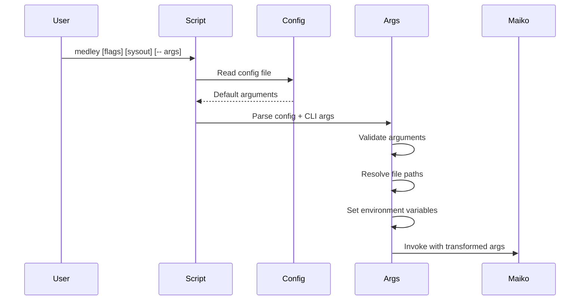
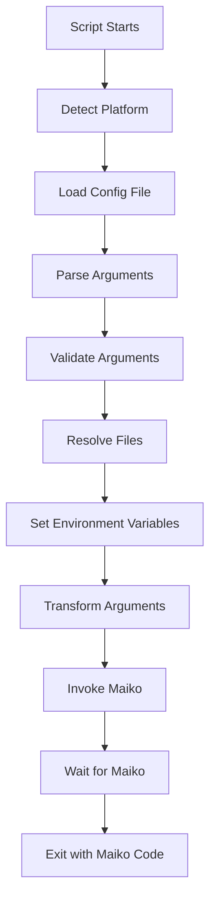

# Medley Script System

**Navigation**: [Medley README](../README.md) | [Medley Index](../INDEX.md) | [Architecture](../architecture.md)

## Overview

The Medley script system is the entry point for starting Medley. Scripts parse command-line arguments, set up the environment, resolve files, and invoke the Maiko emulator. The script system abstracts platform differences and provides a consistent interface across Linux, macOS, Windows, and WSL.

## Script Types

### Linux/macOS: `medley_run.sh`

Shell script for Linux and macOS platforms.

**Location**: `medley/scripts/medley/medley_run.sh`

**Characteristics**:

- Bash/shell script
- Handles X11 and SDL display backends
- Supports standard Unix path conventions
- Used by `medley.sh` wrapper script

**Source Code**: [medley/scripts/medley/medley_run.sh](medley/scripts/medley/medley_run.sh)

### macOS: `medley.command`

macOS application bundle script.

**Location**: `medley/scripts/medley/medley.command`

**Characteristics**:

- macOS-specific script
- Can be double-clicked in Finder
- Handles macOS-specific path conventions
- Similar functionality to `medley_run.sh` but macOS-optimized

**Source Code**: [medley/scripts/medley/medley.command](medley/scripts/medley/medley.command)

### Windows: `medley.ps1`

PowerShell script for Windows/Cygwin.

**Location**: `medley/scripts/medley/medley.ps1`

**Characteristics**:

- PowerShell script
- Handles Windows/Cygwin path conventions
- May use Docker for execution
- Windows-specific behaviors

**Source Code**: [medley/scripts/medley/medley.ps1](medley/scripts/medley/medley.ps1)

## Script Architecture

The Medley script system is modular, with functionality split across multiple sourced scripts:

### Main Script Components

1. **medley.sh** (or platform-specific entry point)
   - Main entry point
   - Sources other script components
   - Handles platform detection

2. **medley_args.sh**
   - Argument parsing logic
   - Config file processing
   - Argument validation

3. **medley_run.sh**
   - Runtime execution logic
   - Maiko invocation
   - Environment setup

4. **medley_configfile.sh**
   - Config file parsing
   - Default argument handling

5. **medley_vnc.sh** (WSL only)
   - VNC setup and execution
   - WSL-specific handling

6. **medley_usage.sh**
   - Usage message generation
   - Help text

## Argument Parsing

### Parsing Flow



### Argument Processing Order

1. **Config File**: Read default arguments from config file (if present)
2. **Command-Line**: Process command-line arguments (override config)
3. **Validation**: Validate argument combinations
4. **Resolution**: Resolve file paths and directories
5. **Transformation**: Transform Medley flags to Maiko flags
6. **Invocation**: Invoke Maiko with transformed arguments

### Argument Categories

#### Sysout Selection Flags

- `-f, --full`: Use `full.sysout`
- `-l, --lisp`: Use `lisp.sysout`
- `-a, --apps`: Use `apps.sysout`
- Explicit sysout argument: Use specified sysout file
- No flag/argument: Check for vmem file

**See**: [Sysout Files Component](sysout.md) for sysout file details

#### Configuration Flags

- `-c FILE, --config FILE`: Use specified config file
- `-c -, --config -`: Suppress config file usage

**See**: [Configuration Files Component](configuration.md) for config file details

#### Greet File Flags

- `-r FILE, --greet FILE`: Use specified greet file
- `-r -, --greet -`: Do not use greet file

**See**: [Greet Files Component](greetfiles.md) for greet file details

#### Display Flags

- `-g WxH, --geometry WxH`: Window geometry
- `-sc WxH, --screensize WxH`: Screen size
- `-d :N, --display :N`: X display (or "SDL" for SDL backend)
- `-v [+|-], --vnc [+|-]`: VNC mode (WSL only)
- `-ps N, --pixelscale N`: Pixel scale factor
- `-bw N, --borderwidth N`: Border width

#### Memory Flags

- `-m N, --mem N`: Virtual memory size in MB (default: 256MB)
- `-p FILE, --vmem FILE`: Virtual memory file path

**See**: [Virtual Memory Files Component](vmem.md) for vmem file details

#### Session Flags

- `-i ID, --id ID`: Run ID for this session
- `-x DIR, --logindir DIR`: LOGINDIR directory
- `-t STRING, --title STRING`: Window title

#### Network Flags (Nethub)

- `-nh-host HOST, --nethub-host HOST`: Nethub host
- `-nh-port PORT, --nethub-port PORT`: Nethub port
- `-nh-mac MAC, --nethub-mac MAC`: Nethub MAC address
- `-nh-debug, --nethub-debug`: Nethub debug mode

#### Other Flags

- `-h, --help`: Show help message
- `-z, --man`: Show man page
- `-ns, --noscroll`: Disable scroll bars
- `-cm FILE, --rem.cm FILE`: REM.CM file path
- `-cc FILE, --repeat FILE`: Repeat Medley run while file exists
- `-am, --automation`: Automation mode (WSL/VNC only)
- `--`: Pass remaining arguments to Maiko

### Pass-Through Arguments

Arguments after `--` are passed directly to Maiko without transformation:

```bash
medley -f -- -some-maiko-flag maiko-value
```

This allows direct Maiko flag access when needed.

## File Resolution

### Sysout File Resolution

Resolution order:

1. Explicit sysout argument: Use specified file path
2. `-f` flag: `MEDLEYDIR/loadups/full.sysout`
3. `-l` flag: `MEDLEYDIR/loadups/lisp.sysout`
4. `-a` flag: `MEDLEYDIR/loadups/apps.sysout`
5. No flag/argument: Check for vmem file (session continuation)

**Source Code Reference**: [medley/scripts/medley/medley_args.sh](medley/scripts/medley/medley_args.sh) - sysout resolution logic

### Vmem File Resolution

Resolution order:

1. `-p FILE` flag: Use specified file
2. Default: `LOGINDIR/vmem/lisp_{run-id}.virtualmem` or `LOGINDIR/vmem/lisp.virtualmem` (if run ID is "default")

**Source Code Reference**: [medley/scripts/medley/medley_run.sh](medley/scripts/medley/medley_run.sh) - vmem resolution logic

### Config File Resolution

Resolution order:

1. `-c FILE` flag: Use specified file
2. `~/.medley_config`: User home directory config
3. `MEDLEYDIR/.medley_config`: Medley directory config

**Source Code Reference**: [medley/scripts/medley/medley_configfile.sh](medley/scripts/medley/medley_configfile.sh) - config file resolution

### Greet File Resolution

Resolution order:

1. `-r FILE` flag: Use specified file
2. `-r -` flag: No greet file
3. Default: `MEDLEYDIR/greetfiles/INIT.LISP`

**Source Code Reference**: [medley/scripts/medley/medley_args.sh](medley/scripts/medley/medley_args.sh) - greet file resolution

## Environment Setup

Scripts set environment variables that Maiko reads:

### MEDLEYDIR

Top-level Medley installation directory. Computed by resolving symbolic links in script path.

**Source Code Reference**: Scripts compute MEDLEYDIR from script location

### LOGINDIR

User-specific Medley directory. Defaults to `MEDLEYDIR/logindir` or `HOME/il`, can be overridden with `-x` flag.

**Source Code Reference**: [medley/scripts/medley/medley_run.sh](medley/scripts/medley/medley_run.sh) - LOGINDIR setup

### LDESOURCESYSOUT

Source sysout file path. Set to resolved sysout file path.

**Source Code Reference**: [medley/scripts/medley/medley_run.sh](medley/scripts/medley/medley_run.sh) - LDESOURCESYSOUT setup

### LDEDESTSYSOUT

Destination vmem file path. Set based on run ID and LOGINDIR.

**Source Code Reference**: [medley/scripts/medley/medley_run.sh](medley/scripts/medley/medley_run.sh) - LDEDESTSYSOUT setup

### LDEINIT

Greet file path. Set to resolved greet file path.

**Source Code Reference**: [medley/scripts/medley/medley_args.sh](medley/scripts/medley/medley_args.sh) - LDEINIT setup

### LDEREMCM

REM.CM file path. Set if `-cm` flag is used.

**Source Code Reference**: [medley/scripts/medley/medley_args.sh](medley/scripts/medley/medley_args.sh) - LDEREMCM setup

**See**: [Interface - Environment Variables](../interface/environment.md) for complete environment variable documentation

## Maiko Invocation

### Invocation Pattern

Scripts invoke Maiko with transformed arguments:

```bash
"${maiko}" "${src_sysout}" \
           -id "${run_id}" \
           -title "${title}" \
           -g ${geometry} \
           -sc ${screensize} \
           ${borderwidth_flag} ${borderwidth_value} \
           ${pixelscale_flag} ${pixelscale_value} \
           ${noscroll_arg} \
           ${mem_flag} ${mem_value} \
           ${nh_host_flag} ${nh_host_value} \
           ${nh_port_flag} ${nh_port_value} \
           ${nh_mac_flag} ${nh_mac_value} \
           ${nh_debug_flag} ${nh_debug_value} \
           ${nofork_arg} \
           "$@"
```

**Source Code Reference**: [medley/scripts/medley/medley_run.sh](medley/scripts/medley/medley_run.sh) - `start_maiko()` function

### Maiko Executable Resolution

Scripts locate Maiko executable in this order:

1. `MAIKODIR` environment variable: `<MAIKODIR>/<osversion>.<machinetype>/lde`
2. `MEDLEYDIR/../maiko/`: `<MEDLEYDIR>/../maiko/<osversion>.<machinetype>/lde`
3. `MEDLEYDIR/maiko/`: `<MEDLEYDIR>/maiko/<osversion>.<machinetype>/lde`
4. PATH: `lde` on PATH

**Source Code Reference**: Scripts include Maiko resolution logic

### Argument Transformation

Medley flags are transformed to Maiko flags:

| Medley Flag | Maiko Flag | Transformation |
|------------|------------|----------------|
| `-f`, `-l`, `-a` | sysout argument | Resolved sysout file path |
| `-i ID` | `-id ID` | Direct pass-through |
| `-t STRING` | `-title STRING` | Direct pass-through |
| `-g WxH` | `-g WxH` | Direct pass-through |
| `-sc WxH` | `-sc WxH` | Direct pass-through |
| `-m N` | `-m N` | Direct pass-through |
| `-ps N` | `-ps N` | Direct pass-through |
| `-bw N` | `-bw N` | Direct pass-through |
| `-ns` | `-ns` | Direct pass-through |
| `-nh-*` | `-nh-*` | Direct pass-through |

**See**: [Interface - Command-Line Arguments](../interface/command-line.md) for complete argument mapping

## Error Handling

### Validation Errors

Scripts validate arguments and report errors:

- Unknown flags: "ERROR: Unknown flag: $1"
- Invalid file paths: Check file existence
- Invalid argument combinations: Validate mutually exclusive flags
- Missing required files: Check sysout file existence

### Maiko Execution Errors

Scripts handle Maiko execution errors:

- Exit code checking: Scripts check Maiko exit codes
- Error reporting: Display error messages
- Cleanup: Handle cleanup on errors

**Source Code Reference**: [medley/scripts/medley/medley_run.sh](medley/scripts/medley/medley_run.sh) - error handling

## Platform-Specific Behaviors

### Linux

- Uses `medley_run.sh`
- X11 or SDL display backend
- Standard Unix path conventions

**See**: [Platform - Linux](../platform/linux.md) for Linux-specific details

### macOS

- Uses `medley.command` or `medley_run.sh`
- X11 or SDL display backend
- macOS-specific path handling

**See**: [Platform - macOS](../platform/macos.md) for macOS-specific details

### Windows/Cygwin

- Uses `medley.ps1`
- May use Docker for execution
- Windows/Cygwin path conventions

**See**: [Platform - Windows](../platform/windows.md) for Windows-specific details

### WSL

- Uses `medley_run.sh` with VNC support
- VNC window on Windows side
- Automation mode support

**See**: [Platform - WSL](../platform/wsl.md) for WSL-specific details

## Script Flow

### Complete Startup Flow



## Related Documentation

- **Architecture**: [Architecture Overview](../architecture.md) - System architecture
- **Directory Structure**: [Directory Structure Component](directory-structure.md) - Directory organization
- **Sysout Files**: [Sysout Files Component](sysout.md) - Sysout file format
- **Virtual Memory Files**: [Virtual Memory Files Component](vmem.md) - Vmem files
- **Configuration Files**: [Configuration Files Component](configuration.md) - Config files
- **Greet Files**: [Greet Files Component](greetfiles.md) - Greet files
- **Interface - Command-Line**: [Command-Line Interface](../interface/command-line.md) - Complete argument mapping
- **Interface - Environment**: [Environment Variables](../interface/environment.md) - Environment variables
- **Interface - Protocols**: [Protocols](../interface/protocols.md) - Runtime protocols
- **Platform Documentation**: [Platform Documentation](../platform/) - Platform-specific behaviors

