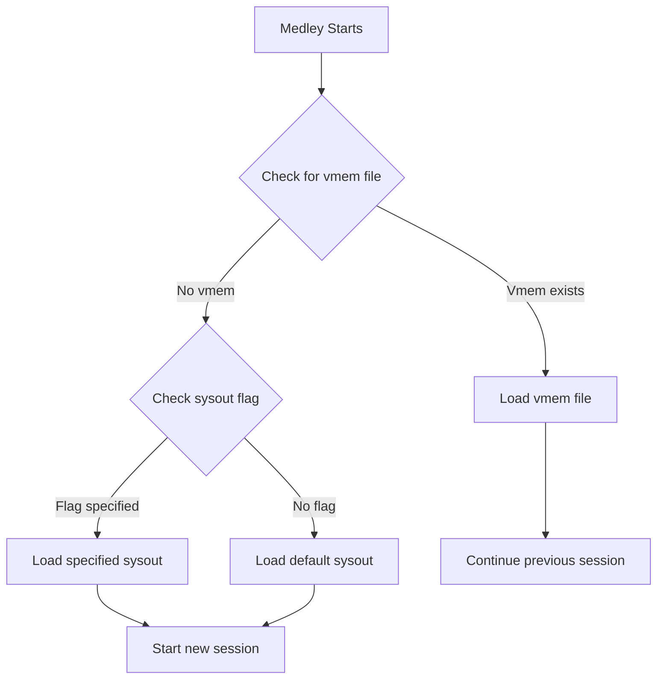

# Virtual Memory Files (Vmem)

**Navigation**: [Medley README](../README.md) | [Medley Index](../INDEX.md) | [Architecture](../architecture.md)

## Overview

Virtual memory files (vmem files) store the persistent state of a Medley session, allowing continuation across restarts. When Medley exits, it saves the current session state to a vmem file. On the next startup, if a vmem file exists, Medley loads it to continue the previous session.

## Vmem File Purpose

### Session Persistence

Vmem files enable session continuation:

1. **Startup**: Medley starts from sysout file (or vmem file if present)
2. **Execution**: User works in Medley session
3. **Exit**: Medley saves session state to vmem file
4. **Next Startup**: Medley loads vmem file to continue session

### State Preservation

Vmem files preserve:

- **Lisp Heap State**: Complete memory image
- **Code State**: All loaded code
- **Data State**: All data structures, variables, bindings
- **Execution State**: Current execution context (if applicable)
- **User Work**: All user-created data and modifications

## Vmem File Format

Vmem files are binary files containing:

- **Virtual Memory Image**: Complete Lisp heap state
- **Memory Layout**: Virtual memory page mappings
- **System State**: System variables and configuration
- **Session State**: Session-specific state

**Format Specification**: Binary format, platform-specific.

**See**: [Interface - File Formats](../interface/file-formats.md#vmem-file-format) for detailed format specification

**Related Maiko Documentation**: 
- `../../components/memory-management.md` - Virtual memory management
- `../../rewrite-spec/memory/virtual-memory.md` - Virtual memory specification

## Vmem File Resolution

### Default Location

Default vmem file location:

- **Default run ID**: `LOGINDIR/vmem/lisp.virtualmem`
- **Custom run ID**: `LOGINDIR/vmem/lisp_{run-id}.virtualmem`

**Source Code Reference**: [medley/scripts/medley/medley_run.sh](medley/scripts/medley/medley_run.sh) - vmem resolution logic

### Custom Location

Vmem file location can be specified with `-p, --vmem` flag:

```bash
medley -p /path/to/custom.virtualmem
```

**Warning**: Care must be taken not to use the same vmem file for two simultaneous Medley instances, as this can cause data corruption.

## Run ID and Vmem Files

### Run ID

Each Medley session has a run ID that determines the vmem file name:

- **Default run ID**: "default" → `lisp.virtualmem`
- **Custom run ID**: Specified with `-i, --id` flag → `lisp_{run-id}.virtualmem`

**See**: [Scripts Component](scripts.md#session-flags) for run ID details

### Multiple Sessions

Different run IDs allow multiple simultaneous Medley sessions:

```bash
medley -i session1  # Uses lisp_session1.virtualmem
medley -i session2  # Uses lisp_session2.virtualmem
```

Each session has its own vmem file and can run independently.

## Session Continuation Flow

### Startup Decision

Medley scripts decide whether to load sysout or vmem:



### Continuation Logic

1. **If vmem file exists and no sysout specified**: Load vmem file, continue session
2. **If sysout flag specified (`-f`, `-l`, `-a`)**: Load sysout file, start new session
3. **If explicit sysout argument**: Load specified sysout, start new session
4. **If `-u, --continue` flag**: Explicitly continue from vmem (if present)

**Source Code Reference**: [medley/scripts/medley/medley_args.sh](medley/scripts/medley/medley_args.sh) - continuation logic

## Vmem File Lifecycle

### Creation

Vmem files are created when Medley exits:

1. **Session End**: User exits Medley (or Medley terminates)
2. **State Save**: Maiko saves current session state
3. **File Write**: State written to vmem file
4. **File Location**: Written to `LOGINDIR/vmem/` directory

**Source Code Reference**: Maiko handles vmem file creation during exit

### Loading

Vmem files are loaded during Medley startup:

1. **File Check**: Scripts check for vmem file existence
2. **File Open**: Maiko opens vmem file
3. **State Restore**: Maiko restores session state from vmem
4. **Execution**: Medley continues from saved state

**Source Code Reference**: [medley/scripts/medley/medley_run.sh](medley/scripts/medley/medley_run.sh) - vmem loading

### Coordination with Maiko

Medley scripts coordinate with Maiko for vmem operations:

- **LDEDESTSYSOUT**: Environment variable set by scripts, tells Maiko where to save vmem
- **LDESOURCESYSOUT**: Environment variable set by scripts, tells Maiko which sysout to load (if no vmem)
- **File Paths**: Scripts resolve vmem file paths and pass to Maiko

**See**: [Interface - Environment Variables](../interface/environment.md) for environment variable details

## LOGINDIR and Vmem Files

### LOGINDIR

LOGINDIR is the user-specific Medley directory where vmem files are stored:

- **Default**: `MEDLEYDIR/logindir` or `HOME/il`
- **Override**: `-x DIR, --logindir DIR` flag

**See**: [Directory Structure Component](directory-structure.md#logindir-structure) for LOGINDIR details

### Vmem Directory

Vmem files are stored in `LOGINDIR/vmem/`:

- Scripts create this directory if it doesn't exist
- Each run ID gets its own vmem file in this directory

**Source Code Reference**: [medley/scripts/medley/medley_run.sh](medley/scripts/medley/medley_run.sh) - vmem directory creation

## Usage Examples

### Default Session Continuation

```bash
medley
# Loads LOGINDIR/vmem/lisp.virtualmem if present
# Otherwise starts from full.sysout
```

### Explicit Continuation

```bash
medley -u
# or
medley --continue
# Explicitly continue from vmem (if present)
```

### Custom Vmem File

```bash
medley -p /path/to/custom.virtualmem
# Use specified vmem file
```

### Multiple Sessions

```bash
medley -i work    # Session 1: lisp_work.virtualmem
medley -i test    # Session 2: lisp_test.virtualmem
```

### Start New Session (Ignore Vmem)

```bash
medley -f
# Start from full.sysout, ignore vmem file
```

## Platform Considerations

### File Format

Vmem file format is platform-specific:

- **Linux/macOS**: Native binary format
- **Windows/Cygwin**: Platform-specific format
- **Cross-Platform**: Vmem files are not portable across platforms

### Path Handling

Platform-specific path conventions apply:

- **Linux/macOS**: Standard Unix paths
- **Windows/Cygwin**: Windows/Cygwin path conventions
- **WSL**: WSL path conventions

**See**: [Platform Documentation](../platform/) for platform-specific details

## Related Documentation

- **Architecture**: [Architecture Overview](../architecture.md) - System architecture
- **Scripts**: [Scripts Component](scripts.md) - Script system and vmem resolution
- **Sysout Files**: [Sysout Files Component](sysout.md) - Sysout files and loading
- **Directory Structure**: [Directory Structure Component](directory-structure.md) - LOGINDIR structure
- **Interface - File Formats**: [File Formats](../interface/file-formats.md) - Vmem file format specification
- **Interface - Environment Variables**: [Environment Variables](../interface/environment.md) - LDEDESTSYSOUT and related variables
- **Interface - Protocols**: [Protocols](../interface/protocols.md) - Session management protocols

