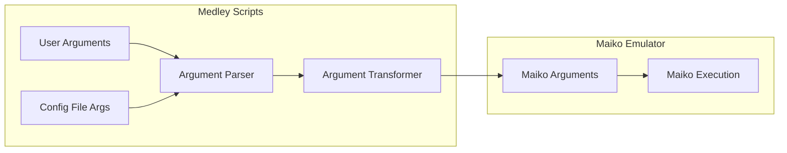

# Command-Line Interface

**Navigation**: [Medley README](../README.md) | [Medley Index](../INDEX.md) | [Interface Overview](README.md)

## Overview

This document provides complete documentation of the command-line argument mapping from Medley flags to Maiko flags. Medley scripts parse user arguments, transform them, and pass specific flags to the Maiko emulator.

**Source**: Based on `medley.1` man page and script implementation in `medley/scripts/medley/`

## Argument Transformation

### Transformation Process

Medley scripts transform arguments in this order:

1. **Config File**: Read default arguments from config file
2. **Command-Line**: Process command-line arguments (override config)
3. **Validation**: Validate argument combinations
4. **Transformation**: Transform Medley flags to Maiko flags
5. **Invocation**: Invoke Maiko with transformed arguments

**Source Code Reference**: [medley/scripts/medley/medley_args.sh](medley/scripts/medley/medley_args.sh) - argument parsing
**Source Code Reference**: [medley/scripts/medley/medley_run.sh](medley/scripts/medley/medley_run.sh) - Maiko invocation

## Complete Flag Mapping

### Sysout Selection Flags

| Medley Flag | Maiko Flag | Transformation | Description |
|------------|------------|---------------|-------------|
| `-f, --full` | sysout argument | `MEDLEYDIR/loadups/full.sysout` | Use full.sysout |
| `-l, --lisp` | sysout argument | `MEDLEYDIR/loadups/lisp.sysout` | Use lisp.sysout |
| `-a, --apps` | sysout argument | `MEDLEYDIR/loadups/apps.sysout` | Use apps.sysout |
| `-y FILE, --sysout FILE` | sysout argument | Specified file path | Use specified sysout |
| `-u, --continue` | sysout argument | Vmem file (if present) or full.sysout | Continue from vmem |
| Explicit sysout argument | sysout argument | Specified file path | Use specified sysout |

**See**: [Sysout Files Component](../components/sysout.md) for sysout file details

### Display Flags

| Medley Flag | Maiko Flag | Transformation | Description |
|------------|------------|---------------|-------------|
| `-g WxH, --geometry WxH` | `-g WxH` | Direct pass-through | Window geometry |
| `-sc WxH, --screensize WxH` | `-sc WxH` | Direct pass-through | Virtual screen size |
| `-d :N, --display :N` | `-d :N` | Direct pass-through | X display (or "SDL") |
| `-ps N, --pixelscale N` | `-ps N` | Direct pass-through | Pixel scale (SDL only) |
| `-bw N, --borderwidth N` | `-bw N` | Direct pass-through | Border width |
| `-ns, --noscroll` | `-ns` | Direct pass-through | Disable scroll bars |
| `-t STRING, --title STRING` | `-title STRING` | Direct pass-through | Window title |

**Platform Notes**:
- `-ps, --pixelscale`: Only applicable when display is SDL-based (Windows/Cygwin)
- `-d, --display`: Set to "SDL" to select SDL instead of X11
- `-t, --title`: Ignored when `--vnc` flag is set

### Memory Flags

| Medley Flag | Maiko Flag | Transformation | Description |
|------------|------------|---------------|-------------|
| `-m N, --mem N` | `-m N` | Direct pass-through | Virtual memory size (MB) |
| `-p FILE, --vmem FILE` | Environment variable | `LDEDESTSYSOUT=FILE` | Vmem file path |

**See**: [Virtual Memory Files Component](../components/vmem.md) for vmem file details

### Session Flags

| Medley Flag | Maiko Flag | Transformation | Description |
|------------|------------|---------------|-------------|
| `-i ID, --id ID` | `-id ID` | Direct pass-through | Run ID |
| `-x DIR, --logindir DIR` | Environment variable | `LOGINDIR=DIR` | LOGINDIR directory |

**See**: [Scripts Component](../components/scripts.md) for session management details

### Greet File Flags

| Medley Flag | Maiko Flag | Transformation | Description |
|------------|------------|---------------|-------------|
| `-r FILE, --greet FILE` | Environment variable | `LDEINIT=FILE` | Greet file path |
| `-r -, --greet -` | Environment variable | `LDEINIT` not set | No greet file |
| `-cm FILE, --rem.cm FILE` | Environment variable | `LDEREMCM=FILE` | REM.CM file path |

**See**: [Greet Files Component](../components/greetfiles.md) for greet file details

### Network Flags (Nethub)

| Medley Flag | Maiko Flag | Transformation | Description |
|------------|------------|---------------|-------------|
| `-nh-host HOST, --nethub-host HOST` | `-nh-host HOST` | Direct pass-through | Nethub host |
| `-nh-port PORT, --nethub-port PORT` | `-nh-port PORT` | Direct pass-through | Nethub port |
| `-nh-mac MAC, --nethub-mac MAC` | `-nh-mac MAC` | Direct pass-through | Nethub MAC address |
| `-nh-debug, --nethub-debug` | `-nh-debug` | Direct pass-through | Nethub debug mode |
| `-nh Host:Port:Mac:Debug, --nethub Host:Port:Mac:Debug` | Multiple flags | Parsed into separate flags | Combined nethub specification |

### Other Flags

| Medley Flag | Maiko Flag | Transformation | Description |
|------------|------------|---------------|-------------|
| `-nf, -NF, --nofork` | `-NF` | Direct pass-through | No fork (loadup only) |
| `--` | Pass-through | All remaining args | Pass to Maiko unchanged |

### Flags Not Passed to Maiko

These flags are handled by Medley scripts and not passed to Maiko:

- `-h, --help`: Show help message (script handles)
- `-z, --man`: Show man page (script handles)
- `-c FILE, --config FILE`: Config file specification (script handles)
- `-cc FILE, --repeat FILE`: Repeat Medley run (script handles)
- `-am, --automation`: Automation mode (script handles, WSL/VNC only)
- `-br BRANCH, --branch BRANCH`: Branch specification (script handles)
- `-prog EXE, --maikoprog EXE`: Maiko executable name (script handles)
- `--maikodir DIR`: Maiko directory (script handles, testing only)
- `-v [+|-], --vnc [+|-]`: VNC mode (script handles, WSL only)

## Maiko Invocation Pattern

### Invocation Function

Scripts invoke Maiko using the `start_maiko()` function:

```bash
"${maiko}" "${src_sysout}" \
           -id "${run_id}" \
           -title "${title}" \
           -g "${geometry}" \
           -sc "${screensize}" \
           ${borderwidth_flag} ${borderwidth_value} \
           ${pixelscale_flag} ${pixelscale_value} \
           ${noscroll_arg} \
           ${mem_flag} ${mem_value} \
           ${nh_host_flag} ${nh_host_value} \
           ${nh_port_flag} ${nh_port_value} \
           ${nh_mac_flag} ${nh_mac_value} \
           ${nh_debug_flag} ${nh_debug_value} \
           ${nofork_arg} \
           "$@"
```

**Source Code Reference**: [medley/scripts/medley/medley_run.sh](medley/scripts/medley/medley_run.sh) - `start_maiko()` function

### Argument Order

Arguments are passed to Maiko in this order:

1. **Sysout file**: First positional argument
2. **Standard flags**: `-id`, `-title`, `-g`, `-sc`, etc.
3. **Optional flags**: Border width, pixel scale, noscroll, memory, nethub
4. **Pass-through arguments**: Arguments after `--`

## Environment Variables Set

Before invoking Maiko, scripts set these environment variables:

- `MEDLEYDIR`: Top-level Medley installation directory
- `LOGINDIR`: User-specific Medley directory
- `LDESOURCESYSOUT`: Source sysout file path
- `LDEDESTSYSOUT`: Destination vmem file path
- `LDEINIT`: Greet file path
- `LDEREMCM`: REM.CM file path

**See**: [Environment Variables](environment.md) for complete environment variable documentation

## Pass-Through Arguments

Arguments after `--` are passed directly to Maiko without transformation:

```bash
medley -f -- -some-maiko-flag maiko-value
```

This allows direct access to Maiko flags not exposed by Medley scripts.

## Complete Flag Reference

### All Medley Flags

Based on `medley.1` man page:

#### Help and Information

- `-h, --help`: Show help message
- `-z, --man`: Show man page

#### Configuration

- `-c [FILE | -], --config [FILE | -]`: Config file specification

#### Sysout Selection

- `-f, --full`: Use full.sysout
- `-l, --lisp`: Use lisp.sysout
- `-a, --apps`: Use apps.sysout
- `-u, --continue`: Continue from vmem
- `-y [FILE | -], --sysout [FILE | -]`: Specify sysout file

#### Display

- `-g [WxH | -], --geometry [WxH | -]`: Window geometry
- `-sc [WxH | -], --screensize [WxH | -]`: Virtual screen size
- `-d [:N | -], --display [:N | -]`: X display (or "SDL")
- `-ps [N | -], --pixelscale [N | -]`: Pixel scale (SDL only)
- `-bw [N | -], --borderwidth [N | -]`: Border width
- `-ns [+ | -], --noscroll [+ | -]`: Scroll bar control
- `-t [STRING | -], --title [STRING | -]`: Window title
- `-v [+ | -], --vnc [+ | -]`: VNC mode (WSL only)

#### Memory

- `-m [N | -], --mem [N | -]`: Virtual memory size (MB)
- `-p [FILE | -], --vmem [FILE | -]`: Vmem file path

#### Session

- `-i [ID | - | -- | ---], --id [ID | - | -- | ---]`: Run ID
- `-x [DIR | - | --], --logindir [DIR | - | --]`: LOGINDIR

#### Greet Files

- `-r [FILE | -], --greet [FILE | -]`: Greet file
- `-cm [FILE | -], --rem.cm [FILE | -]`: REM.CM file

#### Network (Nethub)

- `-nh-host HOST, --nethub-host HOST`: Nethub host
- `-nh-port PORT, --nethub-port PORT`: Nethub port
- `-nh-mac MAC, --nethub-mac MAC`: Nethub MAC address
- `-nh-debug, --nethub-debug`: Nethub debug mode
- `-nh Host:Port:Mac:Debug, --nethub Host:Port:Mac:Debug`: Combined nethub specification

#### Other

- `-e [+ | -], --interlisp [+ | -]`: Interlisp Exec window (apps only)
- `-nf, -NF, --nofork`: No fork (loadup only)
- `-prog EXE, --maikoprog EXE`: Maiko executable name (loadup only)
- `--maikodir DIR`: Maiko directory (testing only)
- `-cc [FILE | -], --repeat [FILE | -]`: Repeat Medley run
- `-am, --automation`: Automation mode (WSL/VNC only)
- `-br [BRANCH | -], --branch [BRANCH | -]`: Branch specification

#### Positional Arguments

- `SYSOUT_FILE`: Explicit sysout file path
- `--`: Pass remaining arguments to Maiko

## Examples

### Basic Invocation

```bash
medley -f
# Transforms to:
# maiko MEDLEYDIR/loadups/full.sysout -id default -title "Medley Interlisp %i" -g 1440x900 -sc 1440x900 -m 256
```

### Custom Geometry

```bash
medley -f -g 1024x768
# Transforms to:
# maiko MEDLEYDIR/loadups/full.sysout -id default -title "Medley Interlisp %i" -g 1024x768 -sc 1024x768 -m 256
```

### With Pass-Through Arguments

```bash
medley -f -- -some-maiko-flag value
# Transforms to:
# maiko MEDLEYDIR/loadups/full.sysout -id default ... -some-maiko-flag value
```

### Session Continuation

```bash
medley -i work
# Transforms to:
# maiko LOGINDIR/vmem/lisp_work.virtualmem -id work ... (if vmem exists)
# or
# maiko MEDLEYDIR/loadups/full.sysout -id work ... (if no vmem)
```

## Argument Transformation Diagram



## Related Documentation

- **Scripts Component**: [Scripts Component](../components/scripts.md) - Script system and argument parsing
- **Environment Variables**: [Environment Variables](environment.md) - Environment variable communication
- **File Formats**: [File Formats](file-formats.md) - File format specifications
- **Protocols**: [Protocols](protocols.md) - Runtime communication protocols
- **Man Page**: [medley/docs/man-page/medley.1.md](medley/docs/man-page/medley.1.md) - Complete man page source

