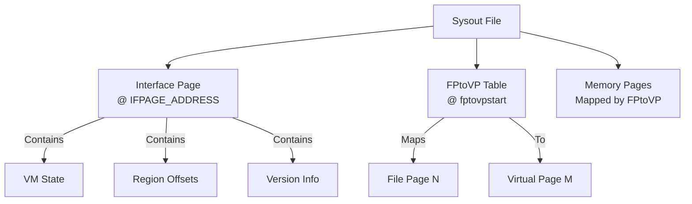

# Sysout File Format Specification

**Navigation**: [README](README.md) | [Cons Cells](cons-cells.md) | [Arrays](arrays.md) | [Function Headers](function-headers.md)

Complete specification of the sysout file format, including file structure, page organization, and loading procedures.

## Overview

Sysout files are persistent snapshots of the Lisp VM state. They contain all memory pages, VM state, and metadata needed to restore a complete Lisp environment.

## File Structure

### File Layout



### File Organization

- **Page-based**: File organized into 512-byte pages (`BYTESPER_PAGE = 512`)
- **Sparse**: Not all pages present (FPtoVP indicates which, 0xFFFF = sparse marker)
- **Mapped**: FPtoVP table maps file pages to virtual pages
- **IFPAGE Location**: Fixed at offset 512 bytes (`IFPAGE_ADDRESS = 512`)

## Interface Page (IFPAGE)

### IFPAGE Structure

Located at fixed address: `IFPAGE_ADDRESS`

```pseudocode
struct IFPAGE:
    key: uint             // Validation key (IFPAGE_KEYVAL = 0x15e3)
    lversion: uint        // Lisp version
    minbversion: uint     // Minimum bytecode version
    process_size: uint    // Process size in MB
    nactivepages: uint    // Number of active pages
    fptovpstart: uint     // FPtoVP table start offset
    storagefullstate: uint // Storage state
    // ... VM state fields ...
    stackbase: LispPTR    // Stack base address
    endofstack: LispPTR   // End of stack
    currentfxp: LispPTR   // Current frame pointer
    // ... other state ...
```

**CRITICAL**: The IFPAGE validation key `IFPAGE_KEYVAL` is `0x15e3` (not `0x12345678`). This value is defined in `maiko/inc/ifpage.h:15`. Any implementation must use this exact value for sysout validation to work correctly.

### IFPAGE Validation

```pseudocode
function ValidateSysout(file):
    // Read IFPAGE
    ifpage = ReadIFPAGE(file)

    // Check key
    if ifpage.key != IFPAGE_KEYVAL:
        Error("Invalid sysout file")

    // Check version compatibility
    if ifpage.lversion < LVERSION:
        Error("Sysout version too old")

    if ifpage.minbversion > MINBVERSION:
        Error("Sysout version too new")

    return true
```

## FPtoVP Table

### Table Structure

```pseudocode
struct FPtoVP:
    // Array mapping file page number to virtual page number
    entries: array[file_page_count] of virtual_page_number

    // Special values:
    // 0177777 (0xFFFF): Page not present in file
    // Other values: Virtual page number
```

### Table Location

- **Offset**: `(ifpage.fptovpstart - 1) * BYTESPER_PAGE + offset_adjust`
  - Non-BIGVM: `offset_adjust = 2`
  - BIGVM: `offset_adjust = 4`
- **Size**: `num_file_pages` entries (where `num_file_pages = sysout_size_halfpages / 2`)
  - `sysout_size_halfpages = (file_size / BYTESPER_PAGE) * 2`
- **Format**: Depends on BIGVM
  - Non-BIGVM: 16-bit entries (u16), read `num_file_pages * 2` bytes
  - BIGVM: 32-bit entries (u32), read `num_file_pages * 4` bytes

### Table Usage

```pseudocode
function LoadPage(file, file_page_number):
    // Check if page exists
    virtual_page = FPtoVP[file_page_number]
    if virtual_page == 0177777:
        return  // Page not in file

    // Seek to file page
    file_offset = file_page_number * BYTESPER_PAGE
    Seek(file, file_offset)

    // Read page data
    page_data = Read(file, BYTESPER_PAGE)

    // Map to virtual address
    virtual_address = virtual_page * BYTESPER_PAGE
    WriteMemory(virtual_address, page_data)
```

## Page Loading Algorithm

### Load Sysout File

```pseudocode
function LoadSysoutFile(filename, process_size):
    // Open file
    file = OpenFile(filename)

    // Read IFPAGE
    ifpage = ReadIFPAGE(file)
    ValidateSysout(ifpage)

    // Allocate virtual memory
    virtual_memory = AllocateMemory(process_size)

    // Read FPtoVP table
    fptovp = ReadFPtoVP(file, ifpage.fptovpstart, ifpage.nactivepages)

    // Load pages
    for file_page = 0 to sysout_size:
        virtual_page = FPtoVP[file_page]
        if virtual_page != 0177777:
            LoadPage(file, file_page, virtual_page)

    // Initialize VM state from IFPAGE
    InitializeVMState(ifpage)

    return virtual_memory
```

## Memory Regions in Sysout

### Stack Space

- **Offset**: STK_OFFSET
- **Contents**: Stack frames and data
- **Size**: Variable

### Atom Space

- **Offset**: ATOMS_OFFSET
- **Contents**: Symbol table
- **Size**: Variable

### Heap Space (MDS)

- **Offset**: MDS_OFFSET
- **Contents**: Cons cells, arrays, code
- **Size**: Variable

### Interface Page

- **Offset**: `IFPAGE_ADDRESS` (512 bytes from file start)
- **Contents**: VM state (~100 fields including validation key, version info, stack state, page management)
- **Size**: ~100 fields (varies by BIGVM/BYTESWAP flags, non-BIGVM version has ~70 fields)
- **Validation**: Key field (`ifpage.key`) must equal `IFPAGE_KEYVAL` (0x15e3)

## Byte Swapping

### Byte Swap Detection

```pseudocode
function NeedsByteSwap(ifpage):
    // Check if bytes need swapping
    // Based on host vs file byte order
    return host_byte_order != file_byte_order
```

### Byte Swap Procedure

```pseudocode
function SwapPage(page_data):
    // Swap 16-bit words
    for i = 0 to page_size / 2:
        word = page_data[i * 2]
        page_data[i * 2] = SwapBytes(word)
```

## Version Compatibility

### Version Checking

```pseudocode
function CheckVersionCompatibility(ifpage):
    // Check Lisp version
    // LVERSION = 21000 (from maiko/inc/version.h:54)
    if ifpage.lversion < LVERSION:
        Error("Sysout version %d < required %d", ifpage.lversion, LVERSION)

    // Check bytecode version
    // MINBVERSION = 21001 (from maiko/inc/version.h:55)
    if ifpage.minbversion > MINBVERSION:
        Error("Sysout bytecode version %d > supported %d", ifpage.minbversion, MINBVERSION)

    return true
```

**CRITICAL**: Version constants are defined in `maiko/inc/version.h`:
- `LVERSION = 21000` - Minimum Lisp version required
- `MINBVERSION = 21001` - Maximum bytecode version supported

Any implementation must use these exact values for version compatibility checking.

## File Size Validation

### Size Checking

```pseudocode
function ValidateFileSize(file, ifpage):
    file_size = GetFileSize(file)

    // BYTESPER_PAGE = 512 (from maiko/inc/lispemul.h:488)
    // Check page alignment
    if file_size mod BYTESPER_PAGE != 0:
        Warning("File size not page-aligned")

    // Check page count
    // sysout_size is calculated in half-pages: (file_size / BYTESPER_PAGE) * 2
    sysout_size_halfpages = (file_size / BYTESPER_PAGE) * 2
    num_file_pages = sysout_size_halfpages / 2

    if num_file_pages != ifpage.nactivepages:
        Error("File size mismatch: %d vs %d pages", num_file_pages, ifpage.nactivepages)
```

## Saving Sysout

### Save Procedure

```pseudocode
function SaveSysoutFile(filename):
    // Create file
    file = CreateFile(filename)

    // Write IFPAGE
    WriteIFPAGE(file, InterfacePage)

    // Build FPtoVP table
    fptovp = BuildFPtoVPTable()

    // Write FPtoVP table
    WriteFPtoVP(file, fptovp)

    // Write memory pages
    for virtual_page in active_pages:
        file_page = GetFilePageForVirtualPage(virtual_page)
        page_data = ReadMemoryPage(virtual_page)
        WritePage(file, file_page, page_data)

    CloseFile(file)
```

## Related Documentation

- [Memory Layout](../memory/memory-layout.md) - Memory regions
- [Virtual Memory](../memory/virtual-memory.md) - Page mapping
- [Function Headers](function-headers.md) - Code in sysout
