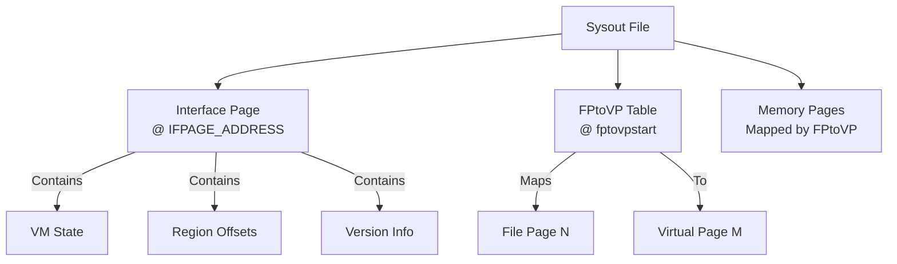

# Sysout File Format Specification

**Navigation**: [README](README.md) | [Cons Cells](cons-cells.md) | [Arrays](arrays.md) | [Function Headers](function-headers.md)

Complete specification of the sysout file format, including file structure, page organization, and loading procedures.

## Overview

Sysout files are persistent snapshots of the Lisp VM state. They contain all memory pages, VM state, and metadata needed to restore a complete Lisp environment.

## File Structure

### File Layout



### File Organization

- **Page-based**: File organized into 512-byte pages (`BYTESPER_PAGE = 512`)
- **Sparse**: Not all pages present (FPtoVP indicates which, 0xFFFF = sparse marker)
- **Mapped**: FPtoVP table maps file pages to virtual pages
- **IFPAGE Location**: Fixed at offset 512 bytes (`IFPAGE_ADDRESS = 512`)

## Interface Page (IFPAGE)

### IFPAGE Structure

Located at fixed address: `IFPAGE_ADDRESS`

```pseudocode
struct IFPAGE:
    key: uint             // Validation key (IFPAGE_KEYVAL = 0x15e3)
    lversion: uint        // Lisp version
    minbversion: uint     // Minimum bytecode version
    process_size: uint    // Process size in MB
    nactivepages: uint    // Number of active pages
    fptovpstart: uint     // FPtoVP table start offset
    storagefullstate: uint // Storage state
    // ... VM state fields ...
    stackbase: LispPTR    // Stack base address
    endofstack: LispPTR   // End of stack
    currentfxp: LispPTR   // Current frame pointer
    // ... other state ...
```

**CRITICAL**: The IFPAGE validation key `IFPAGE_KEYVAL` is `0x15e3` (not `0x12345678`). This value is defined in `maiko/inc/ifpage.h:15`. Any implementation must use this exact value for sysout validation to work correctly.

### IFPAGE Validation

```pseudocode
function ValidateSysout(file):
    // Read IFPAGE
    ifpage = ReadIFPAGE(file)

    // Check key
    if ifpage.key != IFPAGE_KEYVAL:
        Error("Invalid sysout file")

    // Check version compatibility
    if ifpage.lversion < LVERSION:
        Error("Sysout version too old")

    if ifpage.minbversion > MINBVERSION:
        Error("Sysout version too new")

    return true
```

## FPtoVP Table

### Table Structure

```pseudocode
struct FPtoVP:
    // Array mapping file page number to virtual page number
    entries: array[file_page_count] of virtual_page_number

    // Special values:
    // 0177777 (0xFFFF): Page not present in file
    // Other values: Virtual page number
```

### Table Location

**CRITICAL**: Exact byte offset calculation for FPtoVP table:

- **Base Offset**: `(ifpage.fptovpstart - 1) * BYTESPER_PAGE`
  - `fptovpstart` is a page number (1-based), so subtract 1 to get 0-based page number
  - Multiply by `BYTESPER_PAGE` (512) to get byte offset
- **Offset Adjustment**:
  - Non-BIGVM: `offset_adjust = 2` bytes (skip first DLword)
  - BIGVM: `offset_adjust = 4` bytes (skip first LispPTR)
- **Final Offset**: `(ifpage.fptovpstart - 1) * BYTESPER_PAGE + offset_adjust`
- **Size Calculation**:
  - `num_file_pages = (file_size / BYTESPER_PAGE)`
  - Table size: `num_file_pages * entry_size` bytes
    - Non-BIGVM: `entry_size = 2` (u16), total = `num_file_pages * 2` bytes
    - BIGVM: `entry_size = 4` (u32), total = `num_file_pages * 4` bytes
- **Format**: Depends on BIGVM
  - Non-BIGVM: 16-bit entries (u16), stored as big-endian in sysout, must byte-swap when reading on little-endian machines
  - BIGVM: 32-bit entries (u32), stored as big-endian in sysout, must byte-swap when reading on little-endian machines

### Table Usage

```pseudocode
function LoadPage(file, file_page_number):
    // Check if page exists
    virtual_page = FPtoVP[file_page_number]
    if virtual_page == 0177777:
        return  // Page not in file

    // Seek to file page
    file_offset = file_page_number * BYTESPER_PAGE
    Seek(file, file_offset)

    // Read page data
    page_data = Read(file, BYTESPER_PAGE)

    // Map to virtual address
    virtual_address = virtual_page * BYTESPER_PAGE
    WriteMemory(virtual_address, page_data)
```

## Page Loading Algorithm

### Load Sysout File

```pseudocode
function LoadSysoutFile(filename, process_size):
    // Open file
    file = OpenFile(filename)

    // Read IFPAGE
    ifpage = ReadIFPAGE(file, IFPAGE_ADDRESS)

    // CRITICAL: Byte-swap IFPAGE if host is little-endian
    // Sysout files are stored in big-endian format
    if NeedsByteSwap():
        SwapIFPAGE(ifpage)

    // Now validate (key check requires correct byte order)
    ValidateSysout(ifpage)

    // Allocate virtual memory
    virtual_memory = AllocateMemory(process_size)

    // Read FPtoVP table
    fptovp = ReadFPtoVP(file, ifpage.fptovpstart, ifpage.nactivepages)

    // Load pages
    for file_page = 0 to sysout_size:
        virtual_page = FPtoVP[file_page]
        if virtual_page != 0177777:
            LoadPage(file, file_page, virtual_page)

    // Initialize VM state from IFPAGE
```

### Page Loading with Byte Swapping

**CRITICAL**: Page data is stored in big-endian format in sysout files. When loading on little-endian machines, byte swapping is required for multi-byte values.

```pseudocode
function LoadPage(file, file_page_number, virtual_page_number):
    // Calculate file offset: file_page_number * BYTESPER_PAGE
    file_offset = file_page_number * 512  // BYTESPER_PAGE = 512
    
    // Seek to file page
    Seek(file, file_offset)
    
    // Read page data (512 bytes)
    page_buffer = Read(file, 512)
    
    // CRITICAL: Page data is stored as-is (no byte swapping needed for raw bytes)
    // Byte swapping is only needed when interpreting multi-byte values:
    // - DLword (2 bytes): Swap bytes when reading as integer
    // - LispPTR (4 bytes): Swap bytes when reading as integer
    // - But raw page data can be copied directly to virtual memory
    
    // Calculate virtual address: virtual_page_number * BYTESPER_PAGE
    virtual_address = virtual_page_number * 512
    
    // Copy page data directly to virtual memory
    // Note: Byte swapping happens when reading structured data (IFPAGE, frames, etc.)
    // not when copying raw page data
    WriteMemory(virtual_address, page_buffer, 512)
```

**Byte Swapping Details**:
- **IFPAGE**: All DLword fields must be byte-swapped after reading
- **FPtoVP Table**: Each entry (u16 or u32) must be byte-swapped after reading
- **Frame Structures**: DLword and LispPTR fields must be byte-swapped when reading
- **Function Headers**: DLword fields must be byte-swapped when reading
- **Raw Page Data**: Can be copied directly; byte swapping happens when interpreting structured data
    InitializeVMState(ifpage)

    return virtual_memory
```

### Frame Structure Reading

When reading frame structures (FX) from sysout files, multi-byte fields must be byte-swapped:

```pseudocode
function ReadFrame(virtual_memory, frame_offset):
    // FX structure fields (all stored big-endian in sysout):
    // - nextblock: LispPTR (4 bytes, offset 0)
    // - link: LispPTR (4 bytes, offset 4)
    // - fnheader: LispPTR (4 bytes, offset 8)
    // - pcoffset: DLword (2 bytes, offset 12)

    // Read fnheader field (offset 8 bytes from frame start)
    // CRITICAL: Byte-swap LispPTR from big-endian to little-endian
    fnheader_be = ReadU32BigEndian(virtual_memory, frame_offset + 8)
    fnheader_addr = ByteSwapU32(fnheader_be)

    // Read pcoffset field (offset 12 bytes from frame start)
    // CRITICAL: Byte-swap DLword from big-endian to little-endian
    pcoffset_be = ReadU16BigEndian(virtual_memory, frame_offset + 12)
    pcoffset = ByteSwapU16(pcoffset_be)

    return Frame(fnheader_addr, pcoffset, ...)
```

**CRITICAL**: All multi-byte fields in frame structures are stored in big-endian format in sysout files. When reading on little-endian machines, byte swapping is required.

**C Reference**: `maiko/src/main.c:797-807` - Frame reading and PC initialization

## Memory Regions in Sysout

### Stack Space

- **Offset**: STK_OFFSET
- **Contents**: Stack frames and data
- **Size**: Variable

### Atom Space

- **Offset**: ATOMS_OFFSET
- **Contents**: Symbol table
- **Size**: Variable

### Heap Space (MDS)

- **Offset**: MDS_OFFSET
- **Contents**: Cons cells, arrays, code
- **Size**: Variable

### Interface Page

- **Offset**: `IFPAGE_ADDRESS` (512 bytes from file start)
- **Contents**: VM state (~100 fields including validation key, version info, stack state, page management)
- **Size**: ~100 fields (varies by BIGVM/BYTESWAP flags, non-BIGVM version has ~70 fields)
- **Validation**: Key field (`ifpage.key`) must equal `IFPAGE_KEYVAL` (0x15e3)

## Byte Swapping

**CRITICAL**: Sysout files are stored in **big-endian byte order** (network byte order). When loading on a little-endian machine, byte swapping is required for all multi-byte values.

### Byte Order in Sysout Files

- **File Format**: Big-endian (network byte order)
- **DLword fields**: Stored as `[high_byte, low_byte]`
- **LispPTR fields**: Stored as two big-endian DLwords `[h1, l1, h2, l2]`
- **IFPAGE structure**: All fields stored in big-endian format

### Byte Swap Detection

```pseudocode
function NeedsByteSwap():
    // Sysout files are always big-endian
    // Swap needed if host is little-endian
    return host_byte_order == LITTLE_ENDIAN
```

**Note**: The C implementation uses `#ifdef BYTESWAP` to conditionally compile byte swapping code. On little-endian machines (e.g., x86_64), `BYTESWAP` is defined and byte swapping is performed.

### Byte Swap Procedure for IFPAGE

The IFPAGE structure must be byte-swapped immediately after reading from the file, before validation:

```pseudocode
function LoadSysoutFile(filename):
    // Read IFPAGE from file
    ifpage = ReadIFPAGE(file, IFPAGE_ADDRESS)

    // CRITICAL: Byte-swap IFPAGE if needed
    if NeedsByteSwap():
        SwapIFPAGE(ifpage)

    // Now validate (key check will work correctly)
    ValidateSysout(ifpage)
    // ... rest of loading ...
```

### IFPAGE Byte Swapping

The C implementation uses `word_swap_page()` which swaps 32-bit words using `ntohl()`:

```pseudocode
function SwapIFPAGE(ifpage):
    // C: word_swap_page((unsigned short *)&ifpage, (3 + sizeof(IFPAGE)) / 4)
    // This treats IFPAGE as array of u32 words and swaps each using ntohl()
    // ntohl() converts: [b0, b1, b2, b3] -> [b3, b2, b1, b0]

    num_u32_words = (3 + sizeof(IFPAGE)) / 4
    for i = 0 to num_u32_words:
        word = ReadU32(ifpage, i * 4)
        swapped_word = ntohl(word)  // Network to host long (32-bit)
        WriteU32(ifpage, i * 4, swapped_word)
```

**Alternative Approach**: Since IFPAGE contains only DLword (u16) and LispPTR (u32) fields, swapping u16 words also works correctly:

- DLword fields: Swap bytes `[b0, b1] -> [b1, b0]`
- LispPTR fields: Swapped twice (once per u16), resulting in correct little-endian u32

### FPtoVP Table Byte Swapping

The FPtoVP table entries also need byte swapping:

```pseudocode
function LoadFPtoVPTable(file, ifpage):
    // Read table entries
    entries = ReadFPtoVPEntries(file, ...)

    // Byte-swap entries if needed
    if NeedsByteSwap():
        for i = 0 to num_entries:
            if is_bigvm:
                entries[i] = ntohl(entries[i])  // 32-bit entry
            else:
                entries[i] = ntohs(entries[i])  // 16-bit entry
```

**C Reference**: `maiko/src/ldsout.c:117-119, 254-270` - Byte swapping for IFPAGE and FPtoVP table

### Memory Pages Byte Swapping

Memory pages loaded from the sysout file may also need byte swapping, depending on their content type (code vs data). Code pages typically need byte swapping, while data pages may be handled differently.

**C Reference**: `maiko/src/ldsout.c:327-328` - Byte swapping for memory pages

## Version Compatibility

### Version Checking

```pseudocode
function CheckVersionCompatibility(ifpage):
    // Check Lisp version
    // LVERSION = 21000 (from maiko/inc/version.h:54)
    if ifpage.lversion < LVERSION:
        Error("Sysout version %d < required %d", ifpage.lversion, LVERSION)

    // Check bytecode version
    // MINBVERSION = 21001 (from maiko/inc/version.h:55)
    if ifpage.minbversion > MINBVERSION:
        Error("Sysout bytecode version %d > supported %d", ifpage.minbversion, MINBVERSION)

    return true
```

**CRITICAL**: Version constants are defined in `maiko/inc/version.h`:

- `LVERSION = 21000` - Minimum Lisp version required
- `MINBVERSION = 21001` - Maximum bytecode version supported

Any implementation must use these exact values for version compatibility checking.

## File Size Validation

### Size Checking

```pseudocode
function ValidateFileSize(file, ifpage):
    file_size = GetFileSize(file)

    // BYTESPER_PAGE = 512 (from maiko/inc/lispemul.h:488)
    // Check page alignment
    if file_size mod BYTESPER_PAGE != 0:
        Warning("File size not page-aligned")

    // Check page count
    // sysout_size is calculated in half-pages: (file_size / BYTESPER_PAGE) * 2
    sysout_size_halfpages = (file_size / BYTESPER_PAGE) * 2
    num_file_pages = sysout_size_halfpages / 2

    if num_file_pages != ifpage.nactivepages:
        Error("File size mismatch: %d vs %d pages", num_file_pages, ifpage.nactivepages)
```

## Saving Sysout

### Save Procedure

```pseudocode
function SaveSysoutFile(filename):
    // Create file
    file = CreateFile(filename)

    // Write IFPAGE
    WriteIFPAGE(file, InterfacePage)

    // Build FPtoVP table
    fptovp = BuildFPtoVPTable()

    // Write FPtoVP table
    WriteFPtoVP(file, fptovp)

    // Write memory pages
    for virtual_page in active_pages:
        file_page = GetFilePageForVirtualPage(virtual_page)
        page_data = ReadMemoryPage(virtual_page)
        WritePage(file, file_page, page_data)

    CloseFile(file)
```

## Related Documentation

- [Memory Layout](../memory/memory-layout.md) - Memory regions
- [Virtual Memory](../memory/virtual-memory.md) - Page mapping
- [Function Headers](function-headers.md) - Code in sysout
