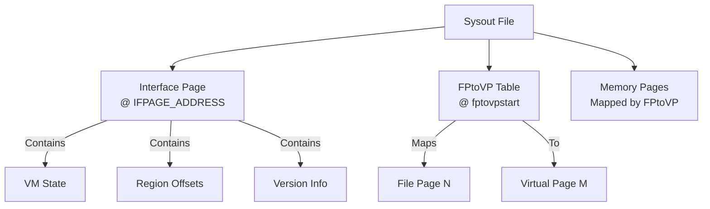

# Sysout File Format Specification

**Navigation**: [README](README.md) | [Cons Cells](cons-cells.md) | [Arrays](arrays.md) | [Function Headers](function-headers.md)

Complete specification of the sysout file format, including file structure, page organization, and loading procedures.

## Overview

Sysout files are persistent snapshots of the Lisp VM state. They contain all memory pages, VM state, and metadata needed to restore a complete Lisp environment.

## File Structure

### File Layout



### File Organization

- **Page-based**: File organized into 512-byte pages (`BYTESPER_PAGE = 512`)
- **Sparse**: Not all pages present (FPtoVP indicates which, 0xFFFF = sparse marker)
- **Mapped**: FPtoVP table maps file pages to virtual pages
- **IFPAGE Location**: Fixed at offset 512 bytes (`IFPAGE_ADDRESS = 512`)

## Interface Page (IFPAGE)

### IFPAGE Structure

Located at fixed address: `IFPAGE_ADDRESS` (512 bytes from start of file)

The IFPAGE structure contains ~100 fields that define the complete VM state, memory layout, and system configuration. It must match the C structure definition in `maiko/inc/ifpage.h` exactly for byte-for-byte compatibility.

**Complete Structure** (non-BIGVM, non-BYTESWAP version):

```pseudocode
struct IFPAGE:
    // Frame pointers (DLword - 16-bit stack offsets from Stackspace)
    currentfxp: DLword      // Current frame pointer (DLword offset from Stackspace)
    resetfxp: DLword        // Reset frame pointer
    subovfxp: DLword        // Stack overflow frame pointer
    kbdfxp: DLword          // Keyboard interrupt frame pointer
    hardreturnfxp: DLword   // Hard return frame pointer
    gcfxp: DLword           // GC frame pointer
    faultfxp: DLword        // Fault frame pointer
    endofstack: DLword      // End of stack (DLword offset from Stackspace)

    // Version information (DLword)
    lversion: DLword        // Lisp version
    minrversion: DLword     // Minimum runtime version
    minbversion: DLword     // Minimum bytecode version
    rversion: DLword        // Runtime version
    bversion: DLword        // Bytecode version
    machinetype: DLword     // Machine type (MACHINETYPE_MAIKO = 3)
    miscfxp: DLword         // Miscellaneous frame pointer

    // Validation and identification (DLword)
    key: DLword             // Validation key (IFPAGE_KEYVAL = 0x15e3) - CRITICAL
    serialnumber: DLword    // Serial number
    emulatorspace: DLword   // Emulator space identifier
    screenwidth: DLword     // Screen width in pixels
    nxtpmaddr: DLword       // Next PM address

    // Page management (DLword)
    nactivepages: DLword    // Number of active pages
    ndirtypages: DLword     // Number of dirty pages
    filepnpmp0: DLword      // File page number PM pointer 0
    filepnpmt0: DLword      // File page number PM table 0
    teleraidfxp: DLword     // Teleray RAID frame pointer
    filler1: DLword         // Reserved filler
    filler2: DLword         // Reserved filler
    filler3: DLword         // Reserved filler

    // User information (DLword)
    usernameaddr: DLword    // Username address (LispPTR)
    userpswdaddr: DLword    // User password address (LispPTR)
    stackbase: DLword       // Stack base (DLword offset from Stackspace)

    // Fault handling (DLword)
    faulthi: DLword         // Fault high word
    faultlo: DLword         // Fault low word
    devconfig: DLword       // Device configuration (was realpagetable)

    // Real page table (DLword)
    rptsize: DLword         // Real page table size
    rpoffset: DLword        // Real page table offset
    wasrptlast: DLword      // Was real page table last
    embufvp: DLword         // Emulator buffer virtual page

    // Network host addresses (DLword)
    nshost0: DLword         // Network host address 0
    nshost1: DLword         // Network host address 1
    nshost2: DLword         // Network host address 2

    // Memory zones (DLword)
    mdszone: DLword         // MDS zone identifier
    mdszonelength: DLword   // MDS zone length
    emubuffers: DLword      // Emulator buffers identifier
    emubuflength: DLword    // Emulator buffer length
    process_size: DLword    // Process size in MB (was lastnumchars)
    storagefullstate: DLword // Storage full state (was sysdisk)
    isfmap: DLword          // ISF map identifier

    // Miscapply stack (LispPTR - 32-bit pointers, not ref counted)
    miscstackfn: LispPTR    // Miscapply stack function pointer
    miscstackarg1: LispPTR  // Miscapply stack argument 1
    miscstackarg2: LispPTR  // Miscapply stack argument 2
    miscstackresult: LispPTR // Miscapply stack result

    // Page management continued (DLword)
    nrealpages: DLword      // Number of real pages
    lastlockedfilepage: DLword // Last locked file page
    lastdominofilepage: DLword // Last domino file page
    fptovpstart: DLword     // FPtoVP table start page number (1-based)
    fakemousebits: DLword   // Fake mouse bits
    dl24bitaddressable: DLword // 24-bit addressable flag
    realpagetableptr: LispPTR // Real page table pointer
    dllastvmempage: DLword  // Last VM emulator page
    fullspaceused: DLword   // Full space used flag
    fakekbdad4: DLword      // Fake keyboard address 4
    fakekbdad5: DLword      // Fake keyboard address 5
```

**Field Types**:
- `DLword`: 16-bit unsigned integer (2 bytes)
- `LispPTR`: 32-bit unsigned integer (4 bytes) - virtual address in Lisp address space

**Byte Layout**:
- All fields are packed (no padding between fields)
- Total structure size: ~200 bytes (varies by BIGVM/BYTESWAP configuration)
- Fields are stored in big-endian format in sysout files
- Must be byte-swapped when reading on little-endian machines

**Critical Fields**:
- `key`: Must be `0x15e3` for valid sysout files
- `fptovpstart`: 1-based page number where FPtoVP table starts (calculate offset: `(fptovpstart - 1) * BYTESPER_PAGE`)
- `currentfxp`: DLword offset from Stackspace (not a LispPTR!) - multiply by 2 for byte offset
- `stackbase`, `endofstack`: DLword offsets from Stackspace
- `process_size`: Process size in MB (0 = use default 64MB)

**CRITICAL**: The IFPAGE validation key `IFPAGE_KEYVAL` is `0x15e3` (not `0x12345678`). This value is defined in `maiko/inc/ifpage.h:15`. Any implementation must use this exact value for sysout validation to work correctly.

### IFPAGE Validation

```pseudocode
function ValidateSysout(file):
    // Read IFPAGE
    ifpage = ReadIFPAGE(file)

    // Check key
    if ifpage.key != IFPAGE_KEYVAL:
        Error("Invalid sysout file")

    // Check version compatibility
    if ifpage.lversion < LVERSION:
        Error("Sysout version too old")

    if ifpage.minbversion > MINBVERSION:
        Error("Sysout version too new")

    return true
```

## FPtoVP Table

### Table Structure

```pseudocode
struct FPtoVP:
    // Array mapping file page number to virtual page number
    entries: array[file_page_count] of virtual_page_number

    // Special values:
    // 0177777 (0xFFFF): Page not present in file
    // Other values: Virtual page number
```

### Table Location

**CRITICAL**: Exact byte offset calculation for FPtoVP table:

- **Base Offset**: `(ifpage.fptovpstart - 1) * BYTESPER_PAGE`
  - `fptovpstart` is a page number (1-based), so subtract 1 to get 0-based page number
  - Multiply by `BYTESPER_PAGE` (512) to get byte offset
- **Offset Adjustment**:
  - Non-BIGVM: `offset_adjust = 2` bytes (skip first DLword)
  - BIGVM: `offset_adjust = 4` bytes (skip first LispPTR)
- **Final Offset**: `(ifpage.fptovpstart - 1) * BYTESPER_PAGE + offset_adjust`
- **Size Calculation**:
  - `num_file_pages = (file_size / BYTESPER_PAGE)`
  - Table size: `num_file_pages * entry_size` bytes
    - Non-BIGVM: `entry_size = 2` (u16), total = `num_file_pages * 2` bytes
    - BIGVM: `entry_size = 4` (u32), total = `num_file_pages * 4` bytes
- **Format**: Depends on BIGVM
  - Non-BIGVM: 16-bit entries (u16), stored as big-endian in sysout, must byte-swap when reading on little-endian machines
  - BIGVM: 32-bit entries (u32), stored as big-endian in sysout, must byte-swap when reading on little-endian machines

### BIGVM Configuration (REQUIRED)

**CRITICAL**: All implementations (Zig and Lisp) **MUST** support **BIGVM mode only**. The non-BIGVM code path is **NOT** supported and can be ignored.

**BIGVM** is a build-time configuration that enables support for larger address spaces (up to 256MB). It affects FPtoVP table structure and memory addressing:

#### FPtoVP Table Storage (BIGVM Format - REQUIRED)

**All implementations MUST use BIGVM format**:
- **Type**: `unsigned int *fptovp` (32-bit cells) **← REQUIRED**
- **Entry Size**: 32 bits per entry
- **Structure**:
  - Low 16 bits: Virtual page number (accessed via `GETFPTOVP`)
  - High 16 bits: Page OK flag (accessed via `GETPAGEOK`)
- **Table Size**: `sysout_size * 2` bytes (each entry is 4 bytes)
- **Reading**: Read `sysout_size * 2` bytes from sysout file

~~**non-BIGVM format**~~ **← NOT SUPPORTED, IGNORE**

#### Macro Definitions (BIGVM Format - REQUIRED)

**All implementations MUST use these macros** (`maiko/inc/lispemul.h:587-589`):
```c
#define GETFPTOVP(b, o) ((b)[o])           // Returns low 16 bits (virtual page number)
#define GETPAGEOK(b, o) ((b)[o] >> 16)     // Returns high 16 bits (page OK flag)
```

**Implementation Notes**:
- `b` is `unsigned int *` (32-bit array)
- `o` is the file page index
- `GETFPTOVP` returns the full 32-bit value, implicitly cast to `unsigned short` (low 16 bits)
- `GETPAGEOK` returns high 16 bits via right shift

~~**non-BIGVM macros**~~ **← NOT SUPPORTED, IGNORE**

#### Current Investigation Status (2025-12-11)

**Maiko C Emulator Build**:
- **Configuration**: **BIGVM IS DEFINED** (confirmed by compile-time diagnostics)
- **BYTESWAP**: Also defined
- **fptovp Type**: `unsigned int *` (32-bit cells, not 16-bit words)
- **Runtime Behavior**: Confirmed BIGVM behavior
  - `GETPAGEOK(fptovp, 9427) = 0x0000` (high 16 bits)
  - `GETFPTOVP(fptovp, 9427) = 0x012e (302)` (low 16 bits)
  - Full 32-bit value: `0x0000012e` (302)

**Mystery Solved**:
- In BIGVM mode, each FPtoVP entry is a 32-bit `unsigned int`
- `GETFPTOVP(b, o) = b[o]` returns the full 32-bit value, cast to `unsigned short` (low 16 bits)
- `GETPAGEOK(b, o) = ((b)[o] >> 16)` returns high 16 bits
- For entry 9427: `fptovp[9427] = 0x0000012e`, so:
  - `GETFPTOVP` = `(unsigned short)(0x0000012e)` = `0x012e` (302) ✓
  - `GETPAGEOK` = `(0x0000012e >> 16)` = `0x0000` ✓

**Sysout File**:
- **File**: `medley/internal/loadups/starter.sysout`
- **Format**: BIGVM format (32-bit FPtoVP entries)
- **FPtoVP Table**: Contains entries that map to virtual page 302 (frame location)

**Key Code Locations**:
- Macro definitions: `maiko/inc/lispemul.h:587-593`
- GETWORDBASEWORD: `maiko/inc/lsptypes.h:377-378` (non-BYTESWAP) or `580` (BYTESWAP)
- FPtoVP reading: `maiko/src/ldsout.c:287-306` (BIGVM path) **← USE THIS PATH ONLY**
- Diagnostic code: `maiko/src/ldsout.c:199-220` (early), `304-340` (runtime), `499-540` (entry 9427)

### Table Usage

```pseudocode
function LoadPage(file, file_page_number):
    // Check if page exists
    virtual_page = FPtoVP[file_page_number]
    if virtual_page == 0177777:
        return  // Page not in file

    // Seek to file page
    file_offset = file_page_number * BYTESPER_PAGE
    Seek(file, file_offset)

    // Read page data
    page_data = Read(file, BYTESPER_PAGE)

    // Map to virtual address
    virtual_address = virtual_page * BYTESPER_PAGE
    WriteMemory(virtual_address, page_data)
```

## Page Loading Algorithm

### Load Sysout File

```pseudocode
function LoadSysoutFile(filename, process_size):
    // Open file
    file = OpenFile(filename)

    // Read IFPAGE
    ifpage = ReadIFPAGE(file, IFPAGE_ADDRESS)

    // CRITICAL: Byte-swap IFPAGE if host is little-endian
    // Sysout files are stored in big-endian format
    if NeedsByteSwap():
        SwapIFPAGE(ifpage)

    // Now validate (key check requires correct byte order)
    ValidateSysout(ifpage)

    // Allocate virtual memory
    virtual_memory = AllocateMemory(process_size)
    
    // CRITICAL: Zero virtual memory to ensure sparse pages are initialized correctly
    // C emulator initializes memory to zeros, so sparse/unmapped pages should be zero
    // This ensures that pages not loaded from sysout file contain zeros, not garbage
    ZeroMemory(virtual_memory, process_size)

    // Read FPtoVP table
    fptovp = ReadFPtoVP(file, ifpage.fptovpstart, ifpage.nactivepages)

    // Load pages
    for file_page = 0 to sysout_size:
        virtual_page = FPtoVP[file_page]
        if virtual_page != 0177777:
            LoadPage(file, file_page, virtual_page)

    // Initialize VM state from IFPAGE
```

### Page Loading with Byte Swapping

**CRITICAL**: Page data is stored in big-endian format in sysout files. When loading on little-endian machines, pages must be byte-swapped after loading to convert DLwords from big-endian to little-endian format.

```pseudocode
function LoadPage(file, file_page_number, virtual_page_number):
    // Calculate file offset: file_page_number * BYTESPER_PAGE
    file_offset = file_page_number * 512  // BYTESPER_PAGE = 512

    // Seek to file page
    Seek(file, file_offset)

    // Read page data (512 bytes)
    page_buffer = Read(file, 512)

    // Calculate virtual address: virtual_page_number * BYTESPER_PAGE
    virtual_address = virtual_page_number * 512

    // Copy page data to virtual memory
    WriteMemory(virtual_address, page_buffer, 512)
    
    // CRITICAL: Byte-swap page data (big-endian sysout -> little-endian native)
    // C: #ifdef BYTESWAP word_swap_page((DLword *)(lispworld_scratch + lispworld_offset), 128); #endif
    // word_swap_page swaps u16 words, so we swap each DLword (2 bytes) in the page
    // This converts: [high_byte, low_byte] -> [low_byte, high_byte] for each DLword
    page_dlwords = GetDLwordArray(virtual_memory, virtual_address)
    num_dlwords = 512 / 2  // 256 DLwords per page
    for i = 0 to num_dlwords:
        // Swap bytes in each DLword: [high, low] -> [low, high]
        temp = page_dlwords[i] & 0xFF
        page_dlwords[i] = ((page_dlwords[i] >> 8) & 0xFF) | (temp << 8)
```

**Byte Swapping Details**:
- **IFPAGE**: All DLword fields must be byte-swapped after reading
- **FPtoVP Table**: Each entry (u16 or u32) must be byte-swapped after reading
- **Memory Pages**: All DLwords in each page must be byte-swapped after loading (C: `word_swap_page`)
- **Frame Structures**: After page byte-swapping, frame fields are in native little-endian format
- **Function Headers**: After page byte-swapping, function header fields are in native little-endian format

**C Reference**: `maiko/src/ldsout.c:676-678` - `word_swap_page((DLword *)(lispworld_scratch + lispworld_offset), 128);`

## Byte-Endianness Best Practices

### General Rules

1. **Sysout Format**: Always store data in **big-endian format** (network byte order)
2. **Host Adaptation**: Byte-swap when loading on little-endian machines
3. **Memory Access**: Use specialized macros that handle byte order differences
4. **Address Handling**: Never byte-swap address values (LispPTR) - they are opaque 32-bit offsets

### Data vs Address Endianness

**CRITICAL DISTINCTION**: The Maiko emulator handles **data values** and **address values** differently:

#### Data Values (Subject to Byte-Swapping)

- **Stored in**: Big-endian format in sysout files
- **Byte-swapped**: When loaded on little-endian hosts
- **Accessed via**: Specialized macros that handle byte order differences
- **Examples**: DLword values, LispPTR values used as data, frame fields, function header fields

#### Address Values (Never Byte-Swapped)

- **Treated as**: Opaque 32-bit offsets into virtual memory
- **No byte-swapping**: Applied to address calculations
- **Converted via**: Pointer arithmetic (`Lisp_world + offset`)
- **Examples**: LispPTR values used for address translation, frame pointers, function header pointers

### Implementation Checklist

When implementing sysout loading:

- [ ] Read data from sysout file (big-endian format)
- [ ] Check host byte order (little-endian vs big-endian)
- [ ] Byte-swap data if host is little-endian (using `word_swap_page()` or equivalent)
- [ ] Use native byte order for runtime operations
- [ ] Never byte-swap address calculations (LispPTR values used as offsets)

### Common Pitfalls

1. **Mixed Byte Order**: Don't mix big-endian and little-endian data in the same structure
2. **Address Confusion**: Don't byte-swap LispPTR values used for address calculations - they are offsets, not data
3. **Inconsistent Swapping**: Apply byte-swapping consistently to all multi-byte fields in a page
4. **Performance Impact**: Be aware that byte-swapping has performance overhead - do it once during loading, not during runtime
5. **Structure Field Order**: Don't assume structure field order matches memory layout - verify actual byte offsets

### Example: Value `0x01234567`

#### As Data (Subject to Byte-Swapping)

- **Sysout File**: `0x01 0x23 0x45 0x67` (big-endian)
- **Little-Endian Host (After Byte-Swap)**: `0x67 0x45 0x23 0x01` (native little-endian)
- **Big-Endian Host (No Swap)**: `0x01 0x23 0x45 0x67` (native big-endian)

#### As Address (No Byte-Swapping)

- **All Architectures**: `0x01234567` (treated as 32-bit offset)
- **Translation**: `Lisp_world + 0x01234567` (pointer arithmetic)
- **No byte order dependency**: Address calculations work the same on all architectures

### Memory Access Macros

The C implementation provides different macros for data access based on `BYTESWAP`:

- **Non-BYTESWAP (Big-Endian Host)**: Direct memory access
- **BYTESWAP (Little-Endian Host)**: Pointer adjustments via XOR operations to handle byte-swapped layout

**C Reference**: `maiko/inc/lsptypes.h:370-376` (non-BYTESWAP), `maiko/inc/lsptypes.h:565-572` (BYTESWAP)

### Frame Structure Reading

When reading frame structures (FX) from sysout files, multi-byte fields must be byte-swapped:

```pseudocode
function ReadFrame(virtual_memory, frame_offset):
    // FX structure fields (all stored big-endian in sysout):
    // - nextblock: LispPTR (4 bytes, offset 0)
    // - link: LispPTR (4 bytes, offset 4)
    // - fnheader: LispPTR (4 bytes, offset 8)
    // - pcoffset: DLword (2 bytes, offset 12)

    // Read fnheader field (offset 8 bytes from frame start)
    // CRITICAL: Byte-swap LispPTR from big-endian to little-endian
    fnheader_be = ReadU32BigEndian(virtual_memory, frame_offset + 8)
    fnheader_addr = ByteSwapU32(fnheader_be)

    // Read pcoffset field (offset 12 bytes from frame start)
    // CRITICAL: Byte-swap DLword from big-endian to little-endian
    pcoffset_be = ReadU16BigEndian(virtual_memory, frame_offset + 12)
    pcoffset = ByteSwapU16(pcoffset_be)

    return Frame(fnheader_addr, pcoffset, ...)
```

**CRITICAL**: All multi-byte fields in frame structures are stored in big-endian format in sysout files. When reading on little-endian machines, byte swapping is required.

**C Reference**: `maiko/src/main.c:797-807` - Frame reading and PC initialization

## Memory Regions in Sysout

### Stack Space

- **Offset**: STK_OFFSET
- **Contents**: Stack frames and data
- **Size**: Variable

### Atom Space

- **Offset**: ATOMS_OFFSET
- **Contents**: Symbol table
- **Size**: Variable

### Heap Space (MDS)

- **Offset**: MDS_OFFSET
- **Contents**: Cons cells, arrays, code
- **Size**: Variable

### Interface Page

- **Offset**: `IFPAGE_ADDRESS` (512 bytes from file start)
- **Contents**: VM state (~100 fields including validation key, version info, stack state, page management)
- **Size**: ~100 fields (varies by BIGVM/BYTESWAP flags, non-BIGVM version has ~70 fields)
- **Validation**: Key field (`ifpage.key`) must equal `IFPAGE_KEYVAL` (0x15e3)

## Byte Swapping

**CRITICAL**: Sysout files are stored in **big-endian byte order**. When loading on a little-endian machine, byte swapping is required for all multi-byte values.

### Byte Order in Sysout Files

- **File Format**: Big-endian
- **DLword fields**: Stored as `[high_byte, low_byte]`
- **LispPTR fields**: Stored as two big-endian DLwords `[h1, l1, h2, l2]`
- **IFPAGE structure**: All fields stored in big-endian format

### Byte Swap Detection

```pseudocode
function NeedsByteSwap():
    // Sysout files are always big-endian
    // Swap needed if host is little-endian
    return host_byte_order == LITTLE_ENDIAN
```

**Note**: The C implementation uses `#ifdef BYTESWAP` to conditionally compile byte swapping code. On little-endian machines (e.g., x86_64), `BYTESWAP` is defined and byte swapping is performed.

### Byte Swap Procedure for IFPAGE

The IFPAGE structure must be byte-swapped immediately after reading from the file, before validation:

```pseudocode
function LoadSysoutFile(filename):
    // Read IFPAGE from file
    ifpage = ReadIFPAGE(file, IFPAGE_ADDRESS)

    // CRITICAL: Byte-swap IFPAGE if needed
    if NeedsByteSwap():
        SwapIFPAGE(ifpage)

    // Now validate (key check will work correctly)
    ValidateSysout(ifpage)
    // ... rest of loading ...
```

### IFPAGE Byte Swapping

The C implementation uses `word_swap_page()` which swaps 32-bit words using `ntohl()`:

```pseudocode
function SwapIFPAGE(ifpage):
    // C: word_swap_page((unsigned short *)&ifpage, (3 + sizeof(IFPAGE)) / 4)
    // This treats IFPAGE as array of u32 words and swaps each using ntohl()
    // ntohl() converts: [b0, b1, b2, b3] -> [b3, b2, b1, b0]

    num_u32_words = (3 + sizeof(IFPAGE)) / 4
    for i = 0 to num_u32_words:
        word = ReadU32(ifpage, i * 4)
        swapped_word = ntohl(word)  // Network to host long (32-bit)
        WriteU32(ifpage, i * 4, swapped_word)
```

**Alternative Approach**: Since IFPAGE contains only DLword (u16) and LispPTR (u32) fields, swapping u16 words also works correctly:

- DLword fields: Swap bytes `[b0, b1] -> [b1, b0]`
- LispPTR fields: Swapped twice (once per u16), resulting in correct little-endian u32

### FPtoVP Table Byte Swapping

The FPtoVP table entries also need byte swapping:

```pseudocode
function LoadFPtoVPTable(file, ifpage):
    // Read table entries
    entries = ReadFPtoVPEntries(file, ...)

    // Byte-swap entries if needed
    if NeedsByteSwap():
        for i = 0 to num_entries:
            if is_bigvm:
                entries[i] = ntohl(entries[i])  // 32-bit entry
            else:
                entries[i] = ntohs(entries[i])  // 16-bit entry
```

**C Reference**: `maiko/src/ldsout.c:117-119, 254-270` - Byte swapping for IFPAGE and FPtoVP table

### Memory Pages Byte Swapping

**CRITICAL**: All memory pages loaded from sysout files MUST be byte-swapped after loading when running on little-endian hosts. The C implementation uses `word_swap_page()` which swaps all DLwords in the page, converting from big-endian (sysout format) to little-endian (native format on x86_64).

**C Reference**: `maiko/src/ldsout.c:676-678` - `word_swap_page((DLword *)(lispworld_scratch + lispworld_offset), 128);`

**Note**: This byte-swapping applies to ALL pages (both code and data pages). There is no distinction between code and data pages regarding byte-swapping - all pages are byte-swapped uniformly.

## Version Compatibility

### Version Checking

```pseudocode
function CheckVersionCompatibility(ifpage):
    // Check Lisp version
    // LVERSION = 21000 (from maiko/inc/version.h:54)
    if ifpage.lversion < LVERSION:
        Error("Sysout version %d < required %d", ifpage.lversion, LVERSION)

    // Check bytecode version
    // MINBVERSION = 21001 (from maiko/inc/version.h:55)
    if ifpage.minbversion > MINBVERSION:
        Error("Sysout bytecode version %d > supported %d", ifpage.minbversion, MINBVERSION)

    return true
```

**CRITICAL**: Version constants are defined in `maiko/inc/version.h`:

- `LVERSION = 21000` - Minimum Lisp version required
- `MINBVERSION = 21001` - Maximum bytecode version supported

Any implementation must use these exact values for version compatibility checking.

## File Size Validation

### Size Checking

```pseudocode
function ValidateFileSize(file, ifpage):
    file_size = GetFileSize(file)

    // BYTESPER_PAGE = 512 (from maiko/inc/lispemul.h:488)
    // Check page alignment
    if file_size mod BYTESPER_PAGE != 0:
        Warning("File size not page-aligned")

    // Check page count
    // sysout_size is calculated in half-pages: (file_size / BYTESPER_PAGE) * 2
    sysout_size_halfpages = (file_size / BYTESPER_PAGE) * 2
    num_file_pages = sysout_size_halfpages / 2

    if num_file_pages != ifpage.nactivepages:
        Error("File size mismatch: %d vs %d pages", num_file_pages, ifpage.nactivepages)
```

## Saving Sysout

### Save Procedure

```pseudocode
function SaveSysoutFile(filename):
    // Create file
    file = CreateFile(filename)

    // Write IFPAGE
    WriteIFPAGE(file, InterfacePage)

    // Build FPtoVP table
    fptovp = BuildFPtoVPTable()

    // Write FPtoVP table
    WriteFPtoVP(file, fptovp)

    // Write memory pages
    for virtual_page in active_pages:
        file_page = GetFilePageForVirtualPage(virtual_page)
        page_data = ReadMemoryPage(virtual_page)
        WritePage(file, file_page, page_data)

    CloseFile(file)
```

## Related Documentation

- [Memory Layout](../memory/memory-layout.md) - Memory regions
- [Virtual Memory](../memory/virtual-memory.md) - Page mapping
- [Function Headers](function-headers.md) - Code in sysout
