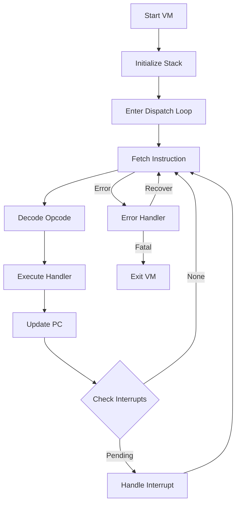
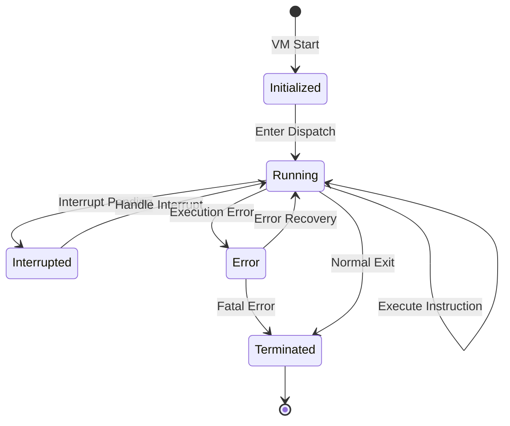

# Execution Model Specification

**Navigation**: [README](README.md) | [Stack Management](stack-management.md) | [Function Calls](function-calls.md) | [Interrupt Handling](interrupt-handling.md)

Complete specification of the VM execution model, including the dispatch loop algorithm, instruction fetch/decode/execute cycle, and program counter management.

## Overview

The execution model defines how the VM executes bytecode instructions. The core is the dispatch loop that continuously fetches, decodes, and executes instructions until the program terminates or an error occurs.

## Dispatch Loop Algorithm

### High-Level Algorithm



### Pseudocode Implementation

```pseudocode
function dispatch():
    // Initialize execution state
    PC = FunctionObject.code_start
    CurrentFrame = InitialFrame
    TopOfStack = InitialValue

    // CRITICAL: Stack must be initialized with at least one value (NIL = 0)
    // before entering dispatch loop. This ensures conditional jumps (FJUMP/TJUMP)
    // have a value to pop from the stack.
    // C: start_lisp() -> TopOfStack = 0;
    TopOfStack = 0  // Initialize with NIL

    // Main dispatch loop
    while not ErrorExit:
        // Fetch instruction
        opcode_byte = ReadByte(PC)

        // Decode instruction
        instruction_length = opcode_length_table[opcode_byte]
        operands = ReadBytes(PC + 1, instruction_length - 1)

        // Check interrupts before execution
        if CheckInterrupts():
            HandleInterrupts()
            continue

        // Execute opcode handler
        ExecuteOpcode(opcode_byte, operands)

        // Update program counter
        PC = PC + instruction_length

        // Check interrupts after execution
        if CheckInterrupts():
            HandleInterrupts()
```

## Instruction Fetch

### Fetch Algorithm

```pseudocode
function FetchInstruction():
    // Read opcode byte
    opcode = ReadByte(PC)

    // Validate opcode
    if opcode not in valid_opcodes:
        HandleInvalidOpcode(opcode)
        return

    // Determine instruction length
    length = opcode_length_table[opcode]

    // Read operands
    operands = []
    for i = 1 to length - 1:
        operands.append(ReadByte(PC + i))

    return Instruction(opcode, operands, length)
```

### Program Counter Management

The program counter (PC) tracks the current instruction:

- **Initial Value**: Set to function code start
- **Update**: Advanced by instruction length after execution
- **Format**: Offset from function object base address
- **Storage**: Stored in stack frame for return

### PC Initialization from Sysout

When loading a sysout file, the PC must be initialized from the saved VM state:

```pseudocode
function InitializePCFromSysout(ifpage, virtual_memory):
    // Get current frame pointer from IFPAGE
    currentfxp = ifpage.currentfxp
    
    // Read frame structure (FX) from virtual memory
    // CRITICAL: Frame fields are stored in big-endian format in sysout
    // Must byte-swap when reading on little-endian machines
    frame = ReadFrame(virtual_memory, currentfxp)
    
    // Get function header address from frame
    fnheader_addr = frame.fnheader
    
    // Read function header
    // CRITICAL: Function header fields are also big-endian
    fnheader = ReadFunctionHeader(virtual_memory, fnheader_addr)
    
    // Calculate PC: function header address + startpc offset
    // C: PC = (ByteCode *)FuncObj + FuncObj->startpc;
    PC = fnheader_addr + fnheader.startpc
    
    // Alternative: Use pcoffset from frame if fnheader unavailable
    // This is a fallback when proper address translation isn't available
    if PC is invalid:
        PC = frame.pcoffset  // Use saved PC offset from frame
    
    return PC
```

**CRITICAL**: Frame and function header fields must be byte-swapped when reading from sysout files on little-endian machines. The sysout format stores all multi-byte values in big-endian format.

**C Reference**: `maiko/src/main.c:797-807` - `start_lisp()` reads current frame and initializes PC

## Instruction Decode

### Decode Algorithm

```pseudocode
function DecodeInstruction(opcode_byte, operand_bytes):
    // Get opcode metadata
    opcode_info = opcode_table[opcode_byte]

    // Decode operands based on opcode type
    decoded_operands = []

    switch opcode_info.operand_format:
        case NO_OPERANDS:
            // No operands to decode
            break

        case SINGLE_BYTE:
            decoded_operands.append(operand_bytes[0])
            break

        case ATOM_INDEX:
            if BIGATOMS:
                atom_index = (operand_bytes[0] << 16) |
                            (operand_bytes[1] << 8) |
                            operand_bytes[2]
            else:
                atom_index = (operand_bytes[0] << 8) | operand_bytes[1]
            decoded_operands.append(atom_index)
            break

        case SIGNED_OFFSET:
            offset = sign_extend(operand_bytes[0])
            decoded_operands.append(offset)
            break

        case MULTI_BYTE:
            // Variable-length decoding
            decoded_operands = DecodeVariableOperands(opcode_info, operand_bytes)
            break

    return DecodedInstruction(opcode_byte, decoded_operands)
```

## Instruction Execute

### Execution Framework

```pseudocode
function ExecuteOpcode(opcode, operands):
    // Lookup opcode handler
    handler = opcode_handler_table[opcode]

    // Prepare execution context
    execution_context = {
        PC: current_PC,
        Stack: current_stack,
        Frame: current_frame,
        Function: current_function
    }

    // Execute handler
    try:
        result = handler(operands, execution_context)

        // Update execution state
        UpdateExecutionState(result)

    except Error as e:
        HandleExecutionError(e, opcode, operands)
```

### Handler Execution

Each opcode handler:

1. Receives decoded operands
2. Accesses stack/memory as needed
3. Performs operation
4. Updates stack/memory
5. Returns execution result

## Dispatch Mechanisms

### Mechanism 1: Computed Goto (OPDISP)

**When Available**: GCC compiler with computed goto support

**Implementation**:

```pseudocode
function dispatch_computed_goto():
    // Jump table with labels
    static label_table[256] = {
        &&case_000, &&case_001, &&case_002, ...
    }

    opcode = ReadByte(PC)
    goto *label_table[opcode]

case_001:
    ExecuteCAR()
    goto next_instruction

case_002:
    ExecuteCDR()
    goto next_instruction

// ... cases for all opcodes ...

next_instruction:
    PC = PC + instruction_length
    goto dispatch_computed_goto
```

**Advantages**:

- Fastest dispatch method
- Minimal overhead per instruction
- Direct jump to handler

### Mechanism 2: Switch Statement

**When Used**: Compilers without computed goto support

**Implementation**:

```pseudocode
function dispatch_switch():
    while not ErrorExit:
        opcode = ReadByte(PC)

        switch opcode:
            case 0x01:
                ExecuteCAR()
                break
            case 0x02:
                ExecuteCDR()
                break
            // ... cases for all opcodes ...
            default:
                HandleInvalidOpcode(opcode)

        PC = PC + instruction_length
        CheckInterrupts()
```

**Advantages**:

- Portable across compilers
- Standard C construct
- Slightly slower but acceptable

## Interrupt Handling

### Interrupt Check Points

Interrupts are checked:

1. **Before instruction execution**: After fetch/decode
2. **After instruction execution**: Before next fetch
3. **During long operations**: Periodically in loops

### Interrupt Check Algorithm

```pseudocode
function CheckInterrupts():
    interrupt_state = GetInterruptState()

    if interrupt_state.waitinginterrupt:
        if interrupt_state.LogFileIO:
            HandleLogFileIO()
        if interrupt_state.ETHERInterrupt:
            HandleEthernetInterrupt()
        if interrupt_state.IOInterrupt:
            HandleIOInterrupt()
        if interrupt_state.storagefull:
            HandleStorageFull()
        if interrupt_state.stackoverflow:
            HandleStackOverflow()

        return true

    return false
```

## Execution State Management

### State Structure

```pseudocode
struct ExecutionState:
    PC: ByteCode*              // Program counter
    CurrentFrame: Frame*       // Current stack frame
    FunctionObject: Function*  // Current function
    TopOfStack: LispPTR        // Top of stack value
    StackPointer: DLword*      // Current stack pointer
    EndOfStack: DLword*        // End of stack
    ErrorExit: boolean         // Error exit flag
```

### State Transitions



## Performance Optimizations

### PC Caching

```pseudocode
// Cache PC in register/local variable
pccache = PC
while not ErrorExit:
    opcode = ReadByte(pccache)
    // ... execute ...
    pccache = pccache + instruction_length
PC = pccache  // Update global PC periodically
```

### Stack Pointer Caching

```pseudocode
// Cache stack pointer
cspcache = CurrentStackPTR
// Use cached pointer for stack operations
// Update global pointer periodically
```

### Instruction Prefetch

Some implementations may prefetch next instruction:

- Read next opcode while executing current
- Reduces fetch latency
- Must handle PC updates correctly

## Error Handling

### Error Detection

Errors detected during execution:

- **Type Errors**: Wrong type for operation
- **Memory Errors**: Invalid address
- **Arithmetic Errors**: Overflow, division by zero
- **Stack Errors**: Stack overflow/underflow

### Error Recovery

```pseudocode
function HandleExecutionError(error, opcode, operands):
    // Save error context
    error_context = {
        opcode: opcode,
        operands: operands,
        PC: PC,
        Frame: CurrentFrame
    }

    // Attempt recovery
    if CanRecover(error):
        RecoverFromError(error, error_context)
    else:
        ErrorExit = true
        UnwindStack()
        ReportError(error, error_context)
```

### Unknown Opcode Handling

When encountering an unknown opcode (not in the opcode table), the VM should:

1. **Log the opcode**: Record the opcode byte and PC for debugging
2. **Check for UFN**: Unknown opcodes may be UFNs (Undefined Function Names) that require lookup
3. **Continue or halt**: Depending on implementation, either continue execution (skipping the opcode) or halt with an error

```pseudocode
function HandleUnknownOpcode(opcode_byte, PC):
    // Log for debugging
    Log("Unknown opcode 0x%02X at PC=0x%X", opcode_byte, PC)
    
    // Check if this might be a UFN (Undefined Function Name)
    // UFNs are opcodes that map to Lisp functions via UFN table
    if IsUFN(opcode_byte):
        return HandleUFN(opcode_byte, PC)
    
    // For development: continue execution to identify missing opcodes
    // For production: halt with error
    if development_mode:
        PC = PC + 1  // Skip opcode byte
        continue
    else:
        ErrorExit = true
        ReportError("Unknown opcode", opcode_byte, PC)
```

**C Reference**: `maiko/src/xc.c:249-258` - `op_ufn` handler for unknown opcodes that are UFNs

## Related Documentation

- [Instruction Set](../instruction-set/) - Opcode specifications
- [Stack Management](stack-management.md) - Stack frame handling
- [Function Calls](function-calls.md) - Function invocation
- [Interrupt Handling](interrupt-handling.md) - Interrupt processing
