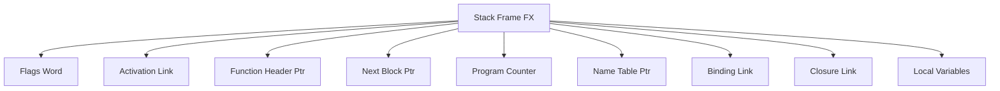

# Stack Management Specification

**Navigation**: [README](README.md) | [Execution Model](execution-model.md) | [Function Calls](function-calls.md)

Complete specification of stack frame structure, stack operations, and frame management.

## Overview

The VM uses a stack-based execution model where each function call creates a stack frame (FX - Frame eXtended). The stack manages function activation, local variables, parameters, and return addresses.

## Stack Frame Addressing

**CRITICAL**: Frame pointers (`currentfxp`, `stackbase`, `endofstack`) in IFPAGE are `DLword` StackOffsets, NOT LispPTR values!

- `currentfxp`: DLword offset from Stackspace base
- `stackbase`: DLword offset from Stackspace base
- `endofstack`: DLword offset from Stackspace base

C: `NativeAligned2FromStackOffset(DLword StackOffset) = Stackspace + StackOffset`
- Since `Stackspace` is `DLword*`, pointer arithmetic adds `StackOffset` DLwords = `StackOffset * 2` bytes
- Per `maiko/inc/adr68k.h:72-75` and `maiko/src/main.c:797`

## Stack Frame Structure

### Frame Layout



### Frame Structure (FX)

```pseudocode
struct FrameEx:
    flags: 3 bits          // Frame flags
    fast: 1 bit            // Fast call flag
    nil2: 1 bit            // Reserved
    incall: 1 bit          // In-call flag
    validnametable: 1 bit  // Name table valid flag
    nopush: 1 bit          // No push flag
    usecount: 8 bits       // Use count for GC
    alink: DLword          // Activation link (previous frame)
    fnheader: LispPTR      // Function header pointer
    nextblock: DLword      // Next stack block offset
    pc: DLword             // Program counter offset
    nametable: LispPTR     // Name table pointer
    blink: DLword          // Binding link
    clink: DLword          // Closure link
    // ... local variables follow ...
```

### Frame Markers

**FX_MARK (0xC000)**:

- Marks start of frame
- Used for frame identification

**BF_MARK (0x8000)**:

- Marks binding frame
- Used for variable binding tracking

**STK_FSB_WORD (0xA000)**:

- Marks free stack block
- Used for stack space management

## Stack Initialization

### Stack Area Location

**CRITICAL**: The stack area is part of virtual memory (`Lisp_world`), NOT a separate allocation!

- `Stackspace = NativeAligned2FromLAddr(STK_OFFSET) = Lisp_world + STK_OFFSET`
- `STK_OFFSET = 0x00010000` (DLword offset from Lisp_world base)
- Stackspace byte offset = `STK_OFFSET * 2 = 0x20000` bytes
- The stack area already contains data from the sysout file (thousands of DLwords)
- Stack operations must use the virtual memory's stack area directly

**C Reference**: `maiko/src/initsout.c:222` - `Stackspace = (DLword *)NativeAligned2FromLAddr(STK_OFFSET);`

### CurrentStackPTR Initialization

**CRITICAL**: `CurrentStackPTR` is initialized from the frame's `nextblock` field, not from a separate stack pointer.

```pseudocode
function InitializeStackPointer(frame, Stackspace):
    // C: start_lisp() -> next68k = NativeAligned2FromStackOffset(CURRENTFX->nextblock)
    // C: CurrentStackPTR = next68k - 2
    next68k = Stackspace + frame.nextblock  // nextblock is DLword offset from Stackspace
    CurrentStackPTR = next68k - 2  // Move back 2 DLwords (stack grows down)
    
    // Stack depth = (CurrentStackPTR - Stackspace) / 2 (in DLwords)
    stack_depth = (CurrentStackPTR - Stackspace) / 2
    // Typically thousands of DLwords (e.g., 5956 DLwords in starter.sysout)
```

**C Reference**: `maiko/src/main.c:795-801` - `next68k = NativeAligned2FromStackOffset(CURRENTFX->nextblock); CurrentStackPTR = next68k - 2;`

### Initial Stack State

**CRITICAL**: The stack area from the sysout already contains data. `TopOfStack` is just a cached variable, not the actual stack pointer.

- The stack area has pre-existing data (typically thousands of DLwords)
- `TopOfStack = 0` in `start_lisp()` is just resetting a cached variable
- The actual stack pointer (`CurrentStackPTR`) points to existing stack data
- Stack depth is calculated as `(CurrentStackPTR - Stackspace) / 2` DLwords

**C Reference**: `maiko/src/main.c:790` - `TopOfStack = 0;` (cached variable, not stack pointer initialization)

## Stack Operations

### Push Stack

**CRITICAL**: Stack stores LispPTR values as 32-bit (2 DLwords). The stack pointer is a `DLword*` array, but values are stored as full LispPTR (4 bytes).

**CRITICAL**: Stack grows DOWN. `Stackspace` is the BASE (lowest address), `CurrentStackPTR` is the current top (higher address when stack has data). Pushing moves `CurrentStackPTR` DOWN (toward lower addresses).

```pseudocode
function PushStack(value: LispPTR):
    // Stack grows down, move pointer down by 4 bytes (2 DLwords)
    CurrentStackPTR = CurrentStackPTR - 2  // Move DOWN 2 DLwords

    // Store LispPTR as 2 DLwords (low word first, then high word)
    CurrentStackPTR[0] = value & 0xFFFF        // Low 16 bits
    CurrentStackPTR[1] = (value >> 16) & 0xFFFF  // High 16 bits

    TopOfStack = value

    // Check stack overflow (CurrentStackPTR must not go below EndSTKP)
    if CurrentStackPTR < EndSTKP:
        HandleStackOverflow()
```

**C Implementation Reference**: `maiko/inc/lispemul.h:PushStack(x)` decrements `CurrentStackPTR` by 2 DLwords and stores LispPTR value.

**Stack Layout**:
- `Stackspace` (BASE): Lowest address, where stack starts
- `CurrentStackPTR`: Current top, higher address when stack has data
- Stack depth = `(CurrentStackPTR - Stackspace) / 2` DLwords
- Stack grows DOWN: pushing moves `CurrentStackPTR` DOWN (toward lower addresses)

### Pop Stack

**CRITICAL**: Stack stores LispPTR values as 32-bit (2 DLwords). Reading requires reconstructing the 32-bit value from 2 DLwords.

**CRITICAL**: Stack grows DOWN. Popping moves `CurrentStackPTR` UP (toward higher addresses). Stack is empty when `CurrentStackPTR <= Stackspace`.

```pseudocode
function PopStack():
    // Check for stack underflow: CurrentStackPTR must be > Stackspace (stack has data)
    if CurrentStackPTR <= Stackspace:
        return StackUnderflow
    
    // Read LispPTR as 2 DLwords (low word first, then high word)
    low_word = CurrentStackPTR[0]   // Low 16 bits
    high_word = CurrentStackPTR[1]  // High 16 bits
    value = (high_word << 16) | low_word  // Reconstruct 32-bit value

    CurrentStackPTR = CurrentStackPTR + 2  // Move UP 2 DLwords (stack grows down)
    TopOfStack = GetTopOfStack()  // Update cached top
    return value
```

**C Implementation Reference**: `maiko/inc/tos1defs.h:POP_TOS_1` increments `CSTKPTRL` (LispPTR*) and reads LispPTR value.

**Stack Underflow Check**:
- Stack is empty when `CurrentStackPTR <= Stackspace`
- Stack has data when `CurrentStackPTR > Stackspace`
- Stack depth = `(CurrentStackPTR - Stackspace) / 2` DLwords

### Stack Frame Allocation

```pseudocode
function AllocateStackFrame(function_obj):
    // Calculate frame size
    frame_size = FRAMESIZE + function_obj.local_count * 2

    // Check available space
    if CurrentStackPTR - frame_size < EndSTKP:
        ExtendStack()

    // Allocate frame
    frame_ptr = CurrentStackPTR - frame_size
    CurrentStackPTR = frame_ptr

    // Initialize frame
    frame = GetFrame(frame_ptr)
    frame.flags = FX_MARK
    frame.fnheader = function_obj.address
    frame.pc = 0
    frame.alink = LAddrFromNative(PreviousFrame)

    return frame_ptr
```

## Frame Management

### Activation Links

Activation links chain frames together:

```pseudocode
function SetActivationLink(new_frame, previous_frame):
    new_frame.alink = LAddrFromNative(previous_frame)
```

### Frame Traversal

```pseudocode
function GetPreviousFrame(current_frame):
    if current_frame.alink == 0:
        return null
    return NativeAligned4FromLAddr(current_frame.alink)
```

### Current Frame Access

```pseudocode
function GetCurrentFrame():
    return NativeAligned4FromStackOffset(CurrentFrameOffset)
```

## Variable Access

### IVar (Local Variables)

```pseudocode
function GetIVar(index):
    frame = GetCurrentFrame()
    ivar_base = NativeAligned2FromStackOffset(frame.nextblock)
    return ivar_base[index]
```

### PVar (Parameter Variables)

```pseudocode
function GetPVar(index):
    frame = GetCurrentFrame()
    pvar_base = frame + FRAMESIZE
    return pvar_base[index]
```

### FVar (Free Variables)

```pseudocode
function GetFVar(index):
    frame = GetCurrentFrame()
    fvar_offset = frame.fnheader.fvaroffset
    nametable = GetNameTable(frame)
    fvar_base = nametable + fvar_offset
    return fvar_base[index]
```

## Stack Extension

### Extend Stack Algorithm

```pseudocode
function ExtendStack():
    // Check if extension needed
    if CurrentStackPTR < EndSTKP:
        return  // No extension needed

    // Allocate new stack page
    new_page = AllocateStackPage()

    // Initialize free stack block
    free_block = GetFreeStackBlock(new_page)
    free_block.marker = STK_FSB_WORD
    free_block.size = DLWORDSPER_PAGE - 2

    // Update end of stack
    EndSTKP = new_page + DLWORDSPER_PAGE

    // Set up guard block
    guard_block = GetGuardBlock(EndSTKP)
    guard_block.marker = STK_GUARD_WORD
```

## Stack Overflow Handling

### Overflow Detection

**CRITICAL**: Stack overflow checks must include a safety margin (`STK_SAFE = 32` words) to prevent stack exhaustion during operations.

```pseudocode
const STK_SAFE = 32  // Safety margin in words (matches C: maiko/inc/stack.h:38)

function CheckStackOverflow(required_space):
    // Add safety margin to required space
    safe_required_space = required_space + (STK_SAFE * sizeof(DLword))

    if CurrentStackPTR - safe_required_space < EndSTKP:
        if CurrentStackPTR < GuardStackAddr:
            SetInterruptFlag(STACKOVERFLOW)
            return true
        else:
            ExtendStack()  // Try to extend stack
            return false
    return false
```

**C Reference**: `maiko/inc/stack.h:STK_SAFE`, `maiko/src/llstk.c:do_stackoverflow()`

### Overflow Recovery

```pseudocode
function HandleStackOverflow():
    // Set interrupt flag
    interrupt_state.stackoverflow = true
    interrupt_state.waitinginterrupt = true

    // Trigger interrupt handler
    TriggerInterrupt(STACKOVERFLOW)
```

## Free Stack Block Management

### Free Block Structure

```pseudocode
struct FreeStackBlock:
    marker: DLword      // STK_FSB_WORD
    size: DLword        // Size in words
    // ... free space ...
```

### Merge Free Blocks

```pseudocode
function MergeFreeBlocks(block_ptr):
    while GetNextBlock(block_ptr).marker == STK_FSB_WORD:
        next_block = GetNextBlock(block_ptr)
        block_ptr.size += next_block.size
        block_ptr = next_block
    return block_ptr
```

## Frame Cleanup

### Frame Deallocation

```pseudocode
function DeallocateFrame(frame_ptr):
    frame = GetFrame(frame_ptr)

    // Mark as free stack block
    free_block = GetFreeStackBlock(frame_ptr)
    free_block.marker = STK_FSB_WORD
    free_block.size = CalculateFrameSize(frame)

    // Merge with adjacent free blocks
    MergeFreeBlocks(free_block)
```

## Related Documentation

- [Execution Model](execution-model.md) - How stack is used in execution
- [Function Calls](function-calls.md) - Frame creation during calls
- [Memory Management](../memory/) - Stack memory allocation
