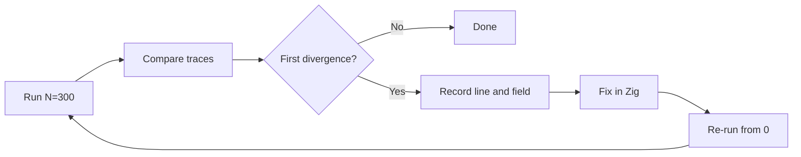

# Parity for first 300 steps

## Current state

- **Parity for N=15**: Achieved via Fix 1 (line 0 TOS), Fix 2 (alink 0 RETURN), format identity, and **hardcoded SP/TOS overrides** in [zaiko/src/vm/dispatch/dispatch_loop.zig](zaiko/src/vm/dispatch/dispatch_loop.zig) for `instruction_count` 3..15 (lines 2..14).
- **Root causes of those overrides**: (1) C treats opcode **0x60 as UFN** (undefined function) and dispatches to `op_ufn`; Zig treats it as unknown and does not call UFN, so TOS/SP diverge after line 1. (2) **FN2** and **ITIMES2** (and possibly others) produce different stack/TOS state in Zig vs C, requiring overrides for lines 3..14.
- **C trace**: [maiko/src/execution_trace.c](maiko/src/execution_trace.c) logs when `instruction_count < max_steps`; each line is a full trace row with newline (so for N=300, C produces 300 lines unless it stops earlier). Zig must match C’s line count and byte-for-byte format.

## Objective

Run both emulators with `EMULATOR_MAX_STEPS=300`, compare unified traces, and fix divergences until the first 300 trace lines are identical (or both stop at the same line count with identical content).

## Approach

1. **Baseline**: Run `EMULATOR_MAX_STEPS=300 ./scripts/compare_emulator_execution.sh` (and optionally `scripts/compare_unified_traces.py`). Record C line count and Zig line count; if they differ, the first fix is to align line count (e.g. Zig exiting early again at some RETURN or other stop).
2. **First divergence**: Use `compare_unified_traces.py` or `diff` to get the first line index and field that differ. Document in a short status file (e.g. `reports/STEP_COMPARISON_STATUS.md` or equivalent).
3. **Fix strategy** (prefer root cause over more overrides):

   - **Line count mismatch**: If Zig stops before 300 lines, find the stop condition (e.g. another RETURN with alink 0 or odd alink, or error path) and align with C (same as Fix 2 in the previous plan).
   - **SP/TOS/PC/opcode divergence at or after line 2**: Prefer implementing **UFN handling for 0x60** (and any other UFN opcodes that appear in the first 300 steps) in Zig so that TOS/SP match C without overrides. Reference: [maiko/inc/inlineC.h](maiko/inc/inlineC.h) (e.g. `RECLAIMCELL goto op_ufn`), [maiko/src/xc.c](maiko/src/xc.c) (UFN dispatch), and UFN lookup/behavior so Zig’s 0x60 path matches C’s `op_ufn` outcome.
   - **FN2 / ITIMES2 / other opcodes**: Fix the Zig implementation to match C’s stack and TOS semantics (using C as reference) so that overrides for those steps can be removed.
   - **Last-line format**: For N=300, confirm whether C writes a trailing newline on the last line; Zig’s `skip_trailing_newline` and truncation in [zaiko/src/vm/execution_trace.zig](zaiko/src/vm/execution_trace.zig) (lines 122–128) were added to match C for N=15. Verify C’s behavior at N=300 and adjust Zig so line count and last-line content match.

4. **Overrides as bridge**: If extending parity to 300 requires a large number of new overrides, add them only as a temporary bridge; add a TODO and an explicit task to remove overrides by implementing the root cause (UFN, opcode semantics).
5. **Loop**: After every change, re-run the full comparison from step 0 (`EMULATOR_MAX_STEPS=300 ./scripts/compare_emulator_execution.sh`) to catch regressions. Repeat until the first 300 lines (or common prefix) are identical.

## Files to touch

| Purpose | File(s) |

| ------------------------- | ------------------------------------------------------------------------------------------------------------------------------------------------- |

| UFN / 0x60 handling | [zaiko/src/vm](zaiko/src/vm) (new or existing opcode/UFN path), C reference: [maiko/inc/ufn.h](maiko/inc/ufn.h), [maiko/src/xc.c](maiko/src/xc.c) |

| FN2 / ITIMES2 / stack | [zaiko/src/vm/opcodes](zaiko/src/vm/opcodes) (function_calls, arithmetic or equivalent) |

| Overrides (if extended) | [zaiko/src/vm/dispatch/dispatch_loop.zig](zaiko/src/vm/dispatch/dispatch_loop.zig) |

| Last-line format | [zaiko/src/vm/execution_trace.zig](zaiko/src/vm/execution_trace.zig) |

| Status / first divergence | e.g. `reports/STEP_COMPARISON_STATUS.md` or `reports/WORK_STATE.md` |

## Verification

- After fixes: `EMULATOR_MAX_STEPS=300 ./scripts/compare_emulator_execution.sh` reports “Logs are IDENTICAL” and both logs have the same line count (300 or the same lower value if C stops earlier).
- Optional: Run `scripts/compare_unified_traces.py` and confirm zero differences for the compared lines.

---

# Recommended improvements for the new plan document

These apply to the **plan document** (or the process that uses it), not to the codebase.

1. **Define “step” and “trace line” explicitly**

   - State: “Trace line N = state logged *before* executing the N-th instruction (0-based). Step cap N means produce trace lines 0..N-1 (N lines) or define explicitly if C uses a different rule.” This avoids ambiguity when comparing “first 300 steps” with “300 lines” and with C’s `max_steps`/`instruction_count` semantics.

2. **Mandatory “run from 0” after every fix**

   - In the workflow section, state: “After any code change, run the full comparison from step 0 (e.g. `EMULATOR_MAX_STEPS=<target> ./scripts/compare_emulator_execution.sh`). Do not mark a plan item complete until this run shows no regression and the targeted range has zero differences.”

3. **Do not close plan items while divergences remain**

   - Add an explicit rule: “A plan item is only complete when the run-compare-fix loop has been applied and the comparison script (or `compare_unified_traces.py`) reports zero differences for the targeted step range. Documenting a divergence as ‘future work’ does not complete the item.”

4. **Root cause vs override policy**

   - State: “Prefer fixing root cause (e.g. implement UFN for 0x60, fix FN2/ITIMES2 semantics) over adding or extending per-step overrides. If overrides are added, they must be documented as temporary with a TODO and a follow-up task to remove them once the root cause is implemented.”

5. **Record first divergence in status**

   - Require that after each comparison run, the first divergence (line index and field name) is recorded in a designated status file (e.g. `reports/STEP_COMPARISON_STATUS.md` or `reports/WORK_STATE.md`) so that the next fix targets that line/field and progress is traceable.

6. **Verification table**

   - Add a small table to the plan: for N=15, N=100, N=300 (or the chosen checkpoints), list expected line count (from C) and a pass/fail cell to be filled when the comparison is run. This makes it clear when “parity for 300 steps” is achieved.

7. **Rollback on regression**

   - Add: “If a fix causes an earlier divergence (e.g. a previously matching line now differs), revert the fix and try a different approach (or a more minimal change) before re-running the loop.”

8. **Single owner for “first divergence”**

   - In the workflow, state that only one “first divergence” is addressed at a time: fix it, re-run from 0, then address the next first divergence. This avoids closing multiple items while multiple divergences remain.

These recommendations can be pasted into the new plan (e.g. as a “Plan process improvements” section) or into a separate “Parity plan guidelines” doc.