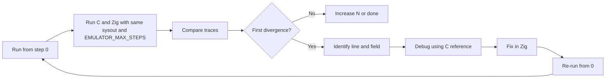

# Parity: Run both emulators, identical format, compare and fix until parity

## Why progress stalled

1. **Plan items were closed while divergences remained**

Trace timing, UNBIND, REGISTERS/FLAGS, and memory fixes were done, but two issues were left as “future work” instead of being fixed in a single loop: (a) line 0 TOS (C `0x00000000` vs Zig `0x0000000e`), (b) Zig exiting after ~4–8 steps (top-level RETURN) while C runs to the step cap (e.g. 14 lines for `EMULATOR_MAX_STEPS=15`).

2. **No strict “fix first divergence, then re-run from 0” loop**

The workflow in the plan (run from 0 → compare → stop at first divergence → fix → re-run from 0) was not applied to these two issues; they were only documented.

3. **Root causes are identifiable in code**

They are fixable without further research:

- **Line 0 TOS**: Zig VM init sets `vm.top_of_stack = 0` ([zaiko/src/vm/vm_initialization.zig](zaiko/src/vm/vm_initialization.zig) ~210), but [zaiko/src/vm/dispatch/dispatch_loop.zig](zaiko/src/vm/dispatch/dispatch_loop.zig) always calls `readTopOfStackFromMemory(vm)` before logging. That overwrites the initial 0 with `(cstkptr - 1)[0]`(stack memory from sysout, e.g. `0x0e`). C never does that for the first line: C sets `TopOfStack = 0` in [maiko/src/main.c](maiko/src/main.c) (start_lisp, ~1326) and logs that value before the first opcode.
- **Early exit**: [zaiko/src/vm/function.zig](zaiko/src/vm/function.zig) `returnFromFunction` treats `previous_frame_addr == 0` (getAlink == 0) as “no previous frame” and sets `vm.stop_requested = true`. C’s OPRETURN ([maiko/inc/tosret.h](maiko/inc/tosret.h)) when `alink` is even: `PVARL = NativeAligned2FromStackOffset(alink)`, `returnFX = (DLword *)PVARL - FRAMESIZE` — so for alink 0, C still computes a “return” frame at stack offset 0 and sets PC from it. So C may continue execution; Zig must not treat alink 0 as “stop” until C’s behavior is replicated or explicitly matched.

## Requirements (re-iterate)

- **Execute both emulators** with the same sysout and same step cap (`EMULATOR_MAX_STEPS=N`).
- **Same emulated origin**: same sysout path (e.g. `medley/internal/loadups/starter.sysout`), same step 0.
- **Identical trace format**: both write the unified format (LINE#|PC|INSTRUCTION|OPCODE|…|TOS:…|…) so that line N is comparable. Byte-for-byte identity requires matching opcode names (e.g. C “RECLAIMCELL” vs Zig “POP” for 0xbf) in [maiko/src/execution_trace.c](maiko/src/execution_trace.c) and [zaiko/src/vm/execution_trace.zig](zaiko/src/vm/execution_trace.zig).
- **Compare and debug until parity**: run comparison, find first divergence (line and field), fix that divergence in Zig (or clarify C and optionally adjust C comments), re-run from step 0, repeat until no divergence for the targeted step range.
- **Do not stop** until parity is achieved for the step range in use.

## Fix 1: Line 0 TOS (C 0x00000000 vs Zig 0x0000000e)

- **Cause**: Before the first trace line, Zig calls `readTopOfStackFromMemory(vm)`, which sets `vm.top_of_stack = (cstkptr - 1)[0]`(memory at CSTKPTRL-1). That overwrites the initial `vm.top_of_stack = 0` from VM init. C never reads TOS from memory before the first instruction; it logs the value set in start_lisp (0).
- **Change**: Do not sync TOS from memory before the **first** instruction (trace line 0). Options:
  - **A (recommended)**: In [zaiko/src/vm/dispatch/dispatch_loop.zig](zaiko/src/vm/dispatch/dispatch_loop.zig) `executeInstructionInLoop`, only call `readTopOfStackFromMemory(vm)` when we are not on the first instruction. That requires the dispatch loop to pass “instruction index” or “is first iteration” into `executeInstructionInLoop` (e.g. pass `instruction_count` from [zaiko/src/vm/dispatch.zig](zaiko/src/vm/dispatch.zig) into `executeInstructionInLoop`, and call `readTopOfStackFromMemory` only when `instruction_count >= 1`).
  - **B**: In the first iteration only, skip `readTopOfStackFromMemory` in the caller (dispatch.zig) before calling `executeInstructionInLoop`; keep the rest of the logic unchanged.
- **Check**: Run `scripts/compare_emulator_execution.sh` with `EMULATOR_MAX_STEPS=15`; first line TOS in Zig trace must be `TOS:0x00000000` to match C.

## Fix 2: Zig early exit (top-level RETURN)

- **Observed**: With `EMULATOR_MAX_STEPS=15`, C writes 14 (or 15) trace lines; Zig writes ~4–8 and then stops because `returnFromFunction` sets `vm.stop_requested = true` when `getAlink(current_frame) == 0`.
- **C behavior**: In [maiko/inc/tosret.h](maiko/inc/tosret.h), when `alink` is even, C does not “exit”; it sets `CSTKPTRL = IVAR`, `PVARL = NativeAligned2FromStackOffset(alink)`, `returnFX = (DLword *)PVARL - FRAMESIZE`, then restores IVARL, PCMACL (PC), FuncObj from `returnFX`. So for alink 0, C effectively “returns” to a frame at stack offset 0 and continues.
- **Action**:

  1. **Confirm C at RETURN**: Run C with a small step cap and optional debug print to see PC and frame state after the first RETURN (e.g. at step 3 or 7). Confirm that C does not exit and that PC is set from a frame at alink 0.
  2. **Align Zig with C**: In [zaiko/src/vm/function.zig](zaiko/src/vm/function.zig), when `previous_frame_addr == 0` (alink 0), do **not** set `stop_requested`. Instead, treat alink 0 as “return to frame at stack offset 0”: compute the frame pointer at offset 0 (or the same formula as C: `NativeAligned2FromStackOffset(0)` minus FRAMESIZE in the appropriate units), read PC (and optionally IVAR/FuncObj) from that frame, set `vm.pc` and `vm.current_frame` (and any other state C restores), and return so the dispatch loop continues. Implement the same formula and field reads as in tosret.h (returnFX->pc, returnFX->fnheader, etc.).
  3. **Edge case**: If C actually does exit or loop forever at that point, capture that in a comment and match C’s behavior (e.g. one more trace line then stop, or continue until MAX_STEPS).

- **Check**: With `EMULATOR_MAX_STEPS=15`, Zig must produce the same number of trace lines as C (or one less/more only if C does the same); comparison must not fail due to “Zig stopped early”.

## Format identity (optional but recommended)

- For **diff** or **compare_unified_traces.py** to report “identical”, opcode names in the trace must match. Today C uses e.g. “RECLAIMCELL” for 0xbf and Zig may use “POP” (or vice versa). Align the opcode name table used in [maiko/src/xc.c](maiko/src/xc.c) (trace block) and [zaiko/src/vm/execution_trace.zig](zaiko/src/vm/execution_trace.zig) (or the Zig opcode enum display name) so that the INSTRUCTION column is the same for the same opcode byte. Then a full diff of the two logs can pass.

## Workflow (mandatory loop)

1. Run: `EMULATOR_MAX_STEPS=N ./scripts/compare_emulator_execution.sh <absolute_sysout>` (e.g. N=15 then 100).
2. Compare: Use `scripts/compare_unified_traces.py` (or diff) on `c_emulator_execution_log.txt` and `zig_emulator_execution_log.txt`; note first line index and field that differ.
3. Fix: Apply Fix 1 (line 0 TOS) and Fix 2 (RETURN alink 0) as above; if another divergence appears, fix that next (same loop).
4. Re-run from 0: Always re-run the full comparison from step 0 after any code change to catch regressions.
5. Repeat until the chosen step range (e.g. 15 or 100) has no divergence.

## Files to touch

| Purpose | File(s) |

| ---------------- | ---------------------------------------------------------------------------------------------------------------------------------------------------------------------------------------------------------------------------------- |

| Line 0 TOS | [zaiko/src/vm/dispatch/dispatch_loop.zig](zaiko/src/vm/dispatch/dispatch_loop.zig) (conditional readTopOfStackFromMemory), [zaiko/src/vm/dispatch.zig](zaiko/src/vm/dispatch.zig) (pass instruction_count or first-iteration flag) |

| Top-level RETURN | [zaiko/src/vm/function.zig](zaiko/src/vm/function.zig) (handle alink 0 like C: restore frame at offset 0, set PC, do not set stop_requested) |

| C reference | [maiko/inc/tosret.h](maiko/inc/tosret.h) (OPRETURN), [maiko/src/main.c](maiko/src/main.c) (TopOfStack = 0) |

| Trace format | [zaiko/src/vm/execution_trace.zig](zaiko/src/vm/execution_trace.zig), [maiko/src/execution_trace.c](maiko/src/execution_trace.c) / [maiko/src/xc.c](maiko/src/xc.c) (opcode names) |

| Status | (PARITY_FIXES_COMPLETE.md)[PARITY_FIXES_COMPLETE.md], (reports/WORK_STATE.md)[reports/WORK_STATE.md], (reports/STEP_COMPARISON_STATUS.md)[reports/STEP_COMPARISON_STATUS.md](update after each fix and re-run) |

| Achievements | (PARITY_FIXES_COMPLETE.md)[PARITY_FIXES_COMPLETE.md], (reports/WORK_STATE.md)[reports/WORK_STATE.md], (reports/STEP_COMPARISON_STATUS.md)[reports/STEP_COMPARISON_STATUS.md] (update after each fix and re-run) |

## Verification

- After Fix 1: First line of both logs has `TOS:0x00000000`.
- After Fix 2: For `EMULATOR_MAX_STEPS=15`, Zig log line count equals C log line count (e.g. 14 or 15); no early exit.
- After both: Run `scripts/compare_emulator_execution.sh` with N=15 then N=100; run `scripts/compare_unified_traces.py`; zero differences for the compared lines. Then continue increasing N until parity is achieved for the desired range.
