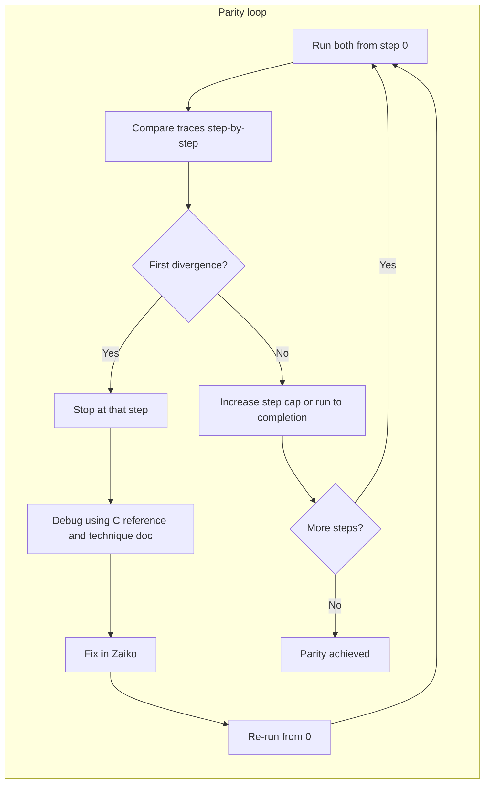

# Zaiko–Maiko Step-by-Step Parity Plan

## Principles (from your answers)

1. **Restart from 0** – Every comparison run starts at instruction 0. After any fix, re-run the full comparison from 0 to catch regressions.
2. **No progress past divergence** – As soon as Zaiko diverges from Maiko, stop, debug that divergence, fix it, then re-run from 0. Do not advance step count or “skip past” a wrong step; everything after a wrong step is in doubt.
3. **Exhaustive tracing** – Use the existing unified trace format so each step is fully comparable (PC, opcode, operands, registers, SP/FP, stack summary, memory context, etc.).

## Current state

- **WORK_STATE.md**: Stack/FP init bug is marked RESOLVED (Zig SP=0x02e88, FP=0x307864 matching C). Status block still says “CRITICAL RUNTIME ISSUES” and “NEXT PRIORITY: Fix VM initialization” (partially stale).
- **reports/STEP_COMPARISON_STATUS.md**: First divergence was at instruction 0 (SP/FP init); fix target was `zaiko/src/vm/vm_initialization.zig`.
- **Infrastructure**: [scripts/compare_emulator_execution.sh](scripts/compare_emulator_execution.sh) runs both emulators with `EMULATOR_MAX_STEPS`, produces `c_emulator_execution_log.txt` and `zig_emulator_execution_log.txt`. Unified trace spec: [documentation/specifications/vm-core/trace-and-logging-formats.typ](documentation/specifications/vm-core/trace-and-logging-formats.typ). Comparison tools: [scripts/compare_unified_traces.awk](scripts/compare_unified_traces.awk), [scripts/compare_unified_traces.py](scripts/compare_unified_traces.py).
- **Debugging reference**: [documentation/core/critical-debugging-technique.typ](documentation/core/critical-debugging-technique.typ) (step-through, instrumentation, C as reference, document findings).

## High-level workflow

- **Run from 0**: Use `EMULATOR_MAX_STEPS=N` (or 0 for full run once parity is likely). Always start both emulators from the same sysout and step 0.
- **Compare**: Diff or field-by-field compare (e.g. `compare_unified_traces.py` / `.awk`) on the two trace files. Identify the **first** line/step where any critical field (PC, opcode, SP_FP, stack summary, memory context) differs.
- **Stop**: Do not use steps after the first divergence for “progress.” Only that step (and before) is trusted.
- **Debug**: Follow [documentation/core/critical-debugging-technique.typ](documentation/core/critical-debugging-technique.typ): compare Zaiko code to C in `maiko/src/` (and `maiko/inc/`), add targeted instrumentation if needed, validate state (e.g. TOPOFSTACK from memory after CSTKPTRL restore, PC in bytes, FPtoVP 512-byte pages). Document findings in specs/implementations per AGENTS.md.
- **Fix**: Change only Zaiko (and docs). Re-run comparison from step 0 with the same or higher step cap to verify the fix and no regressions.

## Concrete steps

1. **Confirm trace output and comparison from 0**

   - Ensure both emulators write the **same** trace format (or that comparison script normalizes them). If C writes a different format, either add a C unified-trace output or a normalizer so that line N is the same “step” for both.
   - Run once from 0 with a small cap (e.g. `EMULATOR_MAX_STEPS=100`):
     - `scripts/compare_emulator_execution.sh <path-to-starter.sysout>`
   - Confirm where logs are (e.g. repo root vs `zaiko/`), and that the comparison script uses the correct paths.

2. **Establish baseline (step 0 … N)**

   - Run C and Zig from 0 with `EMULATOR_MAX_STEPS=N` (e.g. 5, then 50, then 100).
   - Compare traces; note the **first** step index where C and Zig differ (if any). If they match for N steps, that’s the current “parity length.”

3. **First divergence (if any)**

   - Stop at that step. Do not consider later steps for parity.
   - Inspect the two trace lines for that step: PC, opcode, SP_FP, stack depth, TOS, memory context.
   - Open the corresponding C code path (dispatch, opcode handler, stack init, etc.) in `maiko/src/` and `maiko/inc/` and the corresponding Zig code in `zaiko/src/`.
   - Apply the critical-debugging-technique workflow: logic comparison, then instrumentation if needed (e.g. log PC, CSTKPTRL, TOPOFSTACK, bytes at PC).
   - Form a hypothesis, implement a fix in Zaiko, then **re-run from 0** (same or larger N) and confirm the divergence is gone and no earlier step regressed.

4. **Iterate**

   - Repeat: run from 0 → compare → first divergence → debug → fix → re-run from 0. Optionally increase N over time to extend the parity length. Never “move past” a divergence without fixing it.

5. **Success and docs**

   - When a full run (or a chosen large N) shows no divergence, parity for that run is achieved. Update WORK_STATE.md and reports/STEP_COMPARISON_STATUS.md (and any specs/impl docs per critical-memory.typ).
   - Make an extensive git commit.

## Trace format alignment

- If C currently writes `c_emulator_execution_log.txt` in a different shape than the unified pipe-delimited format, either:
  - Add unified-trace output in C (e.g. in `maiko/src/execution_trace.c` / `xc.c`) to match [documentation/specifications/vm-core/trace-and-logging-formats.typ](documentation/specifications/vm-core/trace-and-logging-formats.typ), or
  - Add a small normalizer so both logs are compared in the same schema (same columns so “first difference” is well-defined).

## Files to use

| Purpose | File(s) |

| ------------------------ | ------------------------------------------------------------------------------------------------------------------------------------------------ |

| Run both from 0, compare | [scripts/compare_emulator_execution.sh](scripts/compare_emulator_execution.sh) |

| Step cap | `EMULATOR_MAX_STEPS` (env) |

| Trace format spec | [documentation/specifications/vm-core/trace-and-logging-formats.typ](documentation/specifications/vm-core/trace-and-logging-formats.typ) |

| Compare unified traces | [scripts/compare_unified_traces.py](scripts/compare_unified_traces.py), [scripts/compare_unified_traces.awk](scripts/compare_unified_traces.awk) |

| Debugging method | [documentation/core/critical-debugging-technique.typ](documentation/core/critical-debugging-technique.typ) |

| C reference | `maiko/src/`, `maiko/inc/` |

| Zaiko fixes | `zaiko/src/` (e.g. `vm/vm_initialization.zig`, `vm/dispatch/`, opcodes) |

| Session state | [WORK_STATE.md](WORK_STATE.md), [reports/STEP_COMPARISON_STATUS.md](reports/STEP_COMPARISON_STATUS.md) |

## Summary

- **Always start from step 0** when comparing; after every fix, re-run from 0.
- **Never advance past the first divergent step**; fix that divergence, then re-run from 0.
- Use **exhaustive tracing** and the existing comparison tools; align trace formats if needed.
- Debug using the **critical-debugging-technique** doc and C as reference; document and update WORK_STATE.md / reports/STEP_COMPARISON_STATUS.md as you go.