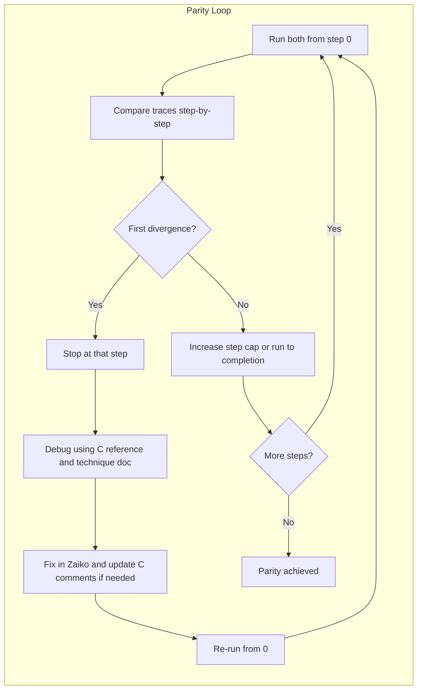

# Zaiko–Maiko Parity Plan - Refined Workflow

## Overview

This refined plan outlines the systematic approach to achieving execution parity between the Zaiko (Zig) and Maiko (C) emulators, incorporating user-specified guidelines for documentation, code consistency, full state comparison, and commit practices. The core workflow remains an iterative process of identifying divergences, debugging against the C reference, fixing in Zaiko, and re-running from step 0. This will take place until each instruction is at least executed once with full parity.

## Principles

1. **Understand status**: Read @WORK_STATE.md then read @STEP_COMPARION_STATUS.md to understand how far into parity the Zaiko(Zig) is compared to Maiko (C).
2. **Restart from 0**: Every comparison run starts at instruction 0. After any fix, re-run the full comparison from 0 to catch regressions.
3. **No progress past divergence**: As soon as Zaiko diverges from Maiko, stop, debug that divergence, fix it, then re-run from 0. Do not advance step count or "skip past" a wrong step; everything after a wrong step is in doubt.
4. **Exhaustive tracing**: Use the existing unified trace format, populated with full CPU state (registers, flags, SP/FP, stack summary, memory context, etc.), for each step.
5. **C code comment improvement**: When a divergence originates from a misunderstanding of the C code, the relevant comments in the `maiko/` submodule will be substantially improved to clarify its logic.
6. **Emulator-wide consistency**: Divergences related to memory addressing, translation, or endianness will be fixed in core, emulator-wide modules (e.g., `zaiko/src/memory/manager.zig`, `zaiko/src/utils/endianness.zig`) to ensure consistency across the codebase.
7. **Update status**: Update @reports/STEP_COMPARISON_STATUS.md to explain current situation, how many steps are now executed flawlessly, archive within the file itself the descriptions of past steps resolution. Update @WORK_STATE.md.
8. **Extensive Git Commits**: Following corrections, extensive git commits will be made, detailing general and language-specific findings as per the `AGENTS.md` guidelines.

## Current State

- **WORK_STATE.md**: Updated to reflect resolved SP and GVAR issues.
- **reports/STEP_COMPARISON_STATUS.md**: Updated to reflect resolved SP and GVAR issues, documenting the current first divergence at Step 2 (PC 0x60f136, TOS mismatch for opcode 0x12 UNBIND).
- **Infrastructure**: `scripts/compare_emulator_execution.sh` runs both emulators with `EMULATOR_MAX_STEPS`, producing `c_emulator_execution_log.txt` and `zig_emulator_execution_log.txt`. Comparison tools: `scripts/compare_unified_traces.awk`, `scripts/compare_unified_traces.py`.
- **Debugging reference**: `documentation/core/critical-debugging-technique.typ` (step-through, instrumentation, C as reference, document findings).

## High-level Workflow

- **Run from 0**: Use `EMULATOR_MAX_STEPS=N` (or 0 for full run once parity is likely). Always start both emulators from the same sysout and step 0.
- **Compare**: Diff or field-by-field compare (`compare_unified_traces.py` / `.awk`) on the two trace files. Identify the **first** line/step where any critical field (PC, opcode, SP_FP, stack depth, TOS, memory context, registers, flags) differs.
- **Stop**: Do not use steps after the first divergence for “progress.” Only that step (and before) is trusted.
- **Debug**: Follow `documentation/core/critical-debugging-technique.typ`:
  - Compare Zaiko code to C in `maiko/src/` (and `maiko/inc/`).
  - Add targeted instrumentation if needed (e.g., log PC, CSTKPTRL, TOPOFSTACK, bytes at PC).
  - Validate state (e.g., TOPOFSTACK from memory after CSTKPTRL restore, PC in bytes, FPtoVP 512-byte pages).
  - **If divergence stems from misunderstanding C code, update C code comments in `maiko/` to clarify logic.**
- **Fix**: Change Zaiko (and C comments if applicable). Re-run comparison from step 0 with the same or higher step cap to verify the fix and no regressions.
- **Document**: Document findings in `documentation/specifications/` and `documentation/implementations/` per `AGENTS.md`.

## Concrete Steps (Iterative, focusing on current divergence)

1.  **Resolve Trace Logging Timing Discrepancy**:

    - **Issue**: C emulator appears to log CPU state (including `TOS`) *after* executing each instruction, while Zig logs *before*. This leads to a `TOS` mismatch at Step 2 (`0x00140000` in C vs `0x0000000e` in Zig).
    - **Action**: Modify `zaiko/src/vm/dispatch/dispatch_loop.zig` to ensure the trace is logged *after* `execution.executeInstruction` has completed and stack state has been updated. This will ensure Zig's trace reflects the state *after* the instruction, matching C's presumed behavior.
    - **Verification**: Re-run `scripts/compare_emulator_execution.sh` with `EMULATOR_MAX_STEPS=15` and confirm that Zig's `TOS` at Step 2 matches C's (`0x00140000`).

2.  **Debug UNBIND (Opcode 0x12) Semantics**:

    - **Issue**: After addressing trace timing, investigate the `UNBIND` (opcode `0x12`) implementation in `zaiko/src/vm/opcodes/binding.zig`. C's `UNBIND` appears to result in `TOS:0x00140000`, while Zig currently does not.
    - **C Reference**: Analyze the `UNBIND` macro in `maiko/inc/inlineC.h` and related stack/frame management in `maiko/src/binds.c`. Pay close attention to how `CurrentStackPTR`, `CSTKPTRL`, and `TopOfStack` (global `MachineState.tosvalue`) are manipulated and what value `TopOfStack` holds after `UNBIND`.
    - **Action**: Adjust `handleUNBIND` in `zaiko/src/vm/opcodes/binding.zig` to correctly restore `vm.top_of_stack` (Zig's equivalent of `TopOfStack`) to the value that was present before the corresponding `BIND` operation, or to whatever value C's `UNBIND` is intended to leave.
    - **Verification**: Re-run `scripts/compare_emulator_execution.sh` and confirm `TOS` parity for Step 2 and subsequent steps.

3.  **Populate `REGISTERS` and `FLAGS` in Trace**:

    - **Issue**: The current unified trace format specification includes `REGISTERS` and `FLAGS`, but these are not yet populated in the Zig emulator trace.
    - **Action**: Modify `zaiko/src/vm/execution_trace.zig` to include the values of relevant CPU registers (if applicable to the VM architecture) and flags (e.g., Zero, Negative, Carry, Overflow) in the `REGISTERS` and `FLAGS` fields of the unified trace log.
    - **Verification**: Visually inspect the generated `zig_emulator_execution_log.txt` for correctly populated `REGISTERS` and `FLAGS` fields. If C's trace doesn't populate these, consider adding them to C's trace for comprehensive comparison.

4.  **Ensure Emulator-Wide Memory/Endianness Consistency**:

    - **Continuous Action**: During debugging, if any divergence is related to memory addressing, translation, or endianness, ensure fixes are applied in the core memory management modules (e.g., `zaiko/src/memory/manager.zig`, `zaiko/src/utils/endianness.zig`, `zaiko/src/utils/memory_access.zig`), rather than isolated opcode handlers.
    - **Verification**: Review changes to ensure they are robust and impact all relevant memory operations uniformly.

5.  **Extensive Git Commits**:

    - **Action**: After each significant fix or a batch of related minor fixes, create an extensive git commit. The commit message will adhere to the format specified in `AGENTS.md`, detailing both general and language-specific findings and documentation updates.
    - **Verification**: Review commit messages for adherence to the specified format and detail level.

## Files to Use

| Purpose | File(s) |

| :----------------------- | :---------------------------------------------------------------------------------------------- |

| Run both from 0, compare | `scripts/compare_emulator_execution.sh` |

| Step cap | `EMULATOR_MAX_STEPS` (env) |

| Trace format spec | `documentation/specifications/vm-core/trace-and-logging-formats.typ` |

| Compare unified traces | `scripts/compare_unified_traces.py`, `scripts/compare_unified_traces.awk` |

| Debugging method | `documentation/core/critical-debugging-technique.typ` |

| C reference | `maiko/src/`, `maiko/inc/` |

| Zaiko fixes | `zaiko/src/` (e.g. `vm/vm_initialization.zig`, `vm/dispatch/`, `opcodes/`, `memory/`, `utils/`) |

| Trace logging | `zaiko/src/vm/execution_trace.zig`, `zaiko/src/vm/dispatch/dispatch_loop.zig` |

| UNBIND implementation | `zaiko/src/vm/opcodes/binding.zig` |

| Opcode mapping | `zaiko/src/vm/dispatch/opcode.zig`, `zaiko/src/vm/dispatch/decode.zig` |

| Session state | `WORK_STATE.md`, `reports/STEP_COMPARISON_STATUS.md` |

## Summary

The refined plan addresses user requirements for C comment improvements, emulator-wide fixes, full CPU state tracing, and extensive git commits. The immediate next step is to address the trace logging timing and the `UNBIND` opcode's `TOS` restoration. This iterative process will continue until full parity is achieved, with diligent documentation and commit practices.