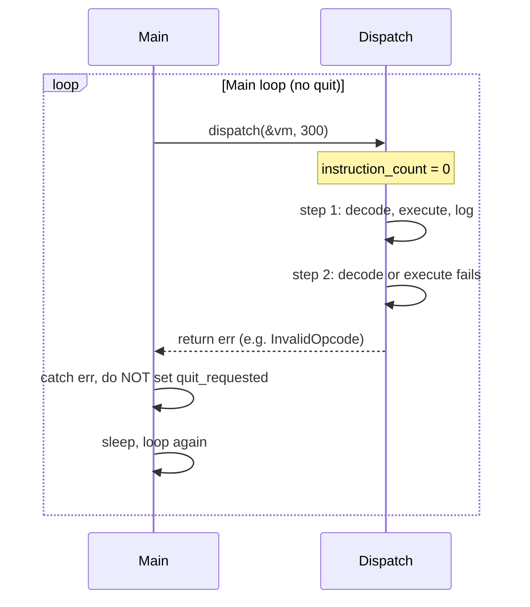

# Zig 300-step trace parity: why single-line-per-step fails and how to fix it

## Current plan (goal)

- Run both C and Zig emulators with a step cap of 300 (`EMULATOR_MAX_STEPS=300` or `--max-steps 300`).
- Each emulator should write a **unified trace**: exactly **one line per execution step**, with the full log for that step on that single line.
- Compare the two trace files so the first 300 lines are identical (parity).

The **trace format is already one line per step**: [zaiko/src/vm/execution_trace.zig](zaiko/src/vm/execution_trace.zig) writes a single line per `logInstruction()` via `unifiedTraceLog()` and `writeAll(buffer[0..pos])`. The step cap is also correctly computed: `max_steps_opt=300` is set (from `--max-steps` or `EMULATOR_MAX_STEPS`), and the check `instruction_count > max_steps` in [zaiko/src/vm/dispatch.zig](zaiko/src/vm/dispatch.zig) would stop after 300 steps.

So the problem is **not** the “one line per step” format or the cap value; it is that **execution never runs 300 steps in one go**.

## Why we are not achieving 300 steps (root cause)

Observed behaviour:

1. **Zig produces 3130 lines** instead of 300 when run with the step cap.
2. **Debug print** `"INFO: dispatch step cap max_steps_opt=300"` appears **~2975 times** in one run.

So `dispatch()` is being **entered ~2975 times** in a single process. That implies:

- The **main loop** in [zaiko/src/main.zig](zaiko/src/main.zig) (lines 473–552) is **not** exiting after one dispatch run.
- Each time: `dispatch.dispatch(&vm, effective_max_steps)` is called, it runs a **small number of steps**, then **returns** (without setting `vm.stop_requested`).
- Because `vm.stop_requested` is never set, the loop does not break. For **non‑critical** errors, the catch block (lines 502–541) also does **not** set `quit_requested`, so the loop continues and calls `dispatch()` again.

So the flow is:

So we get **one (or a few) steps per dispatch call**, and **one log line per step**; over ~3130 calls we get 3130 lines. The cap of 300 is never reached inside a single `dispatch()` run because **dispatch returns early on an error**.

Where dispatch can return without setting `stop_requested`:

- [zaiko/src/vm/dispatch.zig](zaiko/src/vm/dispatch.zig) lines 113–114: `decodeInstruction(...) catch |err| { return err; }` — any decode error (e.g. `InvalidOpcode`, `InvalidAddress`) propagates to main.
- Lines 118–120: `executeInstructionInLoop(...) catch |err| { return err; }` — any execute error propagates to main.
- Lines 131–137: same for the unknown-opcode path.

Main only sets `quit_requested` for **critical** errors (StackOverflow, InvalidAddress, etc.). For `InvalidOpcode` and the `else` branch it only prints and continues, so the loop keeps calling `dispatch()`.

So:

- **Why “single line per step” is already correct:** The tracer writes one line per `logInstruction()` and we call it once per VM step. The format is fine.
- **Why we don’t get 300 steps:** Dispatch returns an error (from decode or execute) after very few steps; main treats that as non-fatal and calls dispatch again. So we never run 300 steps in one dispatch, and we get thousands of “mini” runs and thus thousands of lines.

## Why progress has been stuck

Effort so far focused on:

1. Making sure the **cap is set** (e.g. `effective_max_steps` from env, `max_steps_opt=300` in dispatch) — which is correct.
2. Enforcing the cap **inside** the loop (`instruction_count > max_steps` then `vm.stop_requested = true; return`) — which is correct.

The **actual bug** was not that the cap was wrong, but that **we never reach the cap** because dispatch exits earlier on an error. Until we fix **why dispatch returns an error** (or change how main reacts when a cap is set), we will keep getting one (or a few) steps per call and thousands of lines.

## Recommended fix (concise)

1. **Identify the error** that causes dispatch to return almost every time:

   - Run with stderr **not** discarded and capture what main prints in the catch block (`"VM dispatch error: ..."` or `"CRITICAL VM ERROR: ..."`).
   - Or add a single log line in main’s catch that writes the error tag (e.g. `@tagName(err)`) to a small debug file, then run with the cap and inspect it.

2. **Fix the cause** (one of the following, depending on what the error is):

   - If **decode** returns (e.g. `InvalidOpcode` from invalid address): fix PC handling, decode, or memory so that decode does not error on the second (or early) step; or handle that case inside the dispatch loop so we don’t `return err` and instead continue (e.g. skip / advance PC).
   - If **execute** returns: fix the opcode implementation or error handling in `executeInstructionInLoop` so that non-fatal cases don’t propagate out of dispatch (e.g. handle and `return true` to continue).

3. **Optional hardening when a step cap is set:**

If dispatch returns for **any** reason (error or stop) and `effective_max_steps != null`, set `quit_requested = true` so we don’t keep re-calling dispatch and inflating the line count. This gives at most 300 lines when the cap is set, even if the underlying error is not yet fixed. Prefer fixing the real error (step 2) so that a single dispatch run actually executes 300 steps and then stops on the cap.

4. **Cleanup:** Remove the temporary debug print in dispatch (`"INFO: dispatch step cap max_steps_opt={?}"`) once the fix is verified.

## Summary

| Aspect | Status |

| --------------------------- | ----------------------------------------------------------------------------------------------------------------------------------------------- |

| One line per execution step | Already implemented (one `logInstruction` → one line). |

| Step cap value (300) | Correctly set and checked in dispatch. |

| Why we don’t get 300 steps | Dispatch returns an error after 1–2 steps; main doesn’t quit, so it calls dispatch again ~3130 times → 3130 lines. |

| Next step | Find which error is returned (decode vs execute, which err), then fix that path so dispatch runs 300 steps in one go and then stops on the cap. |
