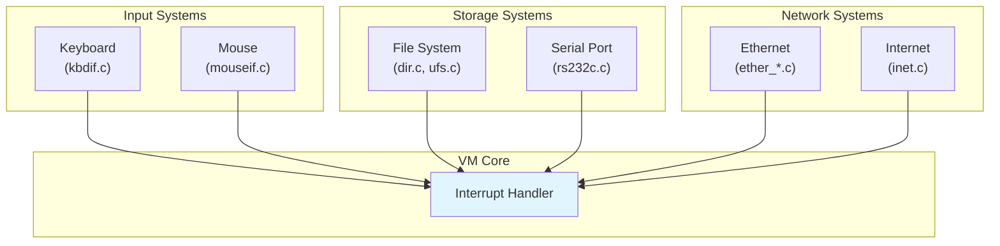

# I/O Systems Component

**Navigation**: [README](../README.md) | [Index](../INDEX.md) | [Architecture](../architecture.md) | [VM Core](vm-core.md) | [Memory Management](memory-management.md) | [Display](display.md) | [Glossary](../glossary.md)

The I/O Systems component handles all input/output operations including keyboard, mouse, file system, and serial communications.

**Related Components**:

- [VM Core](vm-core.md) - I/O interrupts processed by VM
- [Display](display.md) - Keyboard/mouse events from display

## Overview

Maiko provides I/O abstraction for:

- **Keyboard Input**: Key event processing and translation (see [Keyboard System](#keyboard-system))
- **Mouse Input**: Mouse button and movement events (see [Mouse System](#mouse-system))
- **File System**: File and directory operations (see [File System](#file-system))
- **Serial Communication**: RS-232 serial port access (see [Serial Communication](#serial-communication))
- **Network**: Ethernet and Internet protocol support (see [Network Communication](#network-communication))

## Key Files

### Keyboard Input

- **`maiko/src/kbdif.c`**: Keyboard interface
  - Key event processing
  - Key code translation
  - Keyboard state management

- **`maiko/src/kbdsubrs.c`**: Keyboard subroutines
  - Lisp-callable keyboard functions
  - Keyboard configuration

- **`maiko/src/keyevent.c`**: Key event handling
  - Event queue management
  - Event processing

- **`maiko/src/findkey.c`**: Key lookup
  - Key code mapping
  - Key translation

- **`maiko/src/initkbd.c`**: Keyboard initialization
  - `init_keyboard()`: Initialize keyboard subsystem
  - Keyboard setup

### Mouse Input

- **`maiko/src/mouseif.c`**: Mouse interface
  - Mouse event processing
  - Mouse button handling
  - Mouse movement tracking

- **`maiko/src/dosmouse.c`**: DOS mouse support
  - DOS-specific mouse handling

### File System

- **`maiko/src/dir.c`**: Directory operations
  - Directory enumeration
  - Directory creation/deletion
  - File listing

- **`maiko/src/ufs.c`**: Unix file system operations
  - File I/O
  - Pathname handling
  - File attributes

- **`maiko/src/uutils.c`**: Unix utilities
  - File system utilities
  - Pathname utilities

- **`maiko/src/uutils.c`**: File utilities
  - File operations
  - File metadata

- **`maiko/src/uraid.c`**: URAID (Unix RAID) operations
  - File system operations
  - Directory operations

- **`maiko/src/dsk.c`**: Disk operations
  - Disk I/O
  - Disk management

### Serial Communication

- **`maiko/src/rs232c.c`**: RS-232 serial communication
  - Serial port initialization
  - Serial I/O
  - Serial configuration

- **`maiko/src/rawrs232c.c`**: Raw RS-232 operations
  - Low-level serial access
  - Serial port control

### Character Devices

- **`maiko/src/chardev.c`**: Character device operations
  - Device I/O
  - Device management

### Terminal I/O

- **`maiko/src/tty.c`**: Terminal operations
  - Terminal I/O
  - Terminal control

- **`maiko/src/initsout.c`**: Standard output initialization
  - `init_sout()`: Initialize standard output
  - Output stream setup

- **`maiko/src/ldsout.c`**: Lisp standard output
  - Lisp output stream
  - Output redirection

- **`maiko/src/setsout.c`**: Set standard output
  - Output stream configuration

- **`maiko/src/tstsout.c`**: Test standard output
  - Output testing

### Process Communication

- **`maiko/src/unixcomm.c`**: Unix inter-process communication
  - Pipe communication
  - Process communication

- **`maiko/src/unixfork.c`**: Unix fork operations
  - Process forking
  - Process management

- **`maiko/src/doscomm.c`**: DOS communication
  - DOS-specific IPC

### Network I/O

- **`maiko/src/inet.c`**: Internet protocol operations
  - TCP/IP support
  - Socket operations

- **`maiko/src/ether_common.c`**: Ethernet common code
  - Ethernet abstraction
  - Network device management

- **`maiko/src/ether_sunos.c`**: SunOS Ethernet
  - SunOS-specific Ethernet

- **`maiko/src/ether_nethub.c`**: NETHUB Ethernet
  - NETHUB network support

- **`maiko/src/dlpi.c`**: DLPI (Data Link Provider Interface)
  - DLPI network access

## Keyboard System

### Key Event Flow

1. **Hardware Event**: Physical key press/release
2. **OS Event**: OS-level key event (X11 KeyEvent, SDL KeyboardEvent)
3. **Translation**: Convert to Lisp keycode
4. **Queue**: Add to key event queue
5. **Processing**: Process in Lisp interrupt handler

### Key Code Translation

Keys are translated from OS keycodes to Lisp keycodes:

- **Keymap**: Mapping table (`keymap[]` in `sdl.c`)
- **Modifiers**: Shift, Control, Meta keys
- **Special Keys**: Function keys, arrow keys, etc.

### Keyboard State

- **Key State**: Pressed/released state
- **Modifier State**: Shift, Control, Meta state
- **Key Repeat**: Auto-repeat handling

## Mouse System

### Mouse Event Flow

1. **Hardware Event**: Mouse movement or button press
2. **OS Event**: OS-level mouse event
3. **Translation**: Convert to Lisp mouse event
4. **Queue**: Add to mouse event queue
5. **Processing**: Process in Lisp interrupt handler

### Mouse Operations

- **Button Events**: Press/release detection
- **Motion Events**: Movement tracking
- **Position**: Current mouse position
- **Buttons**: Button state tracking

## File System

### File Operations

- **Open**: Open file for reading/writing
- **Close**: Close file
- **Read**: Read data from file
- **Write**: Write data to file
- **Seek**: Change file position
- **Delete**: Delete file
- **Rename**: Rename file

### Directory Operations

- **List**: List directory contents
- **Create**: Create directory
- **Delete**: Delete directory
- **Change**: Change current directory
- **Enumerate**: Enumerate directory entries

### Pathname Handling

- **Pathname Parsing**: Parse pathname components
- **Pathname Construction**: Build pathnames
- **Pathname Resolution**: Resolve relative paths
- **Pathname Normalization**: Normalize paths

## Serial Communication

### Serial Port Operations

- **Open**: Open serial port
- **Close**: Close serial port
- **Configure**: Set baud rate, parity, etc.
- **Read**: Read from serial port
- **Write**: Write to serial port
- **Control**: Flow control, DTR, RTS

### Serial Configuration

- **Baud Rate**: Communication speed
- **Data Bits**: 5, 6, 7, or 8 bits
- **Stop Bits**: 1 or 2 stop bits
- **Parity**: None, even, or odd
- **Flow Control**: XON/XOFF or hardware

## Network Communication

### Ethernet Support

Maiko supports multiple Ethernet backends:

- **DLPI**: Data Link Provider Interface (SunOS)
- **NIT**: Network Interface Tap (SunOS)
- **NETHUB**: Network hub emulation

### Network Operations

- **Open**: Open network device
- **Close**: Close network device
- **Send**: Send packet
- **Receive**: Receive packet
- **Configure**: Configure network interface

### Internet Protocol

- **TCP**: Transmission Control Protocol
- **UDP**: User Datagram Protocol
- **Socket Operations**: Create, bind, connect, listen, accept

## Process Communication

### Unix IPC

- **Pipes**: Unnamed pipes for process communication
- **Fork**: Create child process
- **Exec**: Execute program
- **Wait**: Wait for process completion

### Communication Mechanisms

- **File Descriptors**: Standard file descriptor I/O
- **Signals**: Unix signal handling
- **Pipes**: Pipe-based communication

## I/O Buffering

### Input Buffering

- **Key Buffer**: Keyboard input buffer
- **Mouse Buffer**: Mouse event buffer
- **File Buffer**: File I/O buffer

### Output Buffering

- **Line Buffering**: Line-buffered output
- **Block Buffering**: Block-buffered output
- **Unbuffered**: Direct output

## Error Handling

### Error Codes

- **System Errors**: OS error codes
- **Lisp Errors**: Lisp error conditions
- **Error Translation**: Convert OS errors to Lisp errors

### Error Reporting

- **Error Messages**: Human-readable error messages
- **Error Codes**: Numeric error codes
- **Error Context**: Additional error context

## Related Components

- [Display](display.md) - Keyboard/mouse events from display
  - [Event Handling](display.md#event-handling) - Display events trigger I/O
- [VM Core](vm-core.md) - I/O interrupts processed by VM
  - [Interrupt Handling](vm-core.md#interrupt-handling) - How interrupts are processed
- [Architecture Overview](../architecture.md) - I/O systems in system architecture

## See Also

- [Glossary](../glossary.md) - I/O-related terms:
  - [Keycode](../glossary.md#keycode), [Keymap](../glossary.md#keymap)
  - [Mouse Event](../glossary.md#mouse-event), [File Descriptor](../glossary.md#file-descriptor)
  - [Serial Port](../glossary.md#serial-port), [Ethernet](../glossary.md#ethernet)
- Header Files:
  - `maiko/inc/kbdif.h` - Keyboard interface definitions
  - `maiko/inc/mouseif.h` - Mouse interface definitions
  - `maiko/inc/dirdefs.h` - Directory operation definitions
  - `maiko/inc/unixcommdefs.h` - Unix communication definitions
- [API Overview](../api/overview.md) - I/O functions
