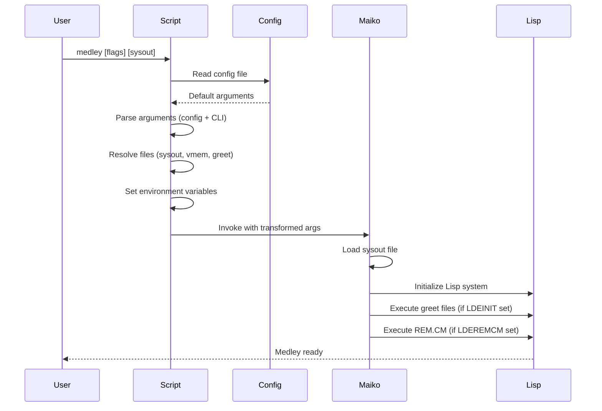
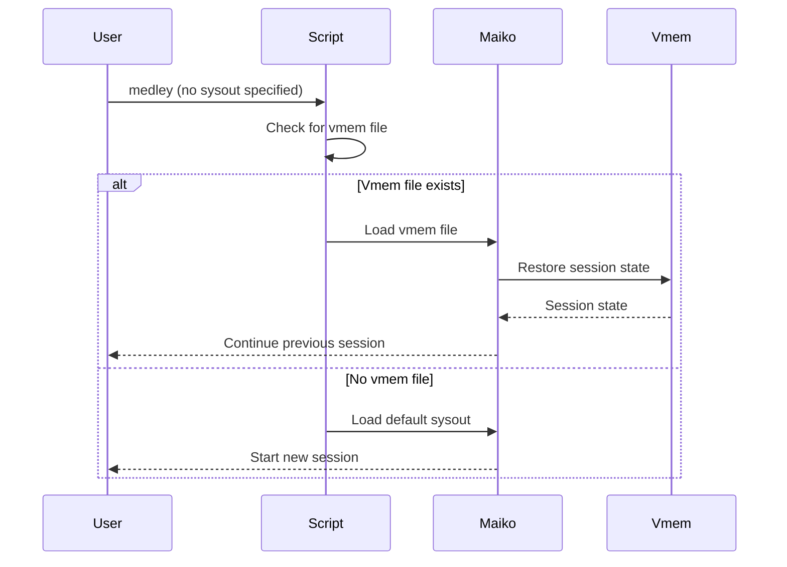
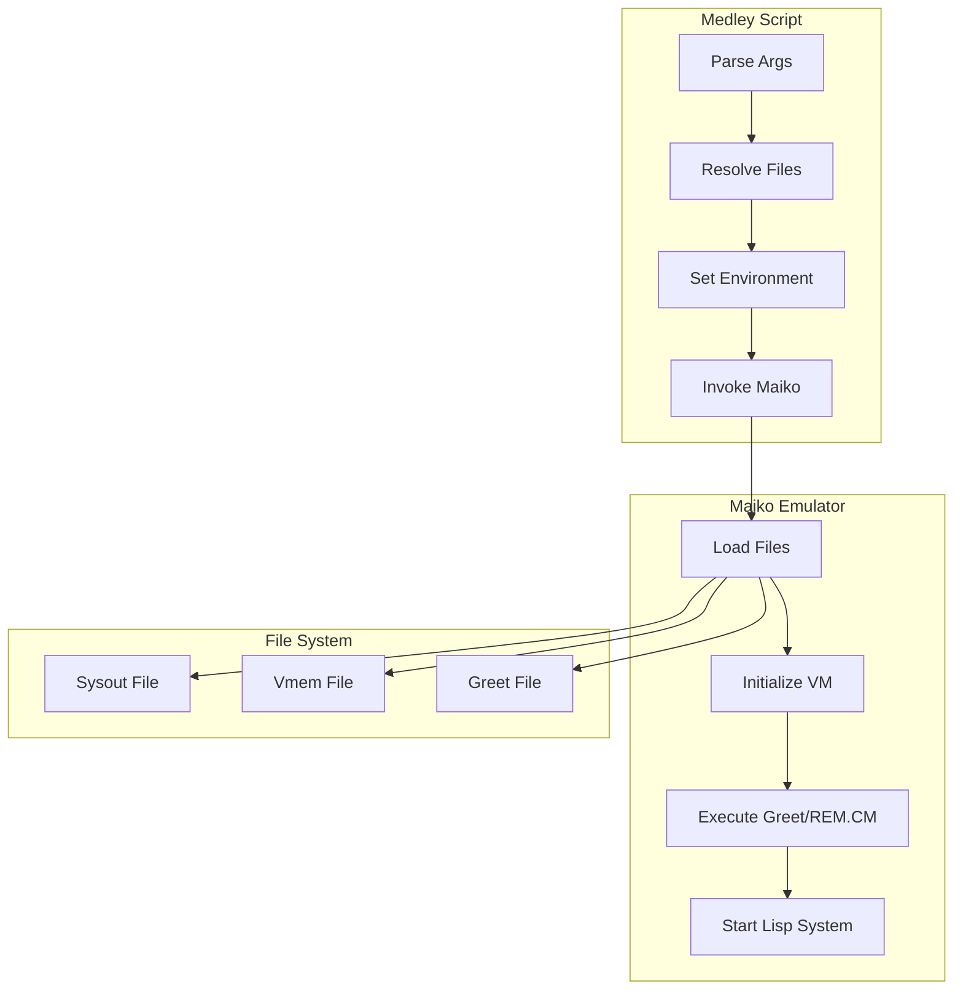

# Runtime Communication Protocols

**Navigation**: [Medley README](../README.md) | [Medley Index](../INDEX.md) | [Interface Overview](README.md)

## Overview

This document describes the runtime communication protocols between Medley scripts and the Maiko emulator. These protocols define how Medley invokes Maiko, how errors are handled, and how sessions are managed.

## Script Invocation Pattern

### Invocation Function

Medley scripts invoke Maiko using the `start_maiko()` function:

```bash
"${maiko}" "${src_sysout}" \
           -id "${run_id}" \
           -title "${title}" \
           -g "${geometry}" \
           -sc "${screensize}" \
           ${borderwidth_flag} ${borderwidth_value} \
           ${pixelscale_flag} ${pixelscale_value} \
           ${noscroll_arg} \
           ${mem_flag} ${mem_value} \
           ${nh_host_flag} ${nh_host_value} \
           ${nh_port_flag} ${nh_port_value} \
           ${nh_mac_flag} ${nh_mac_value} \
           ${nh_debug_flag} ${nh_debug_value} \
           ${nofork_arg} \
           "$@"
```

**Source Code Reference**: [medley/scripts/medley/medley_run.sh](medley/scripts/medley/medley_run.sh) - `start_maiko()` function

### Argument Order

Arguments are passed to Maiko in this order:

1. **Sysout file**: First positional argument (required)
2. **Standard flags**: `-id`, `-title`, `-g`, `-sc`, etc.
3. **Optional flags**: Border width, pixel scale, noscroll, memory, nethub
4. **Pass-through arguments**: Arguments after `--` (if any)

### Environment Variables

Before invocation, scripts set environment variables:

- `MEDLEYDIR`: Top-level Medley installation directory
- `LOGINDIR`: User-specific Medley directory
- `LDESOURCESYSOUT`: Source sysout file path
- `LDEDESTSYSOUT`: Destination vmem file path
- `LDEINIT`: Greet file path (if specified)
- `LDEREMCM`: REM.CM file path (if specified)

**See**: [Environment Variables](environment.md) for complete environment variable documentation

## Startup Sequence

### Complete Startup Flow



### Detailed Startup Steps

1. **Script Initialization**
   - Parse command-line arguments
   - Read config file (if present)
   - Resolve file paths (sysout, vmem, greet, config)
   - Set environment variables

2. **File Resolution**
   - Resolve sysout file (from flags or explicit argument)
   - Resolve vmem file (if no sysout specified)
   - Resolve greet file (from flag or default)
   - Resolve REM.CM file (if `-cm` flag used)

3. **Maiko Invocation**
   - Set environment variables
   - Invoke Maiko executable with transformed arguments
   - Pass sysout file as first argument

4. **Maiko Initialization**
   - Maiko reads environment variables
   - Maiko loads sysout file (or vmem file if specified)
   - Maiko initializes Lisp system

5. **Greet File Execution**
   - Maiko executes greet file (if `LDEINIT` set)
   - Greet file initializes Lisp environment

6. **REM.CM Execution**
   - Maiko executes REM.CM file (if `LDEREMCM` set)
   - REM.CM performs loadup operations

7. **Main System Start**
   - Maiko starts main Lisp system
   - Medley is ready for use

**Source Code Reference**: [medley/scripts/medley/medley_run.sh](medley/scripts/medley/medley_run.sh) - startup sequence

## Session Continuation Protocol

### Continuation Flow



### Continuation Logic

1. **Check for Vmem File**
   - Script checks for vmem file: `LOGINDIR/vmem/lisp_{run-id}.virtualmem`
   - If vmem exists and no sysout specified: Load vmem file
   - If no vmem or sysout specified: Load sysout file

2. **Vmem Loading**
   - Maiko loads vmem file
   - Maiko restores session state from vmem
   - Medley continues from saved state

3. **Sysout Loading**
   - Maiko loads sysout file
   - Maiko initializes new Lisp system
   - Medley starts fresh session

**Source Code Reference**: [medley/scripts/medley/medley_args.sh](medley/scripts/medley/medley_args.sh) - continuation logic

## Error Handling

### Validation Errors

Scripts validate arguments and report errors:

- **Unknown flags**: "ERROR: Unknown flag: $1"
- **Invalid file paths**: Check file existence
- **Invalid argument combinations**: Validate mutually exclusive flags
- **Missing required files**: Check sysout file existence

**Error Codes**: Scripts exit with appropriate error codes

**Source Code Reference**: [medley/scripts/medley/medley_args.sh](medley/scripts/medley/medley_args.sh) - error handling

### Maiko Execution Errors

Scripts handle Maiko execution errors:

- **Exit code checking**: Scripts check Maiko exit codes
- **Error reporting**: Display error messages
- **Cleanup**: Handle cleanup on errors

**Exit Codes**: Maiko returns exit codes indicating success or failure

**Source Code Reference**: [medley/scripts/medley/medley_run.sh](medley/scripts/medley/medley_run.sh) - error handling

### File Loading Errors

Maiko handles file loading errors:

- **Missing files**: Report error if sysout/vmem file not found
- **Invalid format**: Report error if file format is invalid
- **Version incompatibility**: Report error if version mismatch

## Exit Codes

### Script Exit Codes

- **0**: Success
- **1**: General error
- **2**: Invalid LOGINDIR (not a directory)
- **52**: Config file not found

### Maiko Exit Codes

Maiko exit codes are passed through to scripts:

- **0**: Success
- **Non-zero**: Error (specific codes depend on Maiko implementation)

**Source Code Reference**: [medley/scripts/medley/medley_run.sh](medley/scripts/medley/medley_run.sh) - exit code handling

## Session Management

### Run ID Management

Run IDs distinguish multiple Medley sessions:

- **Default**: "default"
- **Custom**: Specified with `-i ID, --id ID` flag
- **Uniqueness**: Only one instance per run ID can run simultaneously

**See**: [Scripts Component](../components/scripts.md#session-flags) for run ID details

### Vmem File Coordination

Vmem files are coordinated by run ID:

- **File naming**: `lisp_{run-id}.virtualmem` or `lisp.virtualmem` (if run ID is "default")
- **Collision prevention**: Run ID prevents vmem file collisions
- **Warning**: `-p FILE` flag bypasses run ID protection

**See**: [Virtual Memory Files Component](../components/vmem.md#run-id-and-vmem-files) for vmem coordination

## Repeat Protocol

### Repeat File Protocol

When `-cc FILE, --repeat FILE` flag is used:

1. **First Run**: Medley runs once normally
2. **Repeat Check**: After exit, script checks if repeat file exists and is non-empty
3. **Repeat Run**: If file exists, Medley runs again using repeat file as REM.CM
4. **Termination**: Repeat continues until file is deleted or empty

**Source Code Reference**: [medley/scripts/medley/medley_run.sh](medley/scripts/medley/medley_run.sh) - repeat protocol

### Repeat File Format

Repeat file is a Lisp file (same format as REM.CM):

- **Format**: Lisp source code
- **Usage**: Executed as REM.CM file on each repeat run
- **Modification**: Can be modified by Medley to control subsequent runs

## VNC Protocol (WSL)

### VNC Setup

On WSL, when `-v, --vnc` flag is used:

1. **VNC Detection**: Script detects WSL environment
2. **VNC Server**: Script starts Xvnc server
3. **Display Setup**: Script sets DISPLAY to VNC display
4. **Maiko Invocation**: Script invokes Maiko with VNC display
5. **VNC Client**: VNC window opens on Windows side

**Source Code Reference**: [medley/scripts/medley/medley_vnc.sh](medley/scripts/medley/medley_vnc.sh) - VNC setup

### Automation Mode

When `-am, --automation` flag is used with VNC:

- **Short Sessions**: Adjusts Xvnc error detection for very short sessions
- **Timing**: Adjusts timing for automation scripts
- **Error Handling**: Prevents false positives from short session detection

**See**: [Platform - WSL](../platform/wsl.md) for WSL-specific details

## Protocol Interaction Diagram



## Related Documentation

- **Scripts Component**: [Scripts Component](../components/scripts.md) - Script system and invocation
- **Command-Line Interface**: [Command-Line Interface](command-line.md) - Command-line argument mapping
- **Environment Variables**: [Environment Variables](environment.md) - Environment variable communication
- **File Formats**: [File Formats](file-formats.md) - File format specifications
- **Virtual Memory Files**: [Virtual Memory Files Component](../components/vmem.md) - Vmem file coordination
- **Platform Documentation**: [Platform Documentation](../platform/) - Platform-specific protocols
