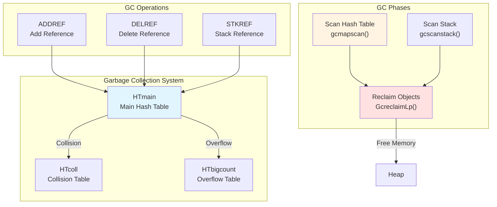

# Garbage Collection Algorithm Specification

**Navigation**: [README](README.md) | [Virtual Memory](virtual-memory.md) | [Memory Layout](memory-layout.md)

Complete specification of the reference-counting garbage collection algorithm, including hash table structure, reference counting operations, and reclamation phases.

## Overview

Maiko uses a reference-counting garbage collection system that tracks references to objects in hash tables. Objects with zero references are reclaimed during GC phases.

## GC System Overview



## GC Hash Tables

### HTmain (Main Hash Table)

Primary hash table for reference counting:

```pseudocode
struct HashEntry:
    count: 15 bits        // Reference count (0-32767 in BIGVM, 0-63 otherwise)
    stackref: 1 bit       // Stack reference flag
    segnum: 15 bits       // Segment number (high bits of pointer)
    collision: 1 bit       // Collision flag (points to HTcoll)
```

**Purpose**:

- Primary lookup table
- Stores reference counts
- Indexed by low bits of pointer

### HTcoll (Collision Table)

Handles hash collisions:

```pseudocode
struct CollisionEntry:
    free_ptr: LispPTR     // Pointer being counted
    next_free: LispPTR    // Next collision entry
```

**Purpose**:

- Chain entries for same hash
- Linked list of collisions
- Reused when entries deleted

### HTbigcount (Overflow Table)

Handles reference count overflow:

```pseudocode
struct OverflowEntry:
    ovfl_ptr: LispPTR     // Pointer with overflow count
    ovfl_cnt: uint        // Large reference count
```

**Purpose**:

- Stores counts > MAX_GCCOUNT
- Prevents count overflow
- Separate table for large counts

## Reference Counting Operations

### ADDREF (Add Reference)

```pseudocode
function ADDREF(pointer):
    if not RefCntP(pointer):
        return  // Not reference counted

    if ReclaimCountdown != NIL:
        htfind(pointer, ADDREF)
    else:
        rec_htfind(pointer, ADDREF)
```

**Algorithm**:

1. Look up pointer in HTmain
2. If entry exists: increment count
3. If count overflows: move to HTbigcount
4. If new entry: create entry with count=2

### DELREF (Delete Reference)

```pseudocode
function DELREF(pointer):
    if not RefCntP(pointer):
        return

    if ReclaimCountdown != NIL:
        htfind(pointer, DELREF)
    else:
        rec_htfind(pointer, DELREF)
```

**Algorithm**:

1. Look up pointer in HTmain
2. Decrement reference count
3. If count reaches 0: mark for reclamation
4. If entry becomes empty: remove from table

### STKREF (Stack Reference)

```pseudocode
function STKREF(pointer):
    if not RefCntP(pointer):
        return

    if ReclaimCountdown != NIL:
        htfind(pointer, STKREF)
    else:
        rec_htfind(pointer, STKREF)
```

**Algorithm**:

1. Set stack reference bit
2. Increment allocation countdown
3. Mark object as stack-referenced

## Hash Table Lookup

### htfind Algorithm

```pseudocode
function htfind(pointer, operation):
    // Extract high bits
    hiptr = (pointer >> (16 - HTHISHIFT)) & HTHIMASK

    // Hash to main table entry
    entry = HTmain + (LOLOC(pointer) >> 1)
    entry_contents = GETGC(entry)

    // Handle empty entry
    if entry_contents == 0:
        NewEntry(entry, hiptr, operation, pointer)
        return

    // Handle collision chain
    if entry_contents & 1:  // Collision bit set
        link = HTcoll + (entry_contents - 1)
        prev = null
        goto newlink

    // Check if matches
    if hiptr == (entry_contents & HTHIMASK):
        ModEntry(entry, entry_contents, pointer, operation, delentry)
        return

    // New collision
    GetLink(link)
    GetLink(prev)
    // Set up collision chain
    GETGC(prev + 1) = 0
    GETGC(prev) = entry_contents
    GETGC(link + 1) = prev - HTcoll
    GETGC(entry) = (link - HTcoll) + 1

    NewEntry(link, hiptr, operation, pointer)

delentry:
    GETGC(entry) = 0
    return NIL
```

## GC Phases

### Phase 1: Scan Hash Table

```pseudocode
function gcmapscan():
    probe = HTMAIN_ENTRY_COUNT

    while (probe = gcscan1(probe)) != -1:
        entry = HTmain + probe

        if entry.collision:
            // Process collision chain
            link = HTcoll + GetLinkptr(entry.contents)
            prev = null

            while link:
                offset = link.free_ptr
                if StkCntIsZero(offset):
                    // Reclaimable object
                    ptr = VAG2(GetSegnuminColl(offset), probe << 1)
                    DelLink(link, prev, entry)
                    GcreclaimLp(ptr)
                    if entry.contents == 0:
                        goto nextentry
                    else:
                        goto retry

                if link.next_free:
                    prev = link
                    link = HTcoll + link.next_free
                else:
                    break

        if StkCntIsZero(entry.contents):
            ptr = VAG2(entry.segnum, probe << 1)
            entry.contents = 0
            GcreclaimLp(ptr)

    return NIL
```

### Phase 2: Scan Stack

```pseudocode
function gcscanstack():
    // Scan stack for references
    frame = GetCurrentFrame()

    while frame:
        // Scan frame variables
        ScanFrameVariables(frame)

        // Scan local variables
        ScanLocalVariables(frame)

        // Move to previous frame
        frame = GetPreviousFrame(frame)
```

### Phase 3: Reclamation

```pseudocode
function GcreclaimLp(pointer):
    // Reclaim object based on type
    type = GetTypeNumber(pointer)

    switch type:
        case TYPE_LISTP:
            GcreclaimCell(pointer)
        case TYPE_ARRAY:
            GcreclaimArray(pointer)
        case TYPE_CODE:
            GcreclaimCode(pointer)
        // ... other types ...
```

## Reference Count Overflow

### Overflow Detection

```pseudocode
function CheckOverflow(count):
    if count >= MAX_GCCOUNT:
        return true
    return false
```

### Overflow Handling

```pseudocode
function enter_big_reference_count(pointer):
    // Find free overflow entry
    oventry = HTbigcount
    while oventry.ovfl_ptr != ATOM_T and oventry.ovfl_ptr != NIL:
        if oventry.ovfl_ptr == pointer:
            Error("Pointer already in overflow table")
            oventry.ovfl_cnt += 0x10000  // Make it live forever
            return
        oventry = oventry + 1

    // Allocate new page if needed
    if oventry.ovfl_ptr == NIL:
        if Evenp(LAddrFromNative(oventry + 1), DLWORDSPER_PAGE):
            if oventry + 1 >= HTcoll:
                Error("GC big reference count table overflow")
            newpage(LAddrFromNative(oventry + 1))

    // Store overflow entry
    oventry.ovfl_cnt = MAX_GCCOUNT
    oventry.ovfl_ptr = pointer
```

## GC Triggering

### Allocation Countdown

```pseudocode
function IncAllocCnt(count):
    ReclaimCountdown = ReclaimCountdown - count

    if ReclaimCountdown <= S_POSITIVE:
        // Time for GC
        Irq_Stk_Check = 0
        Irq_Stk_End = 0
        ReclaimCountdown = S_POSITIVE
        TriggerGC()
```

### GC Disabled State

```pseudocode
function RefCntP(pointer):
    // Check if pointer is reference counted
    if GetTypeEntry(pointer) & TT_NOREF:
        return false

    if GcDisabled_word == ATOM_T:
        return false

    return true
```

## Cell Reclamation

### Cons Cell Reclamation

```pseudocode
function GcreclaimCell(cell):
    // Get cons cell
    cons_cell = GetConsCell(cell)

    // Process CAR
    car_value = cons_cell.car_field
    if RefCntP(car_value):
        DELREF(car_value)

    // Process CDR (handle CDR coding)
    cdr_value = CDR(cell)
    if RefCntP(cdr_value):
        DELREF(cdr_value)

    // Free cell
    FreeConsCell(cell)
```

## Related Documentation

- [Memory Layout](memory-layout.md) - Memory organization
- [Virtual Memory](virtual-memory.md) - Virtual memory system
- [Data Structures](../data-structures/) - Object formats
