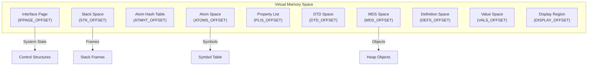

# Memory Layout Specification

**Navigation**: [README](README.md) | [Virtual Memory](virtual-memory.md) | [Garbage Collection](garbage-collection.md)

Complete specification of memory regions, their organization, and memory layout.

## Overview

Maiko memory is organized into distinct regions, each serving a specific purpose. Memory regions are mapped to virtual addresses and managed independently.

## Memory Regions

### Memory Layout Diagram



## Region Specifications

### Interface Page (IFPAGE)

**Offset**: IFPAGE_OFFSET
**Size**: 1 page (256 bytes)
**Purpose**: VM state and control structures

**Contents**:

- Execution state
- Stack pointers
- GC state
- Interrupt state
- Storage state

### Stack Space (STK)

**Offset**: STK_OFFSET
**Size**: Variable (grows as needed)
**Purpose**: Function activation frames

**Organization**:

- Stack frames (FX)
- Binding frames (BF)
- Free stack blocks (FSB)
- Guard blocks

**Growth**: Grows downward (toward lower addresses)

### Atom Space (ATOMS)

**Offset**: ATOMS_OFFSET
**Size**: Variable
**Purpose**: Symbol table

**Organization**:

- Atom structures
- Print names
- Value cells
- Definition cells
- Property lists

### Atom Hash Table (ATMHT)

**Offset**: ATMHT_OFFSET
**Size**: Fixed
**Purpose**: Atom lookup table

**Organization**:

- Hash table entries
- Collision chains
- Atom indices

### Property List Space (PLIS)

**Offset**: PLIS_OFFSET
**Size**: Variable
**Purpose**: Property lists

**Organization**:

- Property list cells
- Property values

### DTD Space (DTD)

**Offset**: DTD_OFFSET
**Size**: Variable
**Purpose**: Data type descriptors

**Organization**:

- DTD structures
- Type information

### MDS Space (Memory Data Structure)

**Offset**: MDS_OFFSET
**Size**: Variable (grows as needed)
**Purpose**: Heap objects

**Organization**:

- Cons cells
- Arrays
- Code blocks
- Other heap objects

**Growth**: Grows upward (toward higher addresses)

### Definition Space (DEFS)

**Offset**: DEFS_OFFSET
**Size**: Variable
**Purpose**: Function definitions

**Organization**:

- Definition cells
- Function headers
- Code blocks

### Value Space (VALS)

**Offset**: VALS_OFFSET
**Size**: Variable
**Purpose**: Global values

**Organization**:

- Value cells
- Global bindings

### Display Region (DISPLAY)

**Offset**: DISPLAY_OFFSET
**Size**: Variable
**Purpose**: Display buffer

**Organization**:

- Display memory
- Bitmap data
- Graphics buffers

## GC Hash Tables

### HTmain

**Offset**: HTMAIN_OFFSET
**Size**: Fixed
**Purpose**: Main GC hash table

**Organization**:

- Hash entries
- Reference counts
- Collision flags

### HTcoll

**Offset**: HTCOLL_OFFSET
**Size**: Variable
**Purpose**: GC collision table

**Organization**:

- Collision entries
- Linked chains

### HTbigcount

**Offset**: HTBIG_OFFSET
**Size**: Variable
**Purpose**: Overflow reference counts

**Organization**:

- Overflow entries
- Large counts

### HToverflow

**Offset**: HTOVERFLOW_OFFSET
**Size**: Variable
**Purpose**: Additional overflow

## Memory Allocation

### Cons Cell Allocation

```pseudocode
function AllocateConsCell():
    // Find free cons cell
    cons_page = FindFreeConsPage()
    cell = GetFreeCell(cons_page)

    // Initialize cell
    cell.car_field = NIL
    cell.cdr_code = CDR_NIL

    return LispAddressOf(cell)
```

### Array Allocation

```pseudocode
function AllocateArray(size, type):
    // Calculate required space
    array_size = CalculateArraySize(size, type)

    // Find free array block
    array_block = FindFreeArrayBlock(array_size)

    // Initialize array header
    array_header = GetArrayHeader(array_block)
    array_header.size = size
    array_header.type = type

    return LispAddressOf(array_block)
```

### Code Allocation

```pseudocode
function AllocateCodeBlock(size):
    // Allocate code block
    code_block = AllocateMDSBlock(size)

    // Initialize code header
    code_header = GetCodeHeader(code_block)
    code_header.size = size

    return LispAddressOf(code_block)
```

## Memory Organization

### Page-Based Organization

Memory is organized into 256-byte pages:

- **Page Number**: High bits of address
- **Page Offset**: Low 8 bits
- **Page Base**: Address with offset cleared

### Segment Organization

Address space divided into segments:

- **Segment Number**: High bits (8-12 bits)
- **Segment Base**: Address with page/offset cleared
- **Segment Size**: Multiple pages

## Storage Management

### Primary Space

Initial memory allocation:

- **Base**: MDS_OFFSET
- **Limit**: Next_MDSpage_word
- **Purpose**: Primary heap allocation

### Secondary Space

Extended memory when primary exhausted:

- **Base**: SecondMDSPage_word
- **Limit**: Process size limit
- **Purpose**: Extended heap allocation

### Storage States

- **SFS_NOTSWITCHABLE**: Cannot use secondary space
- **SFS_SWITCHABLE**: Can switch to secondary space
- **SFS_ARRAYSWITCHED**: Array space switched
- **SFS_FULLYSWITCHED**: Fully switched

## Related Documentation

- [Virtual Memory](virtual-memory.md) - Virtual memory system
- [Garbage Collection](garbage-collection.md) - Memory reclamation
- [Data Structures](../data-structures/) - Object layouts
