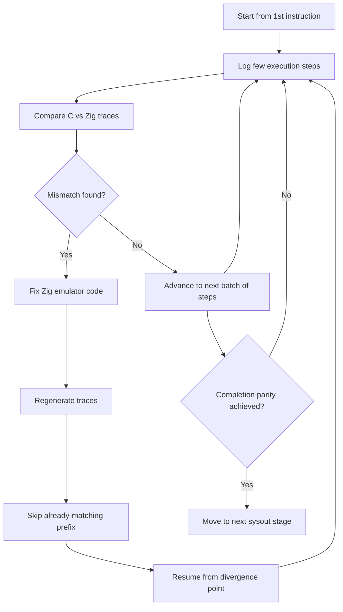

# Implementation Plan: Emulator Runner Scripts + Execution Trace Parity

**Branch**: `004-emulator-runner` | **Date**: 2026-01-16 | **Spec**: `specs/spec.md`
**Input**: Feature specification from `specs/spec.md`

## Summary

Deliver two related capabilities:

1. **Runner scripts**: Run Medley Interlisp with a chosen emulator (C/Zig/Lisp) with validation, locking, and optional auto-build, preserving backward compatibility.
2. **Execution-trace parity**: Provide a repeatable workflow to generate and compare execution traces from the C and Zig emulators, then iteratively fix Zig until it matches C **to completion**, staged (`starter.sysout` first, then `full.sysout`). The process is iterative: start from the 1st instruction, log a few execution steps and compare, then fix mismatches in the Zig emulator. Once fixed, execute but start logging a bit further from just before a mismatch occurs, and repeat until full parity is achieved. Comparison must support skipping the already-matching prefix (auto LCP) and fast iteration via a runtime step cap knob.

## Technical Context

**Language/Version**: Shell (bash + POSIX sh), C (Maiko), Zig 0.15.2+, Python 3

**Primary Dependencies**:

- Unified build layout (spec 003): `maiko/build/<emulator>/<os>.<arch>/...`
- Existing runner scripts: `medley/run-medley`, `medley/scripts/medley/medley.command`, `medley/scripts/medley/medley_run.sh`
- Trace tooling: `scripts/generate_debug_logs.sh`, `scripts/compare_debug_logs.sh`, `scripts/analyze_execution_divergence.py`, `scripts/enhanced_divergence_analysis.py`

**Storage**: None (ephemeral log files + a per-user lock file)

**Testing**:

- Manual smoke tests for runner scripts
- Scripted trace generation/comparison runs for parity work

**Target Platform**: Linux, macOS

**Project Type**: Repository-integrated scripts + emulator parity tooling and emulator code changes (C + Zig)

**Performance Goals**:

- Runner script overhead negligible
- Trace comparison should be able to identify the first divergence quickly (supports skipping matching prefix)

**Constraints**:

- Backward compatible default runner behavior when new flags/env vars aren’t used
- C trace is ground truth
- Parity staged: `starter.sysout` completion parity before `full.sysout`
- Provide a runtime “max steps” knob (flag/env var) honored by both emulators (no source patching)

**Scale/Scope**:

- Single developer workflow, repeated iteration loops
- Logs may be large for “to completion” runs; tools must support incremental iteration (LCP skip)

## Constitution Check

_GATE: Must pass before Phase 0 research. Re-check after Phase 1 design._

- **No placeholders**: plan/spec/tasks must not contain template placeholders.
- **Backward compatibility**: runner script defaults unchanged when not using new options.
- **Traceability**: every FR (including parity FR-019+) must map to one or more tasks.
- **Reference-first**: C emulator output is ground truth for parity.
- **Error messages**: user-friendly summary + technical details.

Status: **PASS** - Plan and tasks enforce constitution gates. Current implementation progress: Zig emulator matches C for first 38 instructions of starter.sysout (divergence at instruction 38).

## Project Structure

### Documentation (this feature)

```text
specs/
├── plan.md
├── research.md
├── data-model.md
├── quickstart.md
├── contracts/
├── tasks.md
├── execution-debugging-plan.md
├── execution-debugging-tasks.md
├── execution-trace-debugging-summary.md
└── execution-trace-debugging-tasks.md
```

### Source Code (repository root)

```text
medley/
├── run-medley
└── scripts/medley/
    ├── emulator_utils.sh
    ├── medley.command
    └── medley_run.sh

scripts/
├── generate_debug_logs.sh
├── compare_debug_logs.sh
├── analyze_execution_divergence.py
└── enhanced_divergence_analysis.py

maiko/src/
└── (C emulator tracing + execution log changes)

zaiko/src/
└── (Zig emulator tracing + parity fixes)
```

**Structure Decision**: Keep runner logic in `medley/` + `medley/scripts/medley/` to match Medley’s existing organization; keep parity workflows in top-level `scripts/` for developer tooling; emulator fixes live in their respective implementations (`maiko/src/`, `zaiko/src/`).

## Iterative Parity Workflow

The execution-trace parity process follows this iterative cycle:



This diagram illustrates the iterative debugging loop: execute, log, compare, fix, repeat until parity is achieved for each sysout stage.

## Complexity Tracking

No constitution violations identified for this feature.
