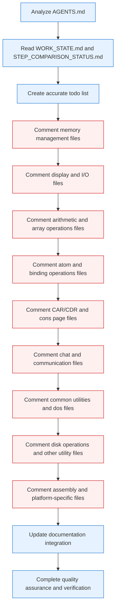
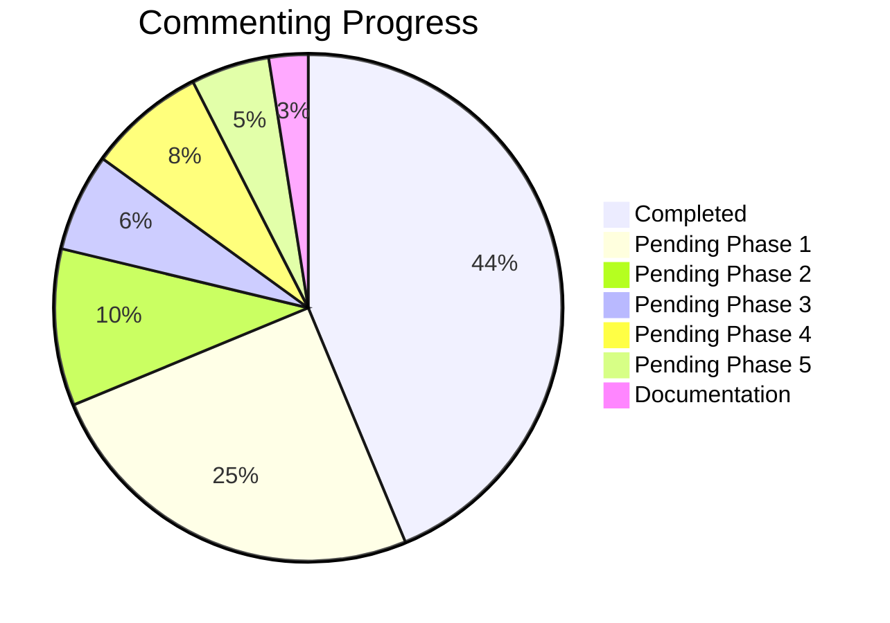
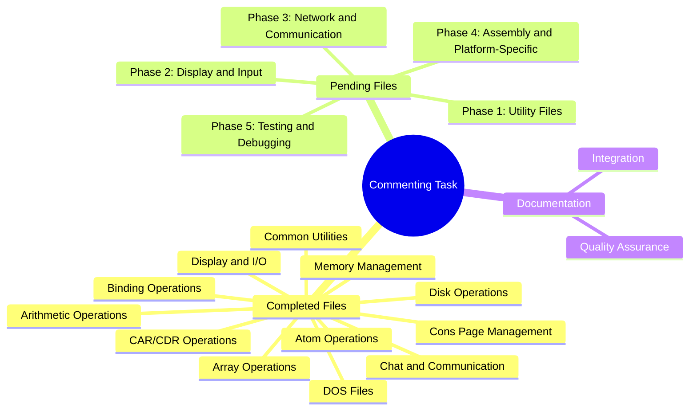

# Commenting C Codebase Task Diagram

## Task Flow



## Progress Overview



## File Categories



## Timeline Estimation

```mermaid
gantt
    title Commenting C Codebase Timeline
    dateFormat  YYYY-MM-DD
    section Completed
    Analyze and Planning       :done,    a1, 2026-01-29, 1d
    Memory Management          :done,    a2, 2026-01-29, 2d
    Display and I/O            :done,    a3, 2026-01-30, 1d
    Arithmetic and Array       :done,    a4, 2026-01-30, 1d
    Atom and Binding           :done,    a5, 2026-01-30, 1d
    CAR/CDR and Cons Pages     :done,    a6, 2026-01-30, 1d
    Chat and Communication     :done,    a7, 2026-01-30, 1d
    Common Utilities           :done,    a8, 2026-01-30, 1d
    DOS Files                  :done,    a9, 2026-01-30, 1d
    Disk Operations            :done,    a10, 2026-01-30, 1d
    section Pending
    Phase 1: Utility Files     :active,  b1, 2026-01-31, 2d
    Phase 2: Display and Input :         b2, after b1, 1d
    Phase 3: Network and Comm  :         b3, after b2, 1d
    Phase 4: Assembly Files    :         b4, after b3, 1d
    Phase 5: Testing Files     :         b5, after b4, 1d
    Documentation Integration  :         c1, after b5, 1d
    Quality Assurance          :         c2, after c1, 1d
```

## Notes

- **Completed**: 35 files have been fully commented
- **Pending**: ~45 files in 5 phases
- **Estimated time**: 2-3 weeks total
- **Priority**: Files are grouped by functionality and importance
- **Format**: All comments follow the established standard with file headers, function comments, and cross-references

This diagram provides a visual overview of the task, showing the progress made so far and the remaining work organized into phases with estimated timelines.
