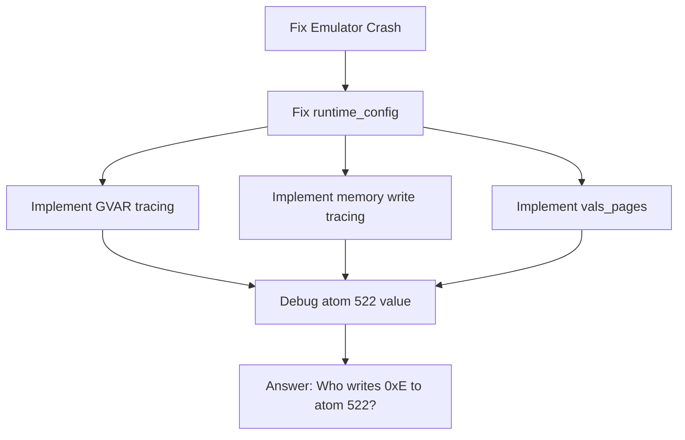

# Introspection Module: Architecture Review and Next Steps

**Date**: 2026-02-20
**Status**: Architecture Review Complete
**Related**: `reports/introspection-status-2026-02-19.md`

---

## Executive Summary

The introspection module is well-architected with a clean SQLite-backed design, event batching for performance, and comprehensive causality tracking. However, several critical issues block its effective use for debugging:

1. **Primary Blocker**: Emulator crash after ~10 opcodes (unrelated to introspection)
2. **Missing Integration**: Three key tables have schemas but no data collection calls
3. **Data Quality Issues**: Incorrect pointer values in runtime_config

---

## Architecture Assessment

### Strengths

| Aspect                 | Assessment                                                      |
| ---------------------- | --------------------------------------------------------------- |
| **Event Batching**     | 10,000 events per batch, minimal overhead                       |
| **Causality Tracking** | Stack-based cause tracking, supports reverse debugging          |
| **Schema Design**      | Comprehensive indexes, convenient views                         |
| **API Design**         | Clean separation between public API and internal implementation |
| **Performance**        | ~1-2% overhead claimed, WAL mode for concurrency                |

### Component Overview

```
maiko/src/introspect/
├── introspect.h           # Public API (410 lines)
├── introspect_internal.h  # Internal types
├── introspect.c           # Core implementation (616 lines)
├── introspect_db.c        # SQLite integration
├── introspect_trace.h     # Tracing macros
└── schema.sql             # Full schema (346 lines)
```

### Integration Points

| File          | Integration                               | Status        |
| ------------- | ----------------------------------------- | ------------- |
| `main.c`      | Session lifecycle, phases, config capture | ✅ Working    |
| `xc.c`        | Opcode tracing, UFN events                | ✅ Working    |
| `gvar2.c`     | Atom cell write tracing                   | ✅ Working    |
| GVAR handler  | `introspect_gvar_execution()`             | ❌ Not called |
| Memory writes | `introspect_memory_write()`               | ❌ Not called |
| Page tracking | `introspect_vals_page()`                  | ❌ Not called |

---

## Current Implementation Status

### Working Tables

| Table              | Purpose                  | Data Status         |
| ------------------ | ------------------------ | ------------------- |
| `sessions`         | Recording sessions       | ✅ Populated        |
| `events`           | All execution events     | ✅ 810K+ events     |
| `build_config`     | Build-time configuration | ✅ Populated        |
| `runtime_config`   | Runtime pointers         | ⚠️ Incorrect values |
| `memory_snapshots` | Key addresses per phase  | ✅ Populated        |

### Schema-Only Tables (No Data)

| Table             | Purpose                   | Why Empty                                  |
| ----------------- | ------------------------- | ------------------------------------------ |
| `memory_writes`   | All memory writes         | `introspect_memory_write()` never called   |
| `vals_pages`      | Page sparse/loaded status | `introspect_vals_page()` never called      |
| `gvar_executions` | Detailed GVAR trace       | `introspect_gvar_execution()` never called |

---

## Identified Issues

### 1. Emulator Crash (Critical Blocker)

```
malloc(): unaligned tcache chunk detected
```

- **Impact**: Blocks all debugging work
- **Occurs**: After ~10 opcodes
- **Related to introspection**: No (happens without INTROSPECT_DB)
- **Priority**: Must fix first

### 2. Missing Function Calls

The following API functions are defined but never called:

```c
// Defined in introspect.h, implemented in introspect.c
// BUT NOT CALLED ANYWHERE:

introspect_memory_write()    // Should be in memory write macros
introspect_vals_page()       // Should be after sysout load
introspect_gvar_execution()  // Should be in GVAR opcode handler
```

### 3. Incorrect Runtime Config Values

```c
// From report:
valspace_ptr    = 0x7FFFD0180000  // Correct
atomspace_ptr   = 0x7FFFD0180000  // WRONG - should be different
stackspace_ptr  = 0x7FFFD0180000  // WRONG - should be different
sysout_size     = 256             // WRONG - should be ~8MB
```

**Root Cause**: The values passed to `introspect_runtime_config()` in `main.c` are incorrect.

### 4. SQLite WAL Not Committed on Crash

- WAL contains uncommitted transactions after crash
- Must run `PRAGMA wal_checkpoint(TRUNCATE)` manually
- Could be automated with signal handlers

---

## Prioritized Next Steps

### Phase 1: Fix Blockers (Must Do First)

1. **Debug and fix the emulator crash**
   - Investigate `malloc(): unaligned tcache chunk detected`
   - Use valgrind or AddressSanitizer
   - This is unrelated to introspection but blocks all work

2. **Fix runtime_config values**
   - Correct atomspace_ptr calculation
   - Correct stackspace_ptr calculation
   - Get actual sysout file size

### Phase 2: Complete Data Collection

3. **Implement GVAR execution tracing**
   - Add `introspect_gvar_execution()` call in GVAR handler
   - Capture atom_index, calculated_addr, value_read, vp, is_sparse

4. **Implement memory write tracing**
   - Add `introspect_memory_write()` call in memory write macros
   - Consider performance impact (may need conditional compilation)

5. **Implement vals_pages population**
   - Call `introspect_vals_page()` after sysout load
   - Enumerate all Valspace pages
   - Mark which are sparse (not loaded from sysout)

### Phase 3: Enhancements

6. **Add signal handler for WAL checkpoint**
   - On SIGSEGV, SIGABRT, etc.
   - Call `sqlite3_exec(db, "PRAGMA wal_checkpoint(TRUNCATE)", ...)`

7. **Add more snapshot locations**
   - Capture more atom value cells
   - Capture stack state
   - Capture PC state

---

## Implementation Details

### Fixing runtime_config

Current code in `main.c`:

```c
introspect_runtime_config(g_introspect,
                          (uint64_t)(uintptr_t)Valspace,
                          (uint64_t)(uintptr_t)Valspace,  // WRONG
                          (uint64_t)(uintptr_t)Valspace,  // WRONG
                          sysout_name,
                          256,  // WRONG
                          ...);
```

Should be:

```c
introspect_runtime_config(g_introspect,
                          (uint64_t)(uintptr_t)Valspace,
                          (uint64_t)(uintptr_t)AtomSpace,  // Correct pointer
                          (uint64_t)(uintptr_t)StackSpace, // Correct pointer
                          sysout_name,
                          sysout_file_size,  // Get from stat()
                          ...);
```

### Adding GVAR Execution Tracing

In the GVAR opcode handler (likely in `xc.c` or `gvar2.c`):

```c
#ifdef MAIKO_INTROSPECT_ENABLED
if (g_introspect) {
    uint32_t vp = calculated_addr / BYTESPER_PAGE;
    int is_sparse = /* check if page was loaded from sysout */;
    introspect_gvar_execution(g_introspect, PC, atom_index,
                              (uint64_t)(uintptr_t)Valspace,
                              calculated_addr, value_read, vp, is_sparse);
}
#endif
```

### Adding Memory Write Tracing

Create wrapper macros in `lispemul.h` or similar:

```c
#ifdef MAIKO_INTROSPECT_ENABLED
#define WRITE_WORD(addr, val) do { \
    DLword old = *(addr); \
    *(addr) = (val); \
    if (g_introspect) { \
        introspect_memory_write(g_introspect, (uint64_t)(addr), \
                                old, (val), PC, 2, current_opcode); \
    } \
} while(0)
#else
#define WRITE_WORD(addr, val) (*(addr) = (val))
#endif
```

---

## Dependencies



---

## Questions for User

1. **Should we prioritize the emulator crash fix?** This is blocking all other work.

2. **What is the correct source for atomspace_ptr and stackspace_ptr?** Need to identify the right variables/macros.

3. **Should memory write tracing be always-on or conditional?** There may be performance implications.

4. **Is the crash related to the parity work?** The crash happens in the C emulator - is this a regression?

---

## Files to Update

When implementing:

1. `maiko/src/main.c` - Fix runtime_config values
2. `maiko/src/xc.c` - Add GVAR execution tracing
3. `maiko/src/gvar2.c` - Alternative location for GVAR tracing
4. `maiko/inc/lispemul.h` - Add memory write macros
5. `reports/introspection-status-2026-02-19.md` - Update status

---

## Conclusion

The introspection module is well-designed and mostly complete. The main issues are:

1. **External blocker**: Emulator crash needs investigation
2. **Missing integration**: Three API functions need to be called
3. **Data quality**: Incorrect values in runtime_config

Once the crash is fixed, completing the data collection should be straightforward. The architecture supports the debugging workflow needed to answer "who writes 0xE to atom 522?"
