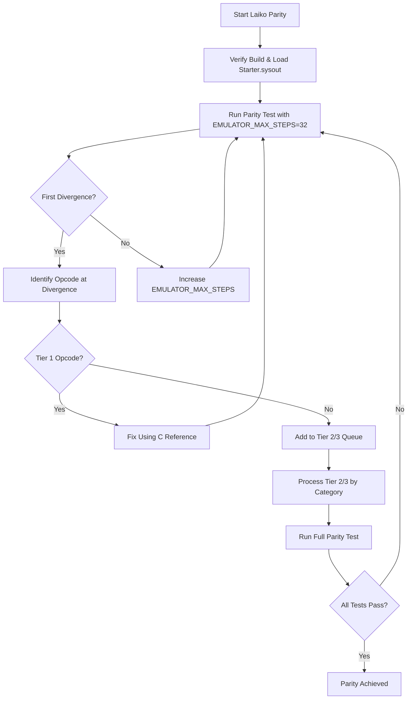

# Laiko Parity Plan

**Date**: 2026-02-28
**Status**: Analysis Complete
**Scope**: Common Lisp (Laiko) implementation parity with C (Maiko)

---

## Executive Summary

This plan provides a comprehensive approach for bringing Laiko (Common Lisp implementation) to functional parity with Maiko (C implementation). Based on analysis of current state, existing plans, and parity testing infrastructure, a **hybrid approach** is recommended that combines instruction-by-instruction parity for core opcodes with feature-based implementation for remaining functionality.

### Current Laiko Status

**Completed:**

- Phase 1: Sysout Loading Foundation ✅
- Phase 2: Unified Trace Format ✅
- ~190+ opcode handlers registered (74% of 256)
- IFPAGE structure corrected (key value `0x15e3`)
- Byte swapping implemented for big-endian sysout files
- FPtoVP table loading complete
- Unified trace format matching C implementation
- Parity testing framework in place

**Known Issues (from archived reports - status unclear if fixed):**

- `read-pc-32-be` placeholder (documented as FIXED in archived report)
- `*bigatoms*` configuration mismatch (documented as FIXED in archived report)
- Atom index masking in GVAR handler (documented as FIXED in archived report)
- ASDF compilation has undefined function warnings
- Some opcode handlers not loading correctly
- IFPAGE accessor functions not properly exported
- Opcode number mismatches with C (comparison opcodes 0x3B–0x3F, logic/shift opcodes 0xE0–0xE7)
- Bytecode extraction still uses placeholder
- FPtoVP offset calculation simplified to non-BIGVM case only
- Function header parsing not yet implemented

**Missing Functionality:**

- Floating point operations (FPLUS2, FDIFFERENCE, FTIMES2, FQUOTIENT)
- Graphics and BitBLT (PILOTBITBLT, DRAWLINE, display I/O)
- I/O subsystems (file system, device handling, network operations)
- ~66 remaining opcodes

---

## Recommended Approach: Hybrid Strategy

### Rationale

A hybrid approach combines the strengths of both systematic opcode-by-opcode and feature-based strategies:

1. **Instruction-by-instruction for Tier 1 opcodes**: Ensures early-executed core opcodes work correctly by finding and fixing the first divergence using `EMULATOR_MAX_STEPS`
2. **Feature-based for Tier 2/3 opcodes**: Groups remaining opcodes by functional category for efficient implementation
3. **Leverages existing infrastructure**: Uses canonical parity testing scripts and systematic debugging workflow

### Workflow Diagram



---

## Prioritized Action Plan

### Phase 0: Foundation Verification (Prerequisite)

**Goal**: Ensure Laiko builds correctly and can load starter.sysout

**Tasks:**

1. Verify ASDF build completes without errors
2. Confirm all opcode handlers load correctly
3. Verify IFPAGE accessor functions are properly exported
4. Test sysout loading with starter.sysout
5. Confirm unified trace format output matches C format

**Success Criteria:**

- ASDF build completes with no undefined function warnings
- All ~190+ opcode handlers registered in `*opcode-metadata*`
- Laiko can load starter.sysout and produce trace output
- Trace format matches C unified trace format

---

### Phase 1: Tier 1 Core Opcodes (Instruction-by-Instruction)

**Goal**: Fix early-executed core opcodes by finding first divergence

**Tier 1 Opcodes (highest priority):**

- **Stack and constants**: POP, COPY, NIL, T, CONST_0, CONST_1, ACONST, SIC, SNIC, SICX, GCONST
- **Variable access**: IVAR0–IVAR6, PVAR0–PVAR6, FVAR0–FVAR6, GVAR, ARG0, MYARGCOUNT, PVARSETPOP0–PVARSETPOP6
- **Control flow**: RETURN, FN0–FN4, FNX, APPLYFN, JUMP0–JUMP15, JUMPX, FJUMP0–FJUMP15, FJUMPX, TJUMP0–TJUMP15, TJUMPX, BIND, UNBIND, UNWIND
- **Base/memory access**: GETBASEPTR-N, GETBASE-N, PUTBASE-N, PUTBASEPTR-N, GETBASEBYTE, PUTBASEBYTE

**Workflow:**

1. Run `scripts/compare_emulator_execution.sh --with-laiko` with `EMULATOR_MAX_STEPS=32`
2. Identify first divergence (PC, opcode)
3. Cross-reference C implementation at that PC using C traces
4. Fix Laiko handler using C as reference
5. Add minimal test under `laiko/tests/`
6. Repeat until first divergence moves beyond Tier 1 set

**Tools:**

- Canonical script: `scripts/compare_emulator_execution.sh`
- Comparison tools: `scripts/compare_unified_traces.awk` (fast), `scripts/compare_unified_traces.py` (detailed)
- Divergence analysis: `scripts/analyze_execution_divergence.py`

**Success Criteria:**

- Laiko executes first 100+ instructions without divergence from C
- All Tier 1 opcodes produce identical stack/memory effects as C
- Focused unit tests exist for each Tier 1 opcode

---

### Phase 2: Tier 2 Data and Memory Opcodes (Feature-Based)

**Goal**: Implement data structure and memory operation opcodes by category

**Tier 2 Opcodes (by category):**

**List Operations:**

- CAR, CDR, CONS, RPLACA, RPLACD, CREATECELL, RPLCONS, NTH, NTHCDR, LAST, LISTLENGTH, APPEND, REVERSE, ASSOC, FMEMB, LISTGET

**Memory and Arrays:**

- AREF1, AREF2, ASET1, ASET2, GETAEL1, GETAEL2, SETAEL1, SETAEL2

**Arithmetic and Comparison:**

- IPLUS2, IDIFFERENCE, ITIMES2, IQUO, IREM, IMINUS, IDIVIDE, IMOD
- PLUS2, DIFFERENCE, TIMES2, QUOTIENT
- EQ, EQL, EQUAL, LESSP, GREATERP, LEQ, GEQ, IGREATERP, NUMEQUAL, CL_EQUAL

**Bitwise and Shifts:**

- LOGAND, LOGIOR, LOGXOR, LOGNOT, LOGOR2, LOGAND2, LOGXOR2, LSH, LLSH1, LLSH8, LRSH1, LRSH8

**Workflow:**

1. Continue stepping C vs Laiko with increasing `EMULATOR_MAX_STEPS`
2. When divergence opcode is in Tier 2 set:
   - Implement or fix Laiko handler semantics using C as reference
   - Add focused tests (list length, aref/aset round-trips, arithmetic edge cases)
3. Process by category for efficiency

**Success Criteria:**

- Laiko executes first 500+ instructions without divergence from C
- All Tier 2 opcodes produce identical results as C
- Category-specific unit tests exist

---

### Phase 3: Tier 3 Advanced Opcodes (Feature-Based)

**Goal**: Implement floating point, graphics, and I/O operations

**Tier 3 Opcodes:**

**Floating Point Arithmetic:**

- FPLUS2, FDIFFERENCE, FTIMES2, FQUOTIENT
- Dependencies: DECODE-FLOAT-POINTER, ENCODE-FLOAT-POINTER

**Graphics and BitBLT:**

- PILOTBITBLT, DRAWLINE, display I/O operations
- Dependencies: SDL3 display backend

**Advanced I/O:**

- File system operations, device handling, network operations

**Workflow:**

1. Implement float representation decisions in Laiko
2. Implement DECODE-FLOAT-POINTER and ENCODE-FLOAT-POINTER
3. Implement float opcodes using C as reference
4. Implement SDL3 display backend integration
5. Implement graphics opcodes using C as reference
6. Implement I/O subsystems using C as reference

**Success Criteria:**

- All floating point opcodes produce identical results as C
- Graphics operations render correctly
- I/O operations function as expected
- Full parity test suite passes

---

### Phase 4: Opcode Number Alignment

**Goal**: Fix opcode number mismatches with C implementation

**Known Mismatches (from archived report):**

**Comparison range 0x3A–0x3F:**

- C: EQL=0x3A, DRAWLINE=0x3B, STORE_N=0x3C, COPY_N=0x3D, RAID=0x3E, SLRETURN=0x3F
- Laiko: eq=0x3A, eql=0x3B (conflict with DRAWLINE), lessp=0x3C, greaterp=0x3D, leq=0x3E, geq=0x3F
- C: EQUAL=0xF4, GREATERP=0xF3
- Laiko: equal=0x3D (duplicate), numequal=0x3D (duplicate), igreaterp=0xF1 (matches C)

**Logic/shift range 0xE0–0xE7:**

- C: LLSH1=0xE0, LLSH8=0xE1, LRSH1=0xE2, LRSH8=0xE3, LOGOR2=0xE4, LOGAND2=0xE5, LOGXOR2=0xE6, LSH=0xE7
- Laiko: logand=0xE0, logior=0xE1, logxor=0xE2, lognot=0xE3, llsh1=0xE4, llsh8=0xE5, lrsh1=0xE6, lrsh8=0xE7
- Laiko: lsh=0xEC (should be 0xE7)

**Float ops 0xE8–0xEB:**

- C: FPLUS2=0xE8, FDIFFERENCE=0xE9, FTIMES2=0xEA, FQUOTIENT=0xEB
- Laiko: logor2=0xE8, logand2=0xE9, logxor2=0xEA (conflict with float ops)

**Workflow:**

1. Cross-reference `maiko/inc/opcodes.h` for canonical opcode values
2. Update Laiko opcode definitions to match C
3. Update `documentation/specifications/instruction-set/opcodes.typ` if needed
4. Re-run parity tests to verify alignment

**Success Criteria:**

- All Laiko opcode numbers match C implementation
- No opcode number conflicts
- Parity tests pass with aligned opcodes

---

### Phase 5: Documentation and Integration

**Goal**: Update documentation and integrate with CI/CD

**Tasks:**

1. Update `documentation/implementations/lisp-implementation.typ` with Laiko-specific details
2. Update `documentation/specifications/` with any emulator-independent findings
3. Add Laiko to `scripts/compare_all_implementations.sh`
4. Add parity test execution to CI pipeline
5. Update `reports/IMPLEMENTATION_STATUS.md` with Laiko progress

**Documentation Requirements (per `documentation/core/critical-memory.typ`):**

- All documentation improvements MUST be emulator-independent in `documentation/specifications/`
- Language-specific details go in `documentation/implementations/`
- ALWAYS write documentation using Typst format
- ALWAYS update both before committing
- ALWAYS use `date` to date entries as YYYY-mm-dd HH:MM

**Success Criteria:**

- Laiko documentation is comprehensive and up-to-date
- Laiko is integrated into multi-implementation parity testing
- CI pipeline runs Laiko parity tests on every commit

---

## Integration with Existing Parity Testing Infrastructure

### Canonical Testing Workflow

1. **Generate C baseline trace:**

   ```bash
   EMULATOR_MAX_STEPS=1000 scripts/compare_emulator_execution.sh --c-only
   ```

2. **Generate Laiko trace:**

   ```bash
   EMULATOR_MAX_STEPS=1000 scripts/compare_emulator_execution.sh --with-laiko
   ```

3. **Compare traces:**

   ```bash
   scripts/compare_unified_traces.awk c_trace.txt laiko_trace.txt
   ```

4. **Analyze divergence:**
   ```bash
   scripts/analyze_execution_divergence.py c_trace.txt laiko_trace.txt
   ```

### Systematic Debugging Workflow

Per `documentation/core/critical-debugging-technique.typ`:

1. **Cross-reference C traces** - Establish baseline with verified C emulator output
2. **Step-by-instruction validation** - Run emulators with `EMULATOR_MAX_STEPS=N`
3. **Debug instrumentation** - Add targeted prints following technique hierarchy
4. **Memory integrity verification** - Check for corruption at critical addresses
5. **Algorithm reverse engineering** - Analyze C code for correct implementation
6. **Hypothesis testing** - Formulate and validate specific bug theories
7. **Documentation updates** - Record findings in specifications and implementations

### Critical Pitfalls to Avoid

- PC is byte offset, not DLword
- FPtoVP uses 512-byte pages
- Use byte swap for big-endian data, not XOR
- CSTKPTRL/TOPOFSTACK must be re-read from memory after restore
- VM/stack initialization: SP/FP from IFPAGE
- Introspection TOS timing: recorded AFTER previous instruction, BEFORE current instruction

---

## Milestones

### Milestone 1: Foundation Verified

- Laiko builds without errors
- Can load starter.sysout
- Produces unified trace format output

### Milestone 2: Tier 1 Parity

- Executes first 100+ instructions without divergence
- All core opcodes (stack, constants, variables, control flow) match C

### Milestone 3: Tier 2 Parity

- Executes first 500+ instructions without divergence
- All data structure and memory opcodes match C

### Milestone 4: Tier 3 Parity

- All floating point, graphics, and I/O opcodes implemented
- Full parity test suite passes

### Milestone 5: Complete Parity

- All opcodes implemented and aligned with C
- Documentation updated
- Integrated into CI/CD pipeline

---

## Key Files and Paths

### Laiko Implementation

- `laiko/src/` - VM core, memory, I/O implementation
- `laiko/src/vm/op-*.lisp` - Opcode handlers
- `laiko/src/data/*.lisp` - Data structures (atoms, cons, arrays)
- `laiko/tests/` - Unit tests
- `laiko/PLAN.md` - Existing implementation plan
- `laiko/README.md` - User-facing documentation
- `laiko/docs/IMPLEMENTATION.md` - Implementation notes

### C Reference

- `maiko/src/` - Production C implementation (primary reference)
- `maiko/inc/opcodes.h` - Canonical opcode definitions
- `maiko/inc/inlineC.h` - Inline C macros (e.g., GVAR implementation)

### Parity Testing

- `scripts/compare_emulator_execution.sh` - Canonical comparison script
- `scripts/compare_unified_traces.awk` - Fast trace comparison
- `scripts/compare_unified_traces.py` - Detailed trace comparison
- `scripts/analyze_execution_divergence.py` - Divergence analysis
- `reports/PARITY_TESTING_GUIDE.md` - Comprehensive testing methodology

### Documentation

- `documentation/core/critical-debugging-technique.typ` - Systematic debugging workflow
- `documentation/core/critical-memory.typ` - Documentation update rules
- `documentation/specifications/` - Emulator-independent specifications
- `documentation/implementations/` - Implementation-specific notes

### Reports

- `reports/IMPLEMENTATION_STATUS.md` - Current implementation status
- `reports/archive/outdated-reports/laiko-gvar-parity-analysis.md` - GVAR analysis (FIXED)
- `reports/archive/outdated-reports/laiko-opcode-audit-vs-maiko.md` - Opcode audit
- `reports/archive/outdated-reports/laiko-opcode-priority.md` - Opcode priorities

---

## Success Criteria

### Functional Parity

- Laiko passes full parity test suite with 0% functional differences
- All opcodes produce identical results as C implementation
- No regressions in existing functionality

### Performance

- Laiko performance within 20% of C for critical paths
- No significant memory leaks or excessive allocations

### Quality

- All code follows project conventions (files under 500 lines)
- Comprehensive unit tests for all opcodes
- Documentation updated per `documentation/core/critical-memory.typ`

### Integration

- Laiko integrated into multi-implementation parity testing
- CI pipeline runs Laiko parity tests on every commit
- All known issues resolved

---

## Next Steps

1. **Verify Foundation**: Ensure Laiko builds correctly and can load starter.sysout
2. **Run Initial Parity Test**: Execute `scripts/compare_emulator_execution.sh --with-laiko` with small `EMULATOR_MAX_STEPS`
3. **Identify First Divergence**: Find the first opcode where Laiko diverges from C
4. **Fix and Iterate**: Fix the divergence using C as reference, then repeat
5. **Track Progress**: Update `reports/IMPLEMENTATION_STATUS.md` as milestones are achieved

---

**Last Updated**: 2026-02-28
**Status**: Ready for implementation
